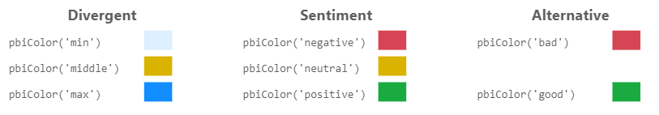

# Change Log

## 1.7.0 (Under Development)

:::info Early Access Availability
The change log is updated as features are added to the main development branch. They are available in [alpha builds](/community/early-access) until such a time as the version is ready for beta testing, and eventual submission to AppSource.
:::

### Vega Updates

- Vega updated to **5.30.0** (from 5.26.1).
- Vega-Lite updated to **5.19.0** (from 5.16.3).

### Monaco Editor for JSON

Power BI custom visuals have some very challenging constraints in terms of what can be integrated. The work done in 1.6 and this release now allows us to include [Monaco Editor](https://microsoft.github.io/monaco-editor/) (the component from [Vega Editor](https://vega.github.io/editor), [Visual Studio Code](https://code.visualstudio.com/) and many parts of Power BI Desktop) for JSON Editing.

This will now give us many of the benefits that Vega Editor has for editing specifications, including, some key benefits which are highlighted below.

#### Commenting

The editor and template system now supports **JSON with comments** (JSONC)! 🎉🎉

 and line (//) comments are now valid in the JSON editor.")

- You can now use comments to either document your specifications or disable portions for debugging purposes.
- You can use single line (`//`) or block (`/* */`) comment format.
- The editor also has shortcuts for these operations:
  - [Ctrl + /] to toggle a line comment.
  - [Ctrl + Alt + A] to toggle a block comment.

#### Auto-Completion

The JSON schemas for Vega and Vega-Lite have been integrated into the editor's autocompletion function, making discovery of the correct properties much more straightforward. Completion will trigger when typing, or when you press [Ctrl + Space] to invoke manually.

#### Inline Documentation

For Vega-Lite, the developers have built-in a lot of additional support for language keywords. You can now hover your mouse over any item that contains such documentation and see this rendered in a pop-up, e.g.:

 will display any relevant documentation.")

Any links in the displayed documentation can be clicked, top open the destination in a browser tab.

#### Improved Highlighting

Any schema warnings and/or errors are now more direclty annotated in the editor, e.g.:

You can also hover the mouse over any such annotation to see the details of the issue.

:::warning Errors need to be fixed for some operations
As errors do not produce valid JSON, you cannot format JSON or export your work as a template until any issues are corrected and re-parsed successfully.
:::

#### Formatting Has Moved

Formatting was previously available via the toolbar - this has now moved to use Monaco's own formatter, available in the context menu, or with the new shortcut of [Ctrl + Shift + I]:

![JSON formatting has moved to use the native Monaco Editor version, available in the context menu or using [Ctrl + Shift + I].](/img/changelog/1.7.0/format-context-menu.png "JSON formatting has moved to use the native Monaco Editor version, available in the context menu or using [Ctrl + Shift + I].")

#### 'Escape Hatch' for UI Navigation

In the editor you can change tab key behavior from standard tabbing to UI navigation (allowing you to tab out to other parts of the UI) by using [Ctrl + M].

### Improved Editor State Preservation

Previously, any specific editor changes you'd made, such as folding/collapsing sections to better organize your work, these would be forgotten when you exited the editor, or performed a format operation on your JSON. These are now remembered for the life of the current session (until you leave the current report page and reinitialize the visual or close and re-open the workbook).

### Dark Mode

You now have the choice of the Deneb Advanced Editor UI to be displayed in light (default) or dark mode.

- This can be changed by either:

  - Clicking the theme button in the top-right of the Advanced Editor toolbar.
  - Using the [Ctrl + Shift + Alt + T] keyboard shortcut.
  - Setting the _Advanced editor > Interface > Theme_ property in the format pane.

- Setting the _Theme_ to _Dark_ will update the interface appearance, e.g.:

  ![You can now set the theme to [Dark], to convert the editor into dark mode. This will display all components (except for the preview area) with darker colors.](/img/changelog/1.7.0/dark-theme-standard.png "You can now set the theme to [Dark], to convert the editor into dark mode. This will display all components (except for the preview area) with darker colors.")

- The preview area in this example is still white, because this is the current report background, and it is intended for you to see how your visual design will look on the report canvas.

- If you wish for the preview area to be dark also - **bearing in mind that this may potentially cause accessibility issues while editing** - you can change this behavior by setting _Advanced editor > Preview area > Apply background settings to preview area_ to **Off**, e.g.:

  ![You can disable the report background being passed through to the preview area by setting the [Apply background settings to preview area] property to OFF. This will apply dark mode styling to the entire interface. Note that this may cause issues with viewing your design as intended on the canvas.](/img/changelog/1.7.0/dark-theme-background-off.png "You can disable the report background being passed through to the preview area by setting the [Apply background settings to preview area] property to OFF. This will apply dark mode styling to the entire interface. Note that this may cause issues with viewing your design as intended on the canvas.")

### `pbiFormat` Changes

As Vega-Lite provides some flexibility in the `format` property for custom format types, you can now supply an object or the desired format string. Refer to the Formatting Values page for further details.

### `pbiFormatAutoUnit` Format Type

This format type has been added as a convenience to emulate _Auto_ units, commonly used in other Power BI visuals. This will use the same logic that Power BI uses to convert values to K, M, Bn, etc. Refer to the Formatting Values page for further details.

### `pbiContainer` Signal

The Vega view now has a new signal named `pbiContainer`, which provides access to information about the visual container in expressions, e.g.:

This can also be used to monitor scrolling events in the visual container and you can refer to the [Scrolling and Overflow](scrolling-overflow#using-pbicontainer-to-track-scrolling-events) page for more details on the internals of this feature.

### Advanced Cross-Filtering

- Advanced cross-filtering provides developers using **Vega** to have more control over cross-filtering behavior between their specification and Power BI.

- From this version, we have renamed the _Cross-filtering (selection) of data points_ setting to _Expose cross-filtering values for dataset rows_. With this enabled, you will now have two further options:

   and Advanced.")

  - _Simple:_
    - This is the functionality you will already have been using, and Deneb attempts to resolve data points from marks and delegates them to Power BI.
    - This option supported for both Vega and Vega-Lite, and is recommended if you just want simple management of cross-filtering.
    - However, [the limitations still apply](interactivity-selection#limitations-and-considerations), as this is a fairly simple modification applied to the Vega view by Deneb.
  - _Advanced:_
    - This will not attempt to help you by monitoring marks for clicks and all cross-filter events must be managed by you.
    - The option cannot be selected for Vega-Lite specifications.

- With the _Advanced_ mode enabled, there are two new expression functions available in Vega signals:

  - `pbiCrossFilterApply(event, filter?, options?)`: for the current event target, filter the original dataset (as sent from Power BI) as instructed and ask Power BI to apply cross-filtering based on this result set.
  - `pbiCrossFilterClear()`: explicitly tell Power BI to clear the current cross-filter selection.

- This is a complex topic that is tempting to include in more detail in the release notes, but benefits from having more detailed documentation to unpack. Refer to the [Advanced Cross-Filtering](interactivity-selection-advanced) page for more details on how to set this up, and how to get the most out of it.

### Other Enhancements

- Signal names in the Debug Pane now have more proportional space and are less likely to truncate when viewing. If a signal name does truncate, you can now hover over it to see the full name in a tooltip (#400).

### Performance and Stability

- Schema validation against the specification is now only performed when the editor is open. This typically improves initial render time in the report canvas view by 400-500ms for Vega-Lite visuals and 200-300ms for Vega visuals.
- Some recursives function were identified as not needing to run for each dataset row during dataset processing. These have been refactored and hoisted to only run when necessary, improving overall processing time.

### Bug fixes

- If you have multiple fields starting with the same characters (e.g. _Sales PY_, _Sales FC_) they should be uniquely identified when generating a template (#276)
- The Power BI tooltip provider will incorrectly show `false` instead of a number, if that number should be text (#429)
- The scrollbar color reverts when changing the visual container padding (#384)
- Re-importing a template with auto field assignment does not correctly verify assignment state (#445)
- `null` values for `datetime` fields are not being casted correctly when processed (#446)

## 1.6.2 (2023-12-08)

### Vega Updates

- Vega updated to **5.26.1** (from 5.25.0).
- Vega-Lite updated to **5.16.3** (from 5.16.1).

### Debug Pane Changes

- The _Rows per page_ value in the status bar is now persisted, meaning that it will remain across editing sessions, and when navigating between different datasets or the Signals view.
- The value is also available in the **Editor > Debug pane** formatting card in Power BI's properties pane.
- The default number of _Rows per page_ has been increased to **50**.
- Further options for **100** and **200** rows per page has been added to the _Rows per page_ list.

### Bugs Fixed

- Power BI tooltips will now show again, due to a packaging/publication issue in 1.6.1 (#407)
- If a dataset emits too many updates, this can cause UI issues while they are processed (#391)
- Enabling or disabling cross-filtering doesn't update the dataset in the debug view (#396)
- Datasets in the debug area with a `vega_id` crash the editor (#397)

## 1.6.1 (2023-11-27)

### Bugs Fixed

- 'Initializing' message shows when dataset has columns or measures, but no data (#393)

## 1.6.0 (2023-11-01)

This update concentrates on making changes that improve performance and architecture for the next planned updates. A lot of these were slated for version 2, but this has become too large of a task to do in one go. As such, version 2's scope will change to focus on features that may result in breaking changes for templates and the next few updates will focus on delivering long-awaited or commonly requested features that will improve the UI and productivity experience for creators.

### Supported Power BI Versions

In order to improve visual loading time and access new features, the Power BI Visuals API has been updated to 5.3.0. This will require a minimum of **April 2023** of Power BI Desktop (or **May 2023** of Power BI Desktop for Report Server).

For older versions Power BI Desktop, you can install previous versions of Deneb as an [organizational visual in your Power BI tenant](https://learn.microsoft.com/en-us/power-bi/developer/visuals/power-bi-custom-visuals-organization). Builds of Deneb are included as assets under the appropriate release [in the GitHub repository](https://github.com/deneb-viz/deneb/releases) and follow the pattern `Deneb_AppSource*.pbiviz`.

### Vega Updates

- Vega updated to **5.25.0** (from 5.23.0).
- Vega-Lite updated to **5.16.1** (from 5.6.1).

### Parsing and Validation Workflow Changes

These would normally be listed under _Performance and Stability_, but there have been significant changes to how Deneb parses the editor content and renders specifications. This will result in much faster output, improve synchronization between the Debug Pane and the rendered output, and stop superfluous rendering of specifications in the UI in-general.

:::caution Please check your specs!
It is anticipated that changes will have a positive effect. However, if you find a use case that is negatively impacted, then please let us know so that we can investigate as soon as possible.
:::

The key impacts on creators and viewers are as follows:

- Transition time between the report canvas and the Advanced Editor (and back again) has significantly improved.

- In conjunction with the visual dataset, specifications and config are memoized, so they are only (re)parsed when a suitable change occurs. The full list of events that can affect memoization are:

  - Specification or Config content is applied (and is different to the last saved values).
  - Changes to the visual dataset, including adding and removing columns or measures and filters being applied (essentially anything that causes the visual to be re-queried, resulting in a change of resulting dataset).
  - Enabling or disabling cross-filtering of data points or cross-highlight values (as these affect the visual dataset).
  - A change to the [Discrete ordinal colors](schemes#discrete-ordinal-colors) property in the _Report theme integration_ menu (as this requires re-generation of the custom Vega ordinal scale that is bound to that value).
  - Enabling or disabling the Power BI tooltip handler.
  - Changing the provider (e.g. from _Vega-Lite_ to _Vega_).
  - Changing the render mode (e.g. from _SVG_ to _Canvas_).
  - Changing the log level in the _Logs_ viewer.
  - When you have finished resizing the visual container in the report canvas.

- If any errors are encountered when parsing (or by the Vega view post-render), the visual is no longer replaced with an error status and shows as blank. All issues will be present in the _Logs_ viewer (providing the level is not set to _None_).

- Vega parsing would not previously catch errors in the _Logs_ viewer. This has been fixed.

:::info Parsing Changes and Effect on Vega Lite Specifications
If you created a visual from the previous internal templates, you may see warnings in the **Logs** viewer. This is due to an issue with the way that the previous templates were configured. If you wish to remove these warnings, remove the following objects from your Config (as they relate to Vega only):

- `path`
- `shape`
- `symbol`

:::

### General UI Changes

Deneb's Advanced Editor UI has been completely migrated from Fluent UI v8 to v9. Some of these changes will be detailed in below sections where necessary, but the overview is as follows:

- The menu in the settings pane has been moved out to the top of the visual and encompasses the entire width. This provides ~11% more vertical space for the JSON editor at the cost of a bit less vertical space for the visual preview.
- The landing page has been redesigned to provide more detailed onboarding for new users.
- Theme brand color has been updated to match Power BI's recent changes.

### Create New Specification Dialog and Packaged Template Changes

As part of the UI changes, the **Create new specification** dialog has received some enhancements:

- The layout has changed to allow more room on the right for template content when it is selected or loaded.
- Using an existing template is the default option.
- For an existing template, the import button has been swapped for a drop zone:

  - You can click this to manually select a template file, or you can drag and drop a valid file to this area for Deneb to import it (if WebView2 is enabled).
  - This will also support copy and paste for files and clipboard text, providing that they are valid Deneb templates.
  - For Vega and Vega-Lite specifications without Deneb metadata, it's recommended that you create a blank specification for the appropriate language and paste these into the editor.

- Links to Deneb's [community page](/community/resources), the Vega examples gallery and the Vega-Lite examples gallery have been added to the initial screen, to assist with discoverability of existing examples or ideas.

- Packaged templates have been refactored:

  - By default, templates no longer use Power BI theming for their look and feel, as this is not necessarily data visualization best practice.
  - A new template named _\[empty (with Power BI theming)]_ has been added for both Vega and Vega-Lite, which will include the relevant config to simulate the default Power BI look and feel.
  - The bar chart templates have been split into two versions: (1) a standard one with basic encodings only, and (2) an interactive one to show how simple Power BI interactivty can be set up.
  - The other simple templates have been removed.

### Generate JSON Template Changes

.")

- The dialog for this operation has been consolidated into a single pane, rather than having three panes as part of the workflow to export a template.
- You can also download the template directly to a `.deneb.json` file, provided that your tenant administrator has allowed [downloads from custom visuals](https://learn.microsoft.com/en-us/power-bi/admin/organizational-visuals#export-data-to-file).
- If you aren't permitted to download, you can still copy the template to the clipboard.

### Debug Pane Enhancements

In conjunction with the parsing and rendering changes above, the Debug Pane has been re-written with updated logic and UI.

Key changes are as follows:

- The option to select the data set (Data viewer) or the log level (Logs viewer) has been moved to the bottom status bar of the debug pane, which frees up some vertical space.
- Tables in the Data and Signals viewers use a new component, have improved pagination, plus the ability to choose from either 10, 25, 50 or 100 rows per page.
- The algorithm for monitoring changes of the data and signals in the Vega view has been improved and this should result in Data and Signal values being correctly up to date (in some cases they might previously have been one update behind).
- The maximum zoom level has been increased to **400%**.
- The _Reset Zoom_ button has been removed and replaced with a popover on the zoom level - this allows you to choose a pre-defined or custom zoom level:

  

  Note that the 'reset zoom to 100%' hotkey ([Ctrl+Alt+0]) will still work as intended.

### Dynamic Format String Support Fields for Calculation Groups and Measures

Deneb has always been able to accommodate calculation groups in its dataset, but access to dynamic format strings has not been part of its feature set. As Power BI now introduces dynamic format string support [for measures as of April 2023](https://powerbi.microsoft.com/en-cy/blog/power-bi-april-2023-feature-summary/#post-23001-_Toc433340751), then this is now becoming less niche and more commonplace.

In this release, new fields are introduced into the dataset to provide additional access to these values if they are present in the query result from Power BI.

See the section in the [Formatting Values](formatting#working-with-dynamic-format-strings-for-measures-and-calculation-groups) page for a detailed explanation as to how these work.

### Scrollbar Appearance Configuration

Some new properties have been introduced to the **Rendered visual** menu in the formatting pane, which give you a bit more control over the display of scrollbars in the rendered output:

- Scrollbar color: allows you to adjust the displayed color of the scrollbar. This is black (_#000000_) by default.
- Scrollbar opacity (%): allows you to adjust the opacity of the scrollbar. This is _20%_ by default, to ensure that the underlying visual can still be seen through the overlaid scrollbar.
- Scrollbar radius (px): allows you to change the curvature of the end of the scrollbars. This is _0_ (square) by default.

Additionally, there is a **Show scrollbars on overflow** in the **Advanced editor** menu, that will allow you to preview the scrollbars in the advanced editor, if your visual will overflow the boundaries of the viewport.

This is covered in more detail in the [Scrolling and Overflow](scrolling-overflow) page.

### Other Enhancements

- The properties pane has been converted to use the new formatting cards that were recently introduced in core visuals.
- The DIN font has had a more sensible alias assigned (this is known internally as `wf_standard-font`) and can now be specified as 'DIN' wherever you're using it.

### Bugs Fixed

- Tooltip with signal of `item` will no longer cause call 'stack size exceeded' errors (#273)
- Vega specifications are restored with the correct visual dimensions upon exiting the Advanced Editor (#286)
- The landing page will no longer be temporarily displayed when a visual is initialized in the Service (#325)
- Handler for keyboard shortcuts should no longer trigger modal dialogs when Alt+F or Alt+N are used in Czech locales (#262)

### Performance and Stability

- The Data viewer in the debug pane now processes data asynchronously. This prevents the whole UI waiting for the processing to complete and will again improve the responsiveness of the editor UI overall.
- Data and Signals viewers now use a monospace font. This is to improve readability of the content, but also to improve performance of calculating the table content (as column widths need to be computed each time the content changes).
- The **Performance Tuning** and **Recalculate during resize** property have been removed from the formatting pane, due to the above enhancements.

## 1.5.0 (2023-03-29)

### Enhancements

- The field name limit for template fields has been increased from 30 to 150 characters.

:::danger Field name limit relaxations are not backwards compatible
If exporting a template with > 30 characters in a field name, it cannot be imported into earler versions and will require you to manually correct the field name in the template JSON if you wish for this to work.
:::

- The `pbiFormat` expression function has an optional third parameter that can be used to specify additional options that are available to custom visual developers.

  Please refer to the [Formatting Values](formatting#pbiformat-expression-function-full-implementation-details) page for more information.

- The `pbiColor` expression function now supports the following named color values:

  

  Color names should be surrounded with single quotes and valid values are as follows:

  - Divergent colors:

    - `min`
    - `middle`
    - `max`

  - Sentiment colors:
    - `negative` (or `bad`)
    - `neutral`
    - `positive` (or `good`)

  Please refer to the [Theme Colors & Schemes](schemes#expression-based-access-using-pbicolor) page for more information.

### Bugs Fixed

- When importing templates created using Vega, the provider would be incorrectly set to Vega-Lite (#278).
- The theme color binding for "middle" divergent color was actually using "neutral" (#283).

### Performance and Stability

- Vega has been updated to version **5.23.0** (from 5.22.1). You can read more about the changes in the [Vega release notes](https://github.com/vega/vega/releases/tag/v5.23.0).

- Vega-Lite has been updated to version **5.6.1** (from 5.4.0). As there have been many small and incremental changes between these versions, it may be easier to review [the commit history for this span](https://github.com/vega/vega-lite/compare/v5.4.0...v5.6.1) rather than inspecting each individual release if you wish to catch up on what's new.

- Published visual size reduced by 8% (down from 1.42MB to 1.32MB).
