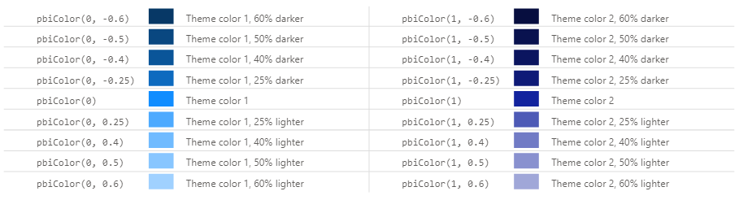

# Change Log

## 1.5.0 (In Development)

Deneb 1.x is in a state of maintenance, and this release focuses on minor improvements and bug fixes. Any significant new features should be expected in version 2 (which is currently being scoped and planned).

### Enhancements

- The field name limit for template fields has been increased from 30 to 150 characters.

  :::danger Field name limit relaxations are not backwards compatible
  If exporting a template with > 30 characters in a field name, it cannot be imported into earler versions and will require you to manually correct the field name in the template JSON if you wish for this to work.
  :::

- The `pbiFormat` expression function has an optional third parameter that can be used to specify additional options that are available to custom visual developers.

  Please refer to the [Formatting Values](formatting#pbiformat-expression-function-full-implementation-details) page for more information.

- The `pbiColor` expression function now supports the following named color values:

  

  Color names should be surrounded with single quotes and valid values are as follows:

  - Divergent colors:

    - `min`
    - `middle`
    - `max`

  - Sentiment colors:
    - `negative` (or `bad`)
    - `neutral`
    - `positive` (or `good`)

  Please refer to the [Theme Colors & Schemes](schemes#expression-based-access-using-pbicolor) page for more information.

### Bugs Fixed

- When importing templates created using Vega, the provider would be incorrectly set to Vega-Lite (#278).
- The theme color binding for "middle" divergent color was actually using "neutral" (#283).

### Performance and Stability

- Vega has been updated to version **5.23.0** (from 5.22.1). You can read more about the changes in the [Vega release notes](https://github.com/vega/vega/releases/tag/v5.23.0).

- Vega-Lite has been updated to version **5.6.1** (from 5.4.0). As there have been many small and incremental changes between these versions, it may be easier to review [the commit history for this span](https://github.com/vega/vega-lite/compare/v5.4.0...v5.6.1) rather than inspecting each individual release if you wish to catch up on what's new.

- Published visual size reduced by 8% (down from 1.42MB to 1.32MB).

## 1.4.0 (2022-08-31)

### Enhancements

- When using the AppSource visual, there's now a warning in the visual header if you're attempting to load external resources such as images or geojson (#244).

   version will display a warning in the visual header, confirming that these cannot be loaded.")

  

- If a mark contains a hyperlink to an external URL, Deneb will request that Power BI perform navigation to the specified location (#177).

  - Note that hyperlinks in custom visuals are consent-based, so Power BI will always display an alert to the user asking if they wish to navigate to the specified URL.

- Vega-Lite has been updated to **5.4.0**, from 5.2.0 (#257). You can read more about the changes [in the Vega-Lite release notes](https://github.com/vega/vega-lite/releases/tag/v5.4.0).

- The **Visual Editor** heading text has been removed when the Editor Pane is expanded, and the Command Bar has been moved up to fill the space (#230). This provides a little bit more vertical space for the JSON editor.

### Bugs Fixed

- When using Vega, the Cross-Filtering checkbox was disabled. Cross-filtering would work, but could not easily be toggled (#251).

- The _Data Point Limit_ property for cross-filtering was being ignored (#252).

- Checkbox and radio button param elements could not change state with cross-filtering enabled (#254).

- `null` dates were causing an infinite rendering loop (#259).

## 1.3.0 (2022-07-06)

### Debug Area (#7, #217)

The Visual Editor interface has been modified to accommodate viewers for Data, Signals and Logs in what was formerly known as the Preview Area Toolbar. Similar to [vega-editor](https://vega.github.io/editor/#/), these expose more information about the underlying Vega view and will provide creators with more information when designing and debugging specifications within Power BI.

These changes also make the Preview Area toolbar resizable and collapsible, much like the Editor Pane. As this functionality is now greatly increased from before, this is being renamed as the [**Debug Pane**](visual-editor#debug-pane).

As this change affects a lot of the existing documentation, the relevant areas are updated with sections pertinent to the Debug Pane, but a short overview is as follows:

- The **Data** pane provides visibility of data sets from the Vega view.

- The **Signals** pane exposes signal details from the Vega view, which will also include things like parameter bindings.

- The **Logs** pane exposes anything that the Vega logger records for the specified log level.

  - Valid levels are **None**, **Error**, **Warn** (default) and **Info**.
  - As a result of this work, it was discovered that some scenarios - such as duplicating params by putting them at the top level for layered plots - were not being correctly trapped and Deneb would 'white out'.
  - The resilience around trapping these errors has been improved and they should display an appropriate error state in the visual (and may expose more details around in the Logs pane).

### Individual Report Theme Colors (#197)

A new expression, `pbiColor` has been added. This allows you to access your report theme's colors by a (zero-based) index. There is also an optional parameter, which will allow you to darken or lighten the color by this value (allowing similar results):

Please refer to the [Theme Colors & Schemes](schemes#expression-based-access-using-pbicolor) page for further details.

### Preview Image in Exported Template (#228)

When exporting a template, you can now opt to include a preview image, e.g.:

Images are generated [using the Vega View APIs](https://vega.github.io/vega/docs/api/view/#image-export). The generated image will be how the image currently looks in the editor, and are capped at a maximum of 150 x 150 pixels (using the largest dimension to constrain the aspect ratio within this area). This is documented in more detail on the [Templates](templates#including-a-preview-image) page, but the high-level overview is as follows:

The generated image will be encoded in your template using base64, so there's a couple of things to consider here:

- This can potentially increase the size of your JSON template considerably.
- This image may potentially expose information about your data if included.

As such, the option is disabled by default and you will need to opt-in.

### Other Minor Enhancements

- Deneb will now retain Cross-Filter and/or Cross-Highlight context for multiple charts when Ctrl+clicking (#213)
- When creating a new Vega-Lite visual using the _[empty]_ template, this will now provide a specification with empty layers (`[]`) rather than a `null` mark. This prevents the display of errors and should serve as a more friendly state for the new user (#51).

### Performance and Stability

- Vega has been upgraded to version **5.22.1**, from 5.21.0 (#221). You can read more about the changes in the Vega release notes:

  - [5.22.0](https://github.com/vega/vega/releases/tag/v5.22.0)
  - [5.22.1](https://github.com/vega/vega/releases/tag/v5.22.1)

- Code and events have been reviewed and refactored to ensure that Vega re-renders are only done when absolutely necessary (#222). This should have an appreciable effect on general UI performance.

## 1.2.0 (2022-04-21)

### Cross-Highlighting Support (#134)

To date, Deneb has only had two supported [interactions](https://docs.microsoft.com/en-us/power-bi/create-reports/service-reports-visual-interactions#change-the-interaction-behavior) from other visuals: **Filter** (default) and **None**.

In this version, we have enabled support for the **Highlight** interaction. Much like [Cross-Filtering](interactivity-selection), it is opt-in - as you will need to ensure that marks have the necessary encodings for orginal vs. highlight values for any active interactions, e.g.:

To see more about how you can get started, please check out the [Cross-Highlighting](interactivity-highlight) page for details. The built-in **Simple Bar Chart** template for both Vega and Vega-Lite has been updated with a sample binding and encoding (as well as the [Simple Worked Example](simple-example)).

:::caution Check Default Interactions
Because this change affects the dataset that the main window sends to a visual, this may make your visuals appear differently that prior to the update if your default interaction is set to **Highlight** (as this is now an option on a Deneb visual when setting interactions). We do try our best to manage this in Deneb if not, but it is recommended that you do this the "Power BI way" and explicitly set interactions to **Filter**.
:::

### Improved Visibility of Vega Versions (#185)

Because Deneb embeds the Vega and Vega-Lite libraries, any new releases are not automatically available to you; these need to be packaged, tested and published via AppSource. As such, there can be a lag between what Deneb supports and any language features in the Vega or Vega-Lite documentation. A good example of this was Vega-Lite 5.2.0 releasing very shortly after Deneb 1.0.0 went live.

To assist with checking compatability of the embedded runtimes vs. their documentation, we previously included the embedded Vega and or Vega-Lite versions on the landing page. However once you began editing your visual, this became hard to (re) discover. To assist with this, the version of the selected language provider is now displayed in the Preview Area toolbar, e.g.:

### Recalculate During Resize (#180)

Due to the dynamic nature of Power BI visual containers, any change to the sizing can trigger an update to a visual's logic and this can cause your visual specification to get re-calculated during the process. This may not be noticeable for visuals that use a small amount of marks, but for those that are more complex, this might create more overhead than you need for something you don't do frequently.

To assist with this, a **Performance Tuning** property menu has been made available, with the option to toggle **Recalculate during resize**. When version 1.2.0 becomes active, the default for this property is **OFF**, which means that Deneb will delay any further calculations until you have finished resizing your visual, e.g.:

The documentation for this feature has also been added to the [Performance Considerations](performance#recalculate-during-resize) page.

### Other Minor Enhancements

- Deneb will now persist the visual container size, as viewed in the report as of the last change. This means that if Deneb is re-initialized while the Visual Editor is open (e.g. by changing to another visual and back again), then it won't "forget" the size of the visual as viewed normally (#178).

### Bugs Fixed

#### Templates

- Specification Field Mapping will replace property keys if they match a dataset field name (#190)
- Exported templates cannot be re-imported without manual corrections (#198)
- Successful import of a template would show the 'Deneb has been updated' prompt (#207)
- When importing a template, if a dataset field name matches a placeholder name, it will now be flagged as allocated, without needing to manually select it (#210)

#### Tooltips

- If using `"tooltip": false` against a Vega-Lite mark (instead of omitting the `tooltip` property), an empty tooltip would be displayed (#191)
- Tooltip signals that are single values rather than field/value pairs are not being correctly converted to Power BI tooltips (#201)
- Updates would trigger an initial console error/warning with tooltip handler enabled (#218)

## 1.1.0 (2022-01-22)

### Report Theme Integration (#124)

Provided via [Vega Color Schemes](https://vega.github.io/vega/docs/schemes/).

- When encoding a `scale`, there are 4 schemes available for inclusion that will bind to the current report theme at run time.
- If you change any colors in your report theme matching these schemes, then the specification will update to match.
- This is documented in more detail on the [Color Schemes](schemes) page.

### Specification Field Mapping (#160)

- This provides means to re-map any columns or measures that have been bound to encodings or expressions.
- If a field is removed from the **Values** data role, the dialog will also be displayed, in order to provide a more convenient way to add and re-assign a field without having to hunt it down manually.
- This is documented in more detail on the [Dataset](dataset#edit-specification-field-mapping) page.

  

### Template Changes

- Placeholders have been changed to a more compact layout, making better use of available space (#156)
- If a template's `usermeta.information.previewImageBase64PNG` property is populated with a valid base64 representation, this will now be rendered in the **Create New Specification** dialog (#159)
- Packaged templates now include preview images (#159)
- Column/measure restrictions have been removed from placeholders (#157)

  

### Editor Properties

Available in the Power BI Format pane.

- Visual Editor [**Word Wrap** property](visual-editor#word-wrap) added (#154)
- Visual Editor [**Line Gutter** and **Line Numbers** properties](visual-editor#line-gutter--line-numbers) added (#155)

### Other Minor Enhancements

- The keyboard shortcut for the Generate JSON Template was failing on some Windows environments, so this has been re-mapped to **Ctrl + Alt + T** (#153)
- Visual scrollbars have been updated to be less intrusive (#164)
- The font named as **DIN** in core visuals can be accessed by specifying `wf_standard-font` wherever you're able to specify the font family (#151)
- To help with understanding when new versions have gone live in your reports, Deneb will display a notification in the Visual Editor pane if you edit an existing visual created with a prior version (#179), e.g.:

  

  Manually dismissing the notification or applying changes to the current specification will prevent this appearing until the next update.

### Performance and Stability

- Vega-Lite has been upgraded to **5.2.0** (#158)

  - You can read about the changes in the [Vega-Lite release notes](https://github.com/vega/vega-lite/releases/tag/v5.2.0).
  - A Vega-Lite **Grouped Bar Chart** template has also been added to Deneb to help illustrate usage of the `xOffset` / `yOffset` encoding changes.

- Dataset field references in expressions are re-coded for template generation (#139)

  - When generating a JSON template, or re-mapping fields, any expression using a `datum.Field` reference will be Automatically re-coded to use `datum['Field']` syntax.
  - This is to ensure that replacing (or tokenizing) fields can support changes for fields that contain whitespace.

- The Vega-Lite **Simple Bar Chart** template `opacity` encoding has been improved (#152)

  - This includes an explicit value for the `opacity` encoding if a datum's `__selected__` value is not `"off"`.
  - This is to preserve logic if a creator changes the view composition to something more complex than a single mark.

- The mechanism for handling interactivity events outside the main plot required unorthodox (and potentially expensive) manipulation of the Vega DOM each time the visual updates. This has been revised to work with the standard DOM (#181)

- The Redux store has been replaced with [Zustand](https://github.com/pmndrs/zustand), and refactored (#147)

### Known Issues

All current known issues are scheduled to be fixed in version 1.2. Workarounds for each are detailed on its linked GitHub issue.

- Exported templates cannot be re-imported without manual corrections ([#198](https://github.com/deneb-viz/deneb/issues/198))
- Specification Field Mapping will replace property keys if they match a dataset field name ([#190](https://github.com/deneb-viz/deneb/issues/190))

## 1.0.0 (2021-11-13)

### IMPORTANT NOTES

- This is the promotion of the preview codebase into [the official AppSource release](https://appsource.microsoft.com/en-us/product/power-bi-visuals/coacervolimited1596856650797.deneb) 🎉🎉🎉🎉
- Fetching via remote URLs (e.g. for image marks) has been disabled to comply with Power BI certification requirements. This can be mitigated by [downloading the standalone build](getting-started#standalone-version).
- There a no major changes in this release; just those that help with QA.

### Bugs Fixed

- Swapping editor position causes editor UI to crash (#137)

### Performance and Stability

- Improved target area of whitespace for clearing an active selection (#140)
- Visual rendering events synced-up with Vega View API (#141)

## Older Versions

To keep the change log (reasonably) tidy, the details of older versions get archived from time to time. Each archive can be found as a sub-page of this section (and you can follow the navigation below to continue reading).
