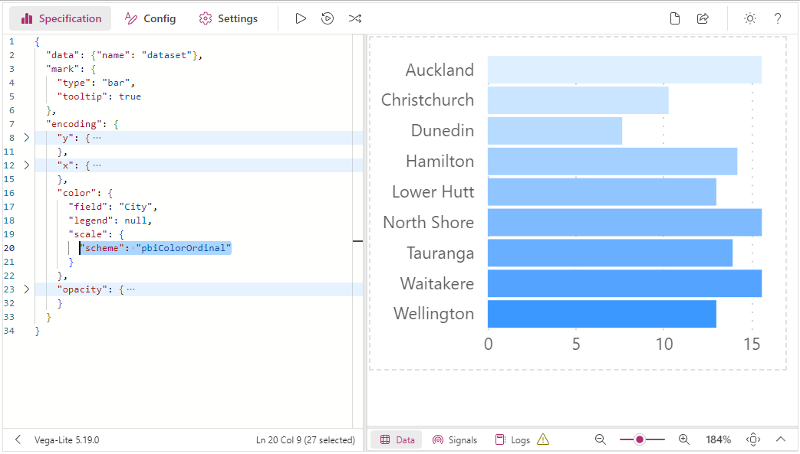
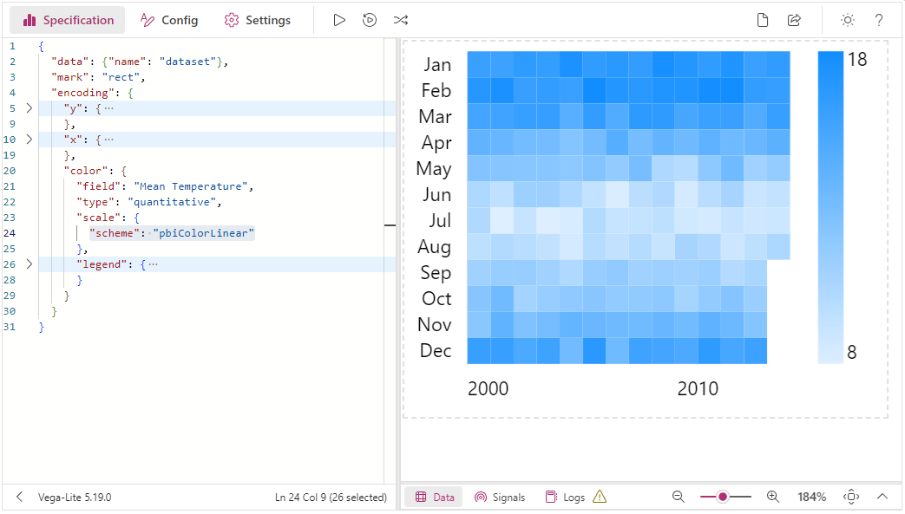
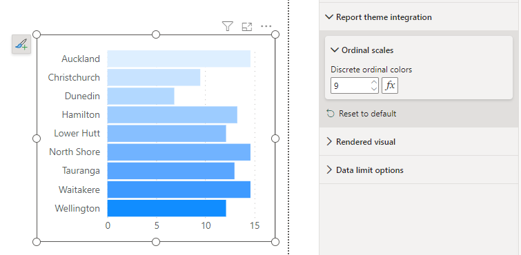

Deneb offers four custom [Vega Color schemes](https://vega.github.io/vega/docs/schemes/) that are tied to the current report theme and will update at run-time. This allows you to keep your visual's color scheme in-sync with your report, if you so wish.

## Usage

The schemes can be used wherever you might reference a color scheme in a Vega or Vega-Lite scale, e.g.:

```json title=Vega-Lite
{
  ...
  "encoding": {
    "color": {
      "field": "City",
      "legend": null,
      "scale": {"scheme": "pbiColorNominal"}
    }
  }
  ...
}
```

```json title=Vega
{
  ...
  "scales": [
    {
      "name": "color",
      "type": "ordinal",
      "domain": {
        "data": "dataset",
        "field": "City",
        "sort": true
      },
      "range": {
        "scheme": "pbiColorOrdinal"
      }
    }
  ],
  ...
}
```

## Available Schemes

### `pbiColorNominal`

The `pbiColorNominal` scheme is intended to be used for nominal/categorical discrete categories, and matches the current Power BI theme colors, e.g.:


### `pbiColorOrdinal`

The `pbiColorNominal` scheme can be used for ordinal categories, and uses a ramped scale from the Min divergent Color to the Max divergent color from the current Power BI theme (excluding Middle color), e.g.:




:::caution Ordinal Scheme has Limited Discrete Colors
The total number of colors to allocate to the ordinal palette is a fixed number. This is **10** by default.

When this limit is reached, the palette 'wraps' back around, which might not be ideal. Similarly, if you don't have enough discrete values, then you may not see an adequate gradient. We have ways of assisting you with this - refer to the [Discrete Ordinal Colors](#discrete-ordinal-colors) section below for more details.
:::

### `pbiColorLinear`

The `pbiColorLinear` scheme will produce an interpolated gradient from the Min divergent Color to the Max divergent color from the current Power BI theme (excluding Middle color), e.g.:



### `pbiColorDivergent`

The `pbiColorDivergent` scheme will produce an interpolated gradient from the Min divergent Color to the Max divergent color from the current Power BI theme (including Middle color), e.g.:


### Discrete Ordinal Colors

As mentioned higher-up, we only have a limited number of colors in an ordinal palette as they are manually specified values, rather than a linear ramp. We could potentially see issues like the following examples if we don't get this right. The functionality to mitigate these issues follows on afterwards.

#### Issue #1: Not Enough Discrete Colors = "Wrapping"

If we were to allocate, say, 5 discrete colors to our palette but had more values than this, we get a "Wrapping" effect, e.g.:


#### Issue #2: Not Enough Discrete Values = Indistinct Gradient

If we try to mitigate this by guessing a hypothetical number of colors - say, 50 - then we perhaps don't get desired results at a lower cardinality than that, e.g.:


#### Managing via Properties

The **Report Theme Integration** menu in the Power BI Format pane allows you to configure the number of values using the **Discrete Ordinal Colors** property, e.g.:



As you may not know what this number is going to be, the property supports [Conditional Formatting](https://docs.microsoft.com/en-us/power-bi/visuals/service-tips-and-tricks-for-color-formatting?WT.mc_id=DP-MVP-5003712#conditional-formatting-for-visualizations), so that you could bind a measure that could count the number of distinct category values. This would then allow dynamic assignment (and calculation) of the intervening colors, e.g.:


