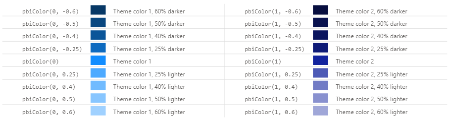
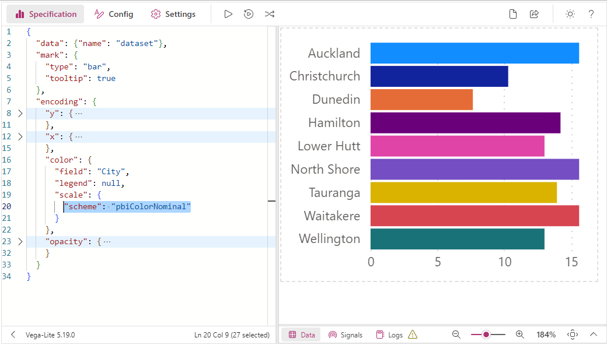
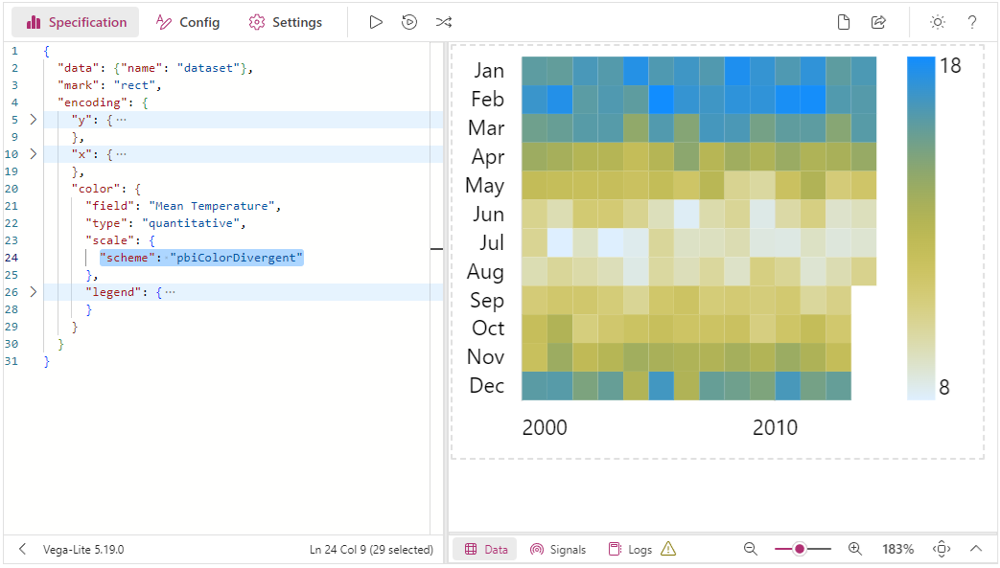

Deneb provides some means to bind to your report's current theme, in the form of:

- Expression-based access using a custom function
- Custom [Vega Color schemes](https://vega.github.io/vega/docs/schemes/)

This functionality will dynamically reference the theme are run-time, meaning that if you change your colors, Deneb will keep these references in-sync.

## Expression-Based Access Using `pbiColor`

Deneb provides a custom function, named `pbiColor` that you can use in [Vega or Vega-Lite expressions](https://vega.github.io/vega/docs/expressions/):

```
pbiColor(index|name, shadePercent = 0)
```

- The first parameter (`index` or `name`) provides access to the associated theme color:

  - `index` is a [zero-based](https://en.wikipedia.org/wiki/Zero-based_numbering) reference to the Power BI theme palette. This means that:

    - `0` = Theme color 1
    - `1` = Theme color 2
    - `2` = Theme color 3
    - ...and so on

  - `name` is a string value (surrounded by single quotes) that specifies a named color from the theme configuration. Valid names are:

    - `min` / `middle` / `max` for divergent colors.
    - `negative` / `neutral` / `positive` for sentiment colors.
    - Power BI also exposes `bad` and `good` for sentiment colors, which can also be used instead of `negative` or `positive`, should you prefer to use these instead.

    .")

- `shadePercent` is optional, and is a decimal value between `-1` (-100%) and `1` (100%).

  - If supplied, this will darken (< 0) or lighten (> 0) the color by the specified amount.
  - This is to provide variants of the theme colors, much like how Power BI does in its color picker.

For example, to specify a `bar` mark's `color` to use Theme color 1, you could use the following in your mark's properties:

```json
{
  ...
  "mark": {
    ...
    "color": {
      "expr": "pbiColor(0)"
    }
  }
}
```

Assuming that you are using the standard theme, output should look like the following for the theme's first two colors (`#118DFF` and `#12239E`):



## Power BI Schemes

The schemes can be used wherever you might reference a color scheme in a Vega or Vega-Lite scale, e.g.:

```json title=Vega-Lite showLineNumbers
{
  ...
  "encoding": {
    "color": {
      "field": "City",
      "legend": null,
      "scale": {"scheme": "pbiColorNominal"}
    }
  }
  ...
}
```

```json title=Vega showLineNumbers
{
  ...
  "scales": [
    {
      "name": "color",
      "type": "ordinal",
      "domain": {
        "data": "dataset",
        "field": "City",
        "sort": true
      },
      "range": {
        "scheme": "pbiColorOrdinal"
      }
    }
  ],
  ...
}
```

The available schemes are detailed further below.

### `pbiColorNominal`

The `pbiColorNominal` scheme is intended to be used for nominal/categorical discrete categories, and matches the current Power BI theme colors, e.g.:




### `pbiColorOrdinal`

The `pbiColorNominal` scheme can be used for ordinal categories, and uses a ramped scale from the Min divergent Color to the Max divergent color from the current Power BI theme (excluding Middle color), e.g.:


:::caution Ordinal Scheme has Limited Discrete Colors
The total number of colors to allocate to the ordinal palette is a fixed number. This is **10** by default.

When this limit is reached, the palette 'wraps' back around, which might not be ideal. Similarly, if you don't have enough discrete values, then you may not see an adequate gradient. We have ways of assisting you with this - refer to the [Discrete Ordinal Colors](#discrete-ordinal-colors) section below for more details.
:::

### `pbiColorLinear`

The `pbiColorLinear` scheme will produce an interpolated gradient from the Min divergent Color to the Max divergent color from the current Power BI theme (excluding Middle color), e.g.:


### `pbiColorDivergent`

The `pbiColorDivergent` scheme will produce an interpolated gradient from the Min divergent Color to the Max divergent color from the current Power BI theme (including Middle color), e.g.:


