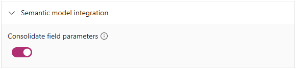
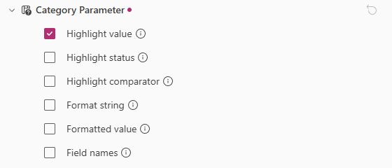
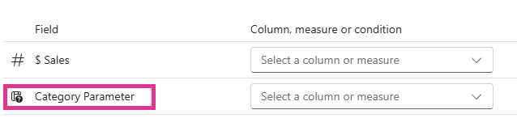

# Field Parameters

[Field parameters](https://learn.microsoft.com/en-us/power-bi/create-reports/power-bi-field-parameters) are a Power BI feature that allows report authors to let consumers dynamically swap columns or measures in and out of a visual via slicer selections. Starting with version 2.0, Deneb provides native support for field parameters, with options for how they are processed and displayed in the visual dataset.

## How Deneb Handles Field Parameters

When columns or measures belonging to a field parameter are added to the visual's **Values** data role, Deneb can detect this from the semantic model metadata. How these fields are represented in the dataset depends on the **Consolidate field parameters** setting, found in the **Semantic model integration** section of the **Project setup** pane.



There are two modes available:

- **Consolidation** (on) - component fields from a parameter are merged into array-valued columns named after the parameter. This is the recommended approach for new work.
- **Pass-through** (off) - component fields appear individually in the dataset, as if they were regular columns or measures.

:::info Default Behavior
For new projects, consolidation is **enabled** by default. For projects migrated from earlier versions of Deneb (prior to 2.0), pass-through is the default in order to preserve backward compatibility and avoid breaking existing specifications.
:::

## Consolidation Mode

When consolidation is enabled, Deneb groups fields that belong to the same field parameter and represents them as a single array-valued column, named after the parameter. Each row in this column contains an array of values, one per component field in the parameter, in data-view order.

For example, if you have a field parameter named **Metric** that contains the measures `[$ Sales]` and `[$ Profit]`, your dataset would contain a `Metric` column where each row holds an array like `[1000, 250]`.

### Companion Fields

In addition to the main array-valued column, Deneb can provide companion fields that give you access to metadata about the parameter's components. These are managed via the [Supporting Fields](dataset#column-or-measure-level-fields) configuration for the parameter, just as with other field types.

| Companion Field                                           | Description                                                                                                                   | Default                            |
| --------------------------------------------------------- | ----------------------------------------------------------------------------------------------------------------------------- | ---------------------------------- |
| Highlight value (`[Parameter]__highlight`)                | Array of per-component highlight values (measures use the highlight value from Power BI; columns pass through the base value) | When cross-highlighting is enabled |
| Highlight status (`[Parameter]__highlightStatus`)         | Array of per-component highlight status strings: `'neutral'`, `'on'`, or `'off'`                                              | Disabled                           |
| Highlight comparator (`[Parameter]__highlightComparator`) | Array of per-component comparator strings: `'eq'`, `'lt'`, `'gt'`, or `'neq'`                                                 | Disabled                           |
| Format string (`[Parameter]__format`)                     | Array of format strings from the semantic model                                                                               | Disabled                           |
| Formatted value (`[Parameter]__formatted`)                | Array of pre-formatted display values                                                                                         | Disabled                           |
| Field names (`[Parameter]__names`)                        | Array of component field display names (e.g., `["$ Sales", "$ Profit"]`)                                                      | Disabled                           |



:::tip Using Multiple Parameter Values
The `__names` companion field is particularly useful when you need to label or distinguish between the component fields after flattening (see below). Since it is disabled by default, you will need to enable it in the **Supporting Fields** settings for the parameter before it appears in the dataset.
:::

:::tip Autocomplete awareness
Deneb's JSON editor autocomplete suggests only the companion fields that are currently enabled for a parameter (for example, `Metric__names` will only appear as a suggestion if **Field names** is checked in the parameter's Supporting Fields configuration). If you expect a companion field to be available but it isn't appearing in autocomplete, check the parameter's entry in the [Supporting Fields](dataset#column-or-measure-level-fields) tree and enable the corresponding flag.
:::

### Working with Array Data

Because consolidated field parameters produce array-valued columns, you will typically need to use a **flatten** transform to decompose them into individual rows before encoding. This is a standard Vega and Vega-Lite transform.

:::note
If you intend to use field parameters in single-select mode via a slicer or filter, Vega and Vega-Lite can flatten single entry arrays for most simple cases, including display, so you can test how this works before proceeding with transforms if necessary.
:::

```json title="Vega-Lite transform example"
{
  "data": { "name": "dataset" },
  "transform": [
    {
      "flatten": ["Metric", "Metric__names"]
    }
  ],
  "mark": "bar",
  "encoding": {
    "x": { "field": "Metric", "type": "quantitative" },
    "color": { "field": "Metric__names", "type": "nominal" }
  }
}
```

```json title="Vega transform example"
{
  "data": [
    { "name": "dataset" },
    {
      "name": "flattened",
      "source": "dataset",
      "transform": [
        {
          "type": "flatten",
          "fields": ["Metric", "Metric__names"]
        }
      ]
    }
  ]
}
```

The `flatten` transform creates a new row for each element in the array, pairing values across all flattened fields by index. The original `__row__` value is preserved through this process, which is important for maintaining [Power BI interactivity](interactivity-overview) such as tooltips and cross-filtering.

### Per-Field Override: "Treat as Field Parameter"

When consolidation is enabled, each column or measure in the dataset configuration has a **Treat as field parameter** option. This allows you to manually flag a regular field as a field parameter, which wraps its value in a single-element array.

This is useful in the following scenarios:

- **Template compatibility**: when importing a template that was designed for a field parameter, but you want to assign a regular column or measure to that slot.
- **Testing**: when developing a specification that uses `flatten` transforms, and you want to test with regular fields before connecting actual field parameters.

When enabled, the field behaves as a single-component parameter: its value becomes a one-element array. If `__names` is also enabled, it will contain the field's display name as a single-element array.

## Pass-Through Mode

When consolidation is disabled, Deneb ignores field parameter metadata entirely. Component fields from a parameter appear as individual columns or measures in the dataset, each assigned its underlying role (grouping for columns, aggregation for measures).

This mode exists primarily for backward compatibility. Prior to Deneb 2.0, [community workarounds](https://github.com/deneb-viz/deneb/issues/238#issuecomment-1501033734) existed for working with field parameters by modifying the parameter's DAX table so that the first column uses a known constant name. Pass-through mode ensures these existing approaches continue to work without modification.

### The Constant-Name Workaround

The key idea is to modify the field parameter's calculated table in DAX so that the first column (which becomes the field name in the visual) is set to a constant value. This means the field name doesn't change when the user selects a different parameter value in the slicer.

For example, given a standard field parameter like this:

```dax
FPTest = {
    ("Country", NAMEOF('Data'[Country]), 0),
    ("Size", NAMEOF('Data'[Size]), 1)
}
```

You would set all values in the first column to the same constant, and add an extra column to use as the slicer label:

```dax
FPTest = {
    ("Series", NAMEOF('Data'[Country]), 0, "By Country"),
    ("Series", NAMEOF('Data'[Size]), 1, "By Size")
}
```

The new fourth column (renamed from `Value4` to something meaningful) is used in the slicer instead of the original. The first column — now always `"Series"` — is added to the Deneb visual's **Values** data role and can be referenced in your specification by that constant name regardless of slicer selection.

:::caution
This workaround requires modifying the Power BI field parameter's DAX definition and relies on implementation details of how Power BI generates field parameter tables. It may be subject to change if Microsoft changes their field parameter implementation. For new work, [consolidation mode](#consolidation-mode) is the recommended approach.
:::

:::tip Migration
If you have existing visuals that use this workaround, they will continue to work as-is after upgrading to Deneb 2.0, since pass-through is the default for migrated projects. You can opt in to consolidation mode at any time by enabling the setting.
:::

## Template Behavior

Field parameters are fully supported in [template](templates) export and import workflows:

- **Export**: consolidated parameter fields are exported with the role `field-parameter` in the template metadata, along with their supporting field configuration. Component fields are not individually listed; the parameter is the tracked unit.
- **Import**: when a template contains a field with the `field-parameter` role, Deneb shows a dedicated icon in the field assignment UI to indicate this.
  - If you assign an actual field parameter to the slot, consolidation is automatically enabled for the project.
  - If you assign a regular column or measure to a parameter slot, Deneb automatically flags the field as "treat as field parameter" and enables consolidation for the project, so the specification's `flatten` transforms continue to work without any manual intervention.



## Limitations

- **Component field ordering** within a consolidated parameter depends on the field's position in the Power BI data view, which may not correspond to alphabetical order or the order defined in the parameter table. There is no way to specify a custom sort order for components.
- **Highlight companion fields produce arrays**, not scalars. The `__highlightStatus` and `__highlightComparator` values within each array are computed per-component: column components pass through their base value (producing `'eq'`/`'neutral'`), while measure components use the highlight value from Power BI. This is a different shape to the scalar highlight fields produced for regular measures.
