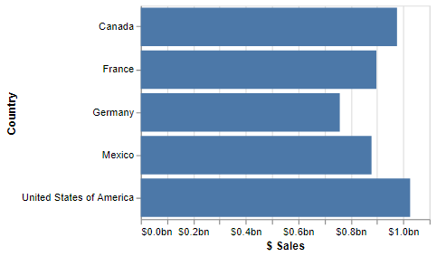
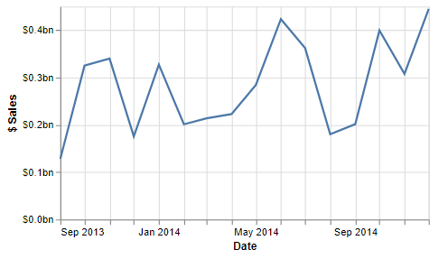
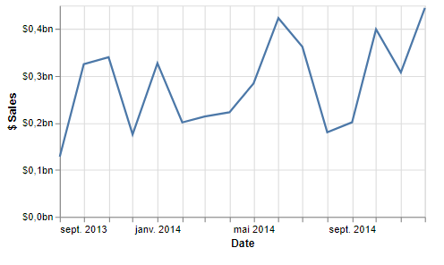

# Formatting Values

## Default Formatting Behavior

When it comes to formatting values (if you're just using simple encodings), then Vega or Vega-Lite will use its own deterministic behavior to figure out things like decimal precision or other elements.

You can provide your own overrides to these wherever they are used. [Vega](https://vega.github.io/vega/docs/api/locale/) and [Vega-Lite](https://vega.github.io/vega-lite/docs/format.html) both use the D3 formatting convention for [numbers](https://github.com/d3/d3-format) and [date & time](https://github.com/d3/d3-time-format) values (incidentally, so does [Charticulator](https://charticulator.com/docs/user-interaction.html#text-formatting)).

Power BI [has its own syntax](https://docs.microsoft.com/en-us/power-bi/create-reports/desktop-custom-format-strings?WT.mc_id=DP-MVP-5003712#supported-custom-format-syntax), which is probably your preference for applying any customized formatting strings into a specification.

To ensure correct compatibility with Vega and Vega-Lite, particularly if you're bringing examples in (or even looking to take them out!) Deneb will use the D3 convention by default, but there's some help at hand if that's not your preference.

## Power BI Custom Formatter

If you prefer working with Power BI format strings, Deneb has [custom format types](https://vega.github.io/vega-lite/docs/config.html#custom-format-type) named `pbiFormat` and `pbiFormatAutoUnit` that you can use in lieu of the D3 format convention.

## Vega-Lite Implementation

In Vega-Lite, we can specify `"pbiFormat"` as a `formatType` wherever you're specifying a `format`.

#### Quantitative Axis Example

Let's say we have a simple bar chart that uses the Power BI financial sample dataset, which shows `[$ Sales]` for each `[Country]`:

```json showLineNumbers
{
  "data": {
    "name": "dataset"
  },
  "mark": {
    "type": "bar"
  },
  "encoding": {
    "y": {
      "field": "Country",
      "type": "nominal"
    },
    "x": {
      "field": "$ Sales",
      "type": "quantitative"
    }
  }
}
```

And this will result in the following output:

. The measure axis displays raw values, with a maximum of 1,000,000,000.")

That's a lot of zeroes! What might be nicer is if his were a little easier to read. If we want to use a Power BI format string for this, we can modify the specification as follows to show values in $bn to one decimal place (changes highlighted):

```json highlight={8-11} showLineNumbers
{
  ...
  "encoding": {
    ...
    "x": {
      "field": "$ Sales",
      "type": "quantitative",
      "axis": {
        "format": "$#0,,,.0bn",
        "formatType": "pbiFormat"
      }
    }
  }
}
```

This results in something a little more human-readable:



:::info Vega-Lite's format property is extensible
The `format` property can also expect an object instead of a string. If you use an object for the `pbiFormat` or `pbiFormatAutoUnit` format types, you can use an object that can include any of the optional `ValueFormatterOptions` properties from [Microsoft's formatting library for custom visuals](https://learn.microsoft.com/en-us/power-bi/developer/visuals/utils-formatting?WT.mc_id=DP-MVP-5003712#valueformatteroptions). The following example is synonymous with the above one:

```json highlight={9-12} showLineNumbers
{
  ...
  "encoding": {
    ...
    "x": {
      "field": "$ Sales",
      "type": "quantitative",
      "axis": {
        "format": {
          "format": "#0.0",
          "value": 1e9        // 1 billion
        },
        "formatType": "pbiFormat"
      }
    }
  }
}
```

:::

#### Quantitative & Temporal Axes Example

If instead, we had a line chart using the same dataset, but this time we wanted to plot `[$ Sales]` by `[Date]` then we could express this as follows:

```json showLineNumbers
{
  "data": {
    "name": "dataset"
  },
  "mark": {
    "type": "line"
  },
  "encoding": {
    "x": {
      "field": "Date",
      "type": "temporal"
    },
    "y": {
      "field": "$ Sales",
      "type": "quantitative"
    }
  }
}
```

And here's how it looks out of the gate:

. The measure axis displays raw values, with a maximum of just over 400,000,000.")

We could use a similar approach as above for both axes, to get them how we want (changes highlighted):

```json highlight={6-9,13-16} showLineNumbers
{
  ...
  "encoding": {
    "x": {
      ...
      "axis": {
        "format": "MMM yyyy",
        "formatType": "pbiFormat"
      }
    },
    "y": {
      ...
      "axis": {
        "format": "$#0,,,.0bn",
        "formatType": "pbiFormat"
      }
    }
  }
}
```

And now, we have both axes formatted as we like:



## Vega Implementation

If using Vega, you'd call the custom formatter in lieu of the [format](https://vega.github.io/vega/docs/expressions/#format) expression, e.g. for an axis tick label:

```json highlight={10} showLineNumbers
{
  ...
  "axes": [
    {
      ...
      "encode": {
        "labels": {
          "update": {
            "text": {
              "signal": "pbiFormat(datum.value, '$#0,,,.0bn')"
            }
          }
        }
      }
    },
    ...
  ],
  ...
}
```

## Locale-Awareness

If using the `pbiFormat` formatter, Deneb currently will resolve your locale [according to your Power BI configuration](https://docs.microsoft.com/en-us/power-bi/fundamentals/supported-languages-countries-regions?WT.mc_id=DP-MVP-5003712#choose-the-language-or-locale-of-power-bi-desktop) for any values.

For example, we can view the live chart example from above _en français_ (fr-FR), and the formatting strings will work as expected:



### Overriding User Locale

If you wish to specify a different local to Power BI's one (for example, you wish values to be norrmalized to the same currency for your users irrespective of location), you can either override this using the `locale` property of a specification's config ([V](https://vega.github.io/vega/docs/config/#:~:text=%22strokeWidth%22.-,locale,-Object) | [VL](https://vega.github.io/vega-lite/docs/config.html#aria-config)), or manually specify a valid Power BI locale within the `options.cultureSelector` property in an expression function for `pbiFormat` (more on this below).

## Auto Formatting with `pbiFormatAutoUnit`

Many Power BI visuals contain an _Auto_ unit type when applying properties. Deneb also contains `pbiFormatAutoUnit` as a type that mimics this behavior, e.g.:

```json highlight={9} showLineNumbers
{
  ...
  "encoding": {
    ...
    "x": {
      "field": "$ Sales",
      "type": "quantitative",
      "axis": {
        "formatType": "pbiFormatAutoUnit"
      }
    }
  }
}
```

You can still use a `format` property as normal to specify a specific format string to use in conjunction with the resolved value; this just illustrates that you can omit it and get numbers formatted to their nearest degree of scale with minimal overhead with this format type.

## `pbiFormat` Expression Function Full Implementation Details

When using `pbiFormat` in an expression function, you have a bit more versatility over using in the encoding properties directly. The full signature for this function when used in expressions is as follows:

```
pbiFormat(value, format, options = {})
```

- The `value` parameter is the number value that you wish to format.

- The `format` parameter is a [valid Power BI format string](https://docs.microsoft.com/en-us/power-bi/create-reports/desktop-custom-format-strings?WT.mc_id=DP-MVP-5003712#supported-custom-format-syntax).

- The `options` parameter is an optional object, where you can supply any of the optional `ValueFormatterOptions` properties from [Microsoft's formatting library for custom visuals](https://learn.microsoft.com/en-us/power-bi/developer/visuals/utils-formatting?WT.mc_id=DP-MVP-5003712#valueformatteroptions).

  Not all properties will translate to useful functionality within Deneb, so the key ones that you might find useful are:

  - `format` - format string to use **\***

  - `precision` - the maximum number of decimal places to show **\***

  - `value` - the value to use when formatting. For example:

    - `1e3` for values to be formatted as thousands.
    - `1e6` for values to be formatted as millions.
    - `1e9` for values to be formatted as billions.
    - `1e12` for values to be formatted as trillions.
    - A dynamic value (e.g. that of your measure) to auto format to thouands, millions, etc., like Power BI does.

  - `cultureSelector` - a valid Power BI culture code, which will enforce formatting to a specific locale, e.g. `en-GB`, `fr-FR`.

  _**\*** will override the `format` parameter if specified_

`pbiFormatAutoUnit` is a convenience function for `pbiFormat` with the `value` property automatically set to the current data value, coercing Power BI to use the nearest sensible unit. As such, the signature is the same as for `pbiFormat`, but would make sense to not set the `value` property to something else.

## Working with Dynamic Format Strings (for Measures and Calculation Groups)

Power BI has the capability for dynamic format strings to be applied for [calculation groups](https://learn.microsoft.com/en-us/analysis-services/tabular-models/calculation-groups#dynamic-format-strings) (and as of May 2023) [for regular measures](https://learn.microsoft.com/en-us/power-bi/create-reports/desktop-dynamic-format-strings). This now means that in some cases, formatting for a measure (or calculation item) may be applied at the row level rather than measure level.

When numeric or date/time-based measures are present in the dataset, Deneb will create support fields for these at a row level:

- `[measure name]__format` - the format string for the measure. This is in case you need direct access to it for use in the `pbiFormat` function, or using the `pbiFormat` custom format type.

- `[measure_name]__formatted` - the measure value formatted according to the format string in the same row.
