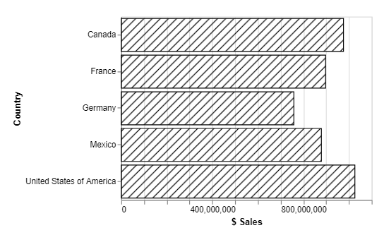
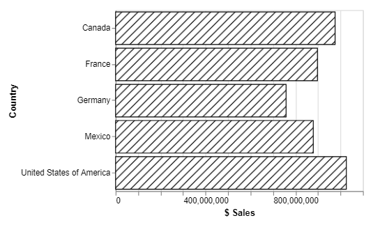
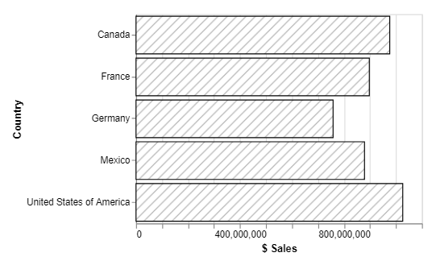
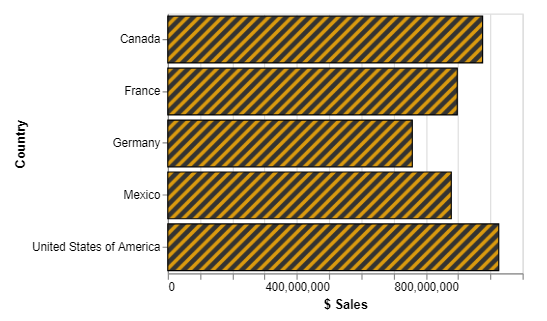

# Pattern Fills

:::caution Pattern fills are not a Vega feature
They are only supported for the SVG renderer and will not work for Canvas. Please bear these points in mind if looking to port a specification elsewhere.
:::

## Overview

There are a range of SVG fill patterns available wherever a `color`, `stroke` or `fill` can be used in a mark's property. These are based on [the excellent work of Irene Ros](https://iros.github.io/patternfills/).

Because SVG patterns have to be explicitly defined inside a web page, we can't add all possible combinations of colors and patterns without significant performance reduction. Therefore the functionality is split into two components:

1. **Default Patterns**: pre-defined monochrome patterns, which are a good starting point for many data visualization use cases.
2. **Dynamic Variations**: a custom expression function to generate variations of the default patterns with a specific foreground and/or background color.

## Default Patterns

Default patterns are referenced using the following syntax:

```
url(#[pattern name])
```

For example, if we want to use the `diagonal-stripe-1` pattern, we would refer to this as follows:

```
url(#diagonal-stripe-1)
```

So, instead of shading our example bar chart from the formatting page with a color, we could use this instead, e.g.:

```json {5} showLineNumbers
{
  "data": { "name": "dataset" },
  "mark": {
    "type": "bar",
    "fill": "url(#diagonal-stripe-1)"
  },
  "encoding": {
    "y": {
      "field": "Country",
      "type": "nominal"
    },
    "x": {
      "field": "$ Sales",
      "type": "quantitative"
    }
  }
}
```

And instead of a solid fill, we would now get the following rendered visual:

. The measure axis displays raw values, with a maximum of 1,000,000,000. We have specified the 'diagonal-stripe-1' pattern fill to fill the bars with a pattern instead of a solid color.")

We could augment this with a `stroke` to provide a boundary to the mark, e.g.:

```json highlight={6} showLineNumbers
{
  "data": { "name": "dataset" },
  "mark": {
    "type": "bar",
    "fill": "url(#diagonal-stripe-1)",
    "stroke": "black"
  },
  "encoding": {
    "y": {
      "field": "Country",
      "type": "nominal"
    },
    "x": {
      "field": "$ Sales",
      "type": "quantitative"
    }
  }
}
```



### Backgrounds

Default patterns have a transparent background, and this can be observed in the above example with the x-axis gridlines. If you want to provide a solid background, you can either use the [dynamic pattern variation expression](#dynamic-variations), or layer a mark behind it with a solid fill, e.g.:

```json highlight={3-10,16-17} showLineNumbers
{
  "data": { "name": "dataset" },
  "layer": [
    {
      "mark": {
        "type": "bar",
        "fill": "white"
      }
    },
    {
      "mark": {
        "type": "bar",
        "fill": "url(#diagonal-stripe-1)",
        "stroke": "black"
      }
    }
  ],
  "encoding": {
    "y": {
      "field": "Country",
      "type": "nominal"
    },
    "x": {
      "field": "$ Sales",
      "type": "quantitative"
    }
  }
}
```



### Intensity Modifier

Default patterns also have a modifier suffix that can be added to reduce the intensity of the stroke from `black (#000000)` to a softer color. These are in intervals of 10, from `10` to `90`, and also at the 1st and 3rd quartiles (`25` and `75`).

So, for our above example, if we wish to reduce the stroke intensity down to 30%, we can use `url(#diagonal-stripe-1-30)`, e.g.:

```json highlight={13} showLineNumbers
{
  "data": { "name": "dataset" },
  "layer": [
    {
      "mark": {
        "type": "bar",
        "fill": "white"
      }
    },
    {
      "mark": {
        "type": "bar",
        "fill": "url(#diagonal-stripe-1-30)",
        "stroke": "black"
      }
    }
  ],
  "encoding": {
    "y": {
      "field": "Country",
      "type": "nominal"
    },
    "x": {
      "field": "$ Sales",
      "type": "quantitative"
    }
  }
}
```



### Available Patterns

The following Power BI report shows all available pre-defined patterns and their SVG URL IDs.

- You can hover over a pattern to get a tooltip showing its ID in a larger font, as well as how the SVG URL should look in order to apply it.
- The slicer at the bottom of the page can be used to observe the patterns at the specified intensity, and the SVG URL ID required to apply it.

<iframe
    width="100%"
    height="486"
    src="https://app.powerbi.com/view?r=eyJrIjoiMWY0NTdlYjQtYzVlZS00ZjJmLWExMGItNzIxNmYyMjk4ZjAxIiwidCI6IjUzYmJlMGQ3LTU0NzItNGQ0NS04NGY0LWJiNzJiYjFjMjI4OSJ9"
    frameborder="0"
    allowFullScreen="true"
/>

## Dynamic Variations

If you wish to use more color in your patterns, then Deneb provides an expression function that you can use. This will dynamically generate and apply a variation of a default SVG pattern definition to the visual's DOM, and re-use them if necessary.

### The `pbiPatternSVG` Expression Function

The function has the following syntax within a Vega or Vega-Lite expression ref:

```
pbiPatternSVG(pattern, foreground, background)
```

Where:

- `pattern` is one of the pre-defined pattern IDs above, enclosed with single quotes.

  - The `#` used in the SVG URL should not be included here.
  - If an unknown (or invalid) `pattern` is provided, then this will result in no fill being applied.

- `foreground` is a valid CSS color name or hex value, enclosed with single quotes.

  - If `foreground` is omitted (or `null`), Deneb will resolve this back to the value used by the default pattern (`black`).
  - `transparent` is a permitted value, and this will effectively hide the pattern stroke from the reader.
  - `foreground` overrides the intensity modifier, if this is supplied in `pattern`.

- `background` is a valid CSS color name or hex value, enclosed with single quotes.

  - If `background` is omitted, then Deneb will produce a transparent background for the generated pattern.

### Simple Example - Mark Properties

If we wanted to apply a custom foreground and background, we could use `pbiPatternSVG` in an expression function as follows:

```json highlight={5-7} showLineNumbers
{
  "data": { "name": "dataset" },
  "mark": {
    "type": "bar",
    "fill": {
      "expr": "pbiPatternSVG('diagonal-stripe-3', '#DA9A0F', '#333333')"
    },
    "stroke": "black"
  },
  "encoding": {
    "y": {
      "field": "Country",
      "type": "nominal"
    },
    "x": {
      "field": "$ Sales",
      "type": "quantitative"
    }
  }
}
```


