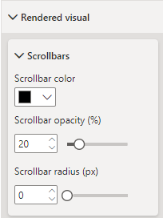

# Scrolling and Overflow

By default, Deneb will do its best to fit simple specifications to the visual container. However, there are many scenarios that can and will cause the displayed visual to overflow this container. Such scenarios can include setting the explicit height and/or width of your viewport, working with facets or repeating views, or using an explicit step size for a scale.

## On the Report Canvas

Let's use the step size as an example to demonstrate how this looks. Here, we have too many values on our y-axis, causing our visual to overflow vertically:

## Configuring Scrollbar Appearance

The **Scrollbars** formatting card in the **Rendered visual** menu in Power BI's formatting pane provides some customization options for the scrollbars:

- **Scrollbar color** allows you to tailor the displayed color of the scrollbar.

- **Scrollbar opacity (%)** allows you to tailor the opacity of the scrollbar.

- **Scrollbar radius (px)** allows you to tailor the corder radius of the scrollbar handle.

## In the Visual Editor

When viewing your specification in the Visual Editor's preview area, this is shown relative to the viewport marker (dotted area), so that you can quickly determine the degree of overflow and make any corrections if necessary, e.g.:

The preview area will have its own scrollbars as needed, and these also take effect if you zoom the output in to a larger footprint than the available room in the editor.

#### Confirming and Configuring Scrollbar Report Canvas Appearance in the Editor

If you want to see how the visual will appear on the canvas in terms of its scrolling behavior, you can enable the **Show scrollbars on overflow** property in the **Preview area** formatting card in the **Advanced area** property menu:

 to the viewport marker rather than the preview area.")

With this property enabled, Deneb will apply the scrollbars to the viewport marker rather than the preview area, e.g.:

The displayed scrollbars will also use the [appearance configuration](#configuring-scrollbar-appearance) from the **Scrollbars** formatting card, so you can use this option to test this within the editor if so desired.
