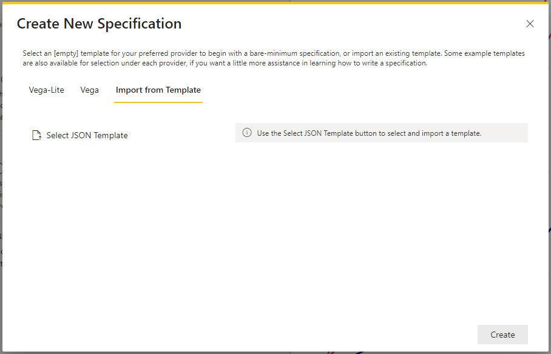
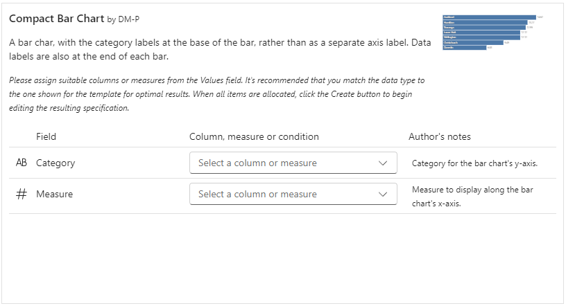
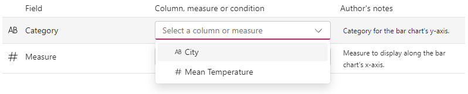
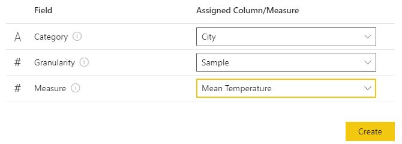
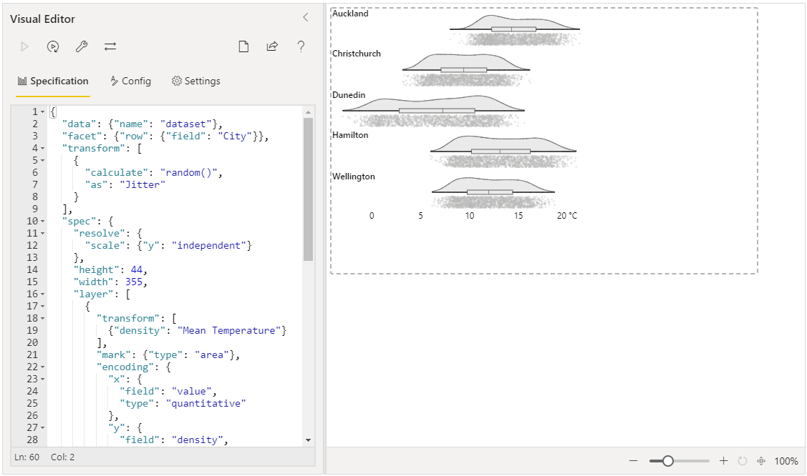
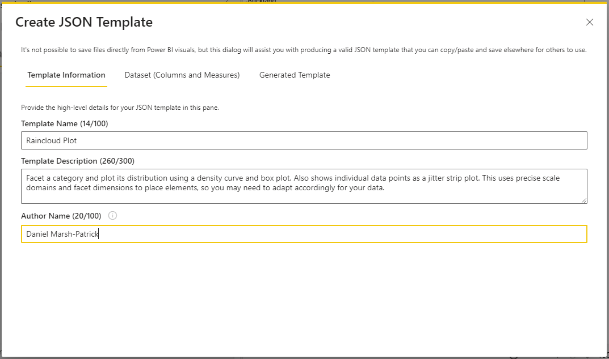
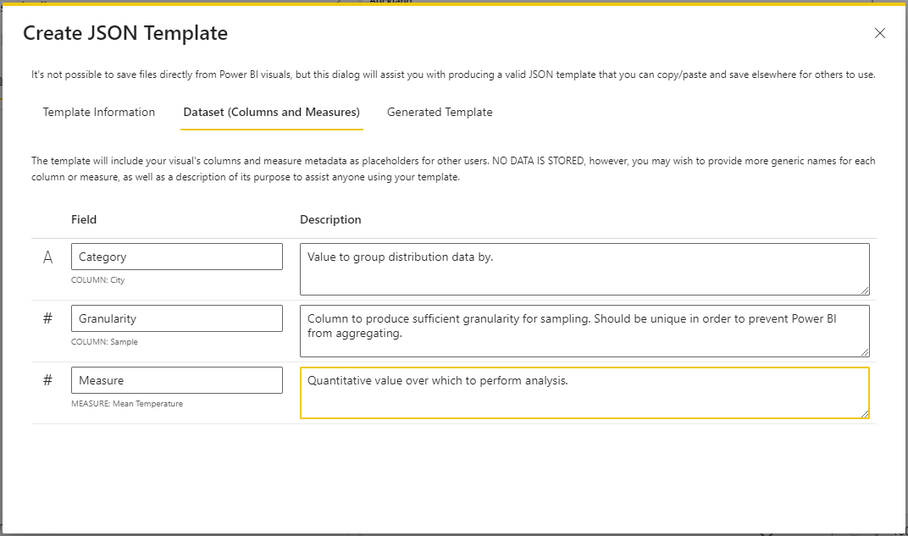

# Working with Templates

Deneb provides a number of built-in templates available from the **Create New Specification** dialog. This is demonstrated in the [Simple Worked Example](simple-example#selecting-the-template) when we create our first chart.

Of course, we can't capture everything in these templates, and they're really meant to help you get started. You can generate your own or import those generated by others.

## Importing a Template

Much like creating from an inbuilt template, to import a template, you will need to ensure that you have at least one column or measure in your visual's dataset so that the advanced editor can be accessed.

In the advanced editor's _Create New Specification_ dialog, you have the option to import a template:

Ensure that **Existing template** is selected as the method, and either click the area under **Import your file** to browse to your template's `.json` file. Click **Open** when ready.

If you have the content of your Deneb template copied to your clipboard (either as plain text or from a file in Explorer), you can paste it into this dialog with [Ctrl + V], and it will be imported if Deneb recognizes it as a valid template.

:::info Only valid Deneb templates can be imported
Deneb templates contain [special metadata](#template-structure) that are typically not present in Vega or Vega-Lite examples you may find elsewhere. For these examples, it's better to create an empty specification for your desired language, then paste the JSON into the editor.
:::

:::note `$schema` is stripped on template import
When a template is imported through the _Create New Specification_ dialog, Deneb removes any root-level `$schema` property from the specification before loading it into the editor. This is so the editor can use Deneb's internally-resolved schema for auto-completion, inline documentation, and validation, rather than attempting an external fetch that would be blocked in the AppSource build.

If you paste a specification directly into the editor (rather than importing it as a template), `$schema` is left in place and the editor will surface a [dedicated warning with a Quick Fix action](visual-editor#specification-editor-pane) so you can remove it.
:::

### Dataset Placeholders

The selected file's JSON will be validated, and if successful, the placeholder information will be displayed:

:::info Template Compatibility
Only valid Deneb templates can be imported. If you're looking to add a Vega or Vega-Lite specification from elsewhere, it's better to create a blank template for the appropriate provider. Then paste this into the editor and correct it directly, or manually add the required metadata for Deneb, then import. [Refer below](#template-structure) for more details on this.
:::

For each placeholder, the suggested data type (as used in the author's dataset) is shown next to the name.

You are not restricted to choosing columns or measures of the same data type, but it is likely that your results may vary if you do choose a different one from the author's design. The only restriction is that columns and measures cannot be used interchangeably; they are greyed out and disabled accordingly.

If the author entered a description for the placeholder, it can be viewed by interacting with the information icon next to it.

### Populating Placeholders

Click or expand a placeholder's dropdown list to select an appropriate column or measure from your dataset:

The data type for each column and measure is shown next to it, so that you can quickly identify eligible candidates. If a suitable candidate does not exist, you can add new columns or measures to the data model, and the details in the dropdown list will update accordingly.

Once all placeholders have been assigned, the _Create_ button is enabled:

:::tip Keep your Dataset Tidy
If you have anything from your dataset that is unassigned (particularly columns), it is recommended that you remove them in order to preserve the cardinality or row context that the template author originally intended.
:::

Selecting the _Create_ button will then add the template to the advanced editor, with all placeholders filled out as specified:

Everyone's data is different, so it is highly likely you'll need to make further tweaks to the specification to suit your particular scenario. Otherwise, you're good to go! 😄

## Generating a Template

If you're happy with a specification and wish to share it with others, or take a copy for reuse or source control, you can 'export' a template.

In the advanced editor, select the [Generate JSON Template](visual-editor#generate-json-template-ctrl--alt--e) command. This will open the dialog.

### Template Information

Fill in a suitable, descriptive name for the template, along with a more detailed description. This will be displayed to any users when importing it and should help them with filling it in.

#### Including a Preview Image

You can include a preview image in the output of your generated template.

:::danger Preview Images Can Potentially Contain Sensitive Information

- By generating a preview image, you are including visual information about your data in the template.
- Including a preview image can substantially increase the size of your JSON template.
- Because of these factors, you need to manually opt in each time the dialog is opened.

**If your data is sensitive, or you don't know whether your data is sensitive or not, do not include a preview image in your template.**

:::

By checking this box, Deneb will do the following:

- Use the [Vega View APIs](https://vega.github.io/vega/docs/api/view/#image-export) to generate a PNG-encoded image of the current view in the editor.
- Constrain this to a maximum of 150 x 150 pixels (which helps to keep the physical size of the template lower).
- The aspect ratio will be preserved, using the largest dimension of the image (either width or height).
- Include the base64 representation of this image in the template's `usermeta.information.previewImageBase64PNG` property ([refer below](#base64png) for more details).

### Template Dataset

Beneath the information and preview image, you have the opportunity to customize your dataset requirements for your users:

:::tip Keep Only What you Need
Deneb assumes all columns and measures from your dataset are required. If any columns or measures are superfluous to the template, remove them from the **Values** data role so they are also removed from this part of the dialog. This will ensure they aren't included for your end users and could cause side effects or ambiguity about how they should be used.
:::

Each dataset field has a text box where you can rename the placeholder to something more general-purpose for your template. This is also particularly useful if your names might be sensitive. It's recommended to use specific terms, which helps document your template for end users.

If you leave a box empty or delete its contents, the original name from your dataset will be used. This can also be seen in the **Original field** column for comparison purposes.

Each field has an optional **Author's notes** field. In here, you can add more information for your end users, if needed. This description will be displayed next to the field placeholder when used for import.

### Review and Export

When you're happy to proceed, you can either download the template file or copy it to the clipboard. If copying, you can paste into your editor of choice and save it with the `.json` extension.

:::note Exported templates include `$schema`
The template file produced here has the appropriate `$schema` URL for your provider added to the specification, so the output validates cleanly when opened in external tools such as the [Vega Editor](https://vega.github.io/editor/). Deneb strips `$schema` out again if the template is later imported through the _Create New Specification_ dialog.
:::

:::note Direct Downloads May Not Be Possible
Power BI visuals can only download a file **if your tenant admin has enabled downloading from custom visuals**. [You can learn more about this here](https://learn.microsoft.com/en-us/power-bi/admin/organizational-visuals#export-data-to-file).

If downloading is disabled, you will typically receive a warning when you click the **Download** button. In these cases, you can use the **Copy** button to copy the template definition to the clipboard.
:::

## Template Structure

Whilst templates do not include any data from your visual, they are intended to be portable. You would need to supply your own dataset, but it should be possible to use this as a jumping-off point for further work, similar to how you might start with an existing example before refining it in Deneb.

As such, a template is either a Vega or Vega-Lite specification, with a custom `usermeta` object ([Vega](https://vega.github.io/vega/docs/specification/#top-level-specification-properties) | [Vega-Lite](https://vega.github.io/vega-lite/docs/spec.html#top-level)). This would typically be ignored by an external Vega parser, but is used to identify the template as valid for Deneb. This has the following objects:

### `deneb`

_All properties are required._

- `build`: Which version the template was built with.
  - While this is required, it is purely for the purposes of troubleshooting at these early stages, so it is ideally left as-is.
- `metaVersion`: The template metadata version.
  - Valid values are `1` (v1 metadata) or `2` (v2 metadata). New templates are always produced with `2`; `1` is retained only for backward compatibility with templates created prior to Deneb 2.0.
  - This value tells Deneb which schema version the template conforms to, and determines which migrations to perform when an older template is imported.
  - For example, importing a v1 template into a version of Deneb that expects v2 metadata will trigger automatic migration of the template structure to the current format.
- `provider`: Which provider should be used when loading and parsing the template.
  - Valid values are `vega` or `vegaLite`.
  - If this is manually modified, Deneb will do its best to auto-resolve this from the top-level `$schema` property (if supplied), falling back to parsing spec. It's not guaranteed to be successful.

### `information`

The following required properties are populated from the details entered by the author in the _Template Information_ pane from the _Create JSON Template_ dialog:

- `name`: The name of the template that is displayed in the dialog for users, once imported.
- `description`: Longer-form details of the template purpose that are displayed in the dialog for users, once imported.
- `author`: Used to identify the author.
  - Currently not displayed in the dialog upon import (but might be later on).

The following required properties are auto-generated by Deneb:

- `uuid`: unique ID for the template.
- `generated`: time (in UTC) the template was generated.

The following properties are reserved for potential use elsewhere and are not currently used within Deneb. This may change later on:

- `supportUri`: A URI to indicate where further information about the template can be found (such as a blog or website).
- `videoUri`: A URI to indicate where a supporting video asset, such as a demo or 'how-to' guide, can be found.
- `previewImageBase64PNG`: Placeholder for a base64-encoded PNG image, which could be used for displaying a thumbnail or assistive image.
  - This is shown in the **Create New Specification** dialog if included with the template.
  - Images should be no larger than 150x150 pixels.

The `information` object can be further extended with any properties you want for your own needs, but they will be ignored by Deneb upon import.

### `dataset`

An array of field placeholder objects. Each entry describes a column or measure that the end user will need to supply when importing the template. The following properties are available for each entry:

| Property                    | Required | Type                                                     | Remarks                                                                                                                                                                                                                                                                                                                                                                 |
| --------------------------- | -------- | -------------------------------------------------------- | ----------------------------------------------------------------------------------------------------------------------------------------------------------------------------------------------------------------------------------------------------------------------------------------------------------------------------------------------------------------------- |
| `key`                       | Yes      | string                                                   | Unique placeholder name. Must start and end with `__` (double underscore) and contain only alphanumeric characters in between, e.g., `__myField__`. Max 30 characters.                                                                                                                                                                                                  |
| `name`                      | Yes      | string                                                   | Display name shown to the end user when assigning fields to the placeholder. Max 150 characters.                                                                                                                                                                                                                                                                        |
| `description`               | No       | string                                                   | Optional assistive text displayed to the end user next to the placeholder. Max 300 characters.                                                                                                                                                                                                                                                                          |
| `kind`                      | Yes      | `column` \| `measure` \| `parameter` \| `any`            | Specifies whether the placeholder expects a column, a measure, a [field parameter](field-parameters), or any of these. When set to `parameter`, Deneb shows a distinct icon in the field assignment UI at import time, automatically enables consolidation for the project, and flags the assigned field with _Treat as field parameter_ if a regular field is chosen. |
| `type`                      | Yes      | `bool` \| `text` \| `numeric` \| `dateTime` \| `other`   | The recommended data type for the placeholder, based on the author's original dataset. Shown to end users as guidance; using a different type is permitted but may require adjustments.                                                                                                                                                                                 |
| `supportFieldConfiguration` | No       | object                                                   | Per-field map of [supporting field](dataset#supporting-fields) flags to persist with the template, for example `{ "highlight": true, "format": true }`. Sparse - only flags explicitly set by the author are included; anything omitted falls back to Deneb's role-based defaults on import. The flag names match the [PBIR structure](pbir-guide#supportfieldconfiguration) (without the outer text-literal wrapping that PBIR requires). |

### `interactivity`

An optional object that specifies interactivity settings to apply when the template is imported. If omitted, Deneb's defaults are used. The following properties are available:

| Property              | Required | Default  | Type                   | Remarks                                                                                                                                                                                                    |
| --------------------- | -------- | -------- | ---------------------- | ---------------------------------------------------------------------------------------------------------------------------------------------------------------------------------------------------------- |
| `tooltip`             | Yes      | `true`   | boolean                | Enables the [Power BI tooltip handler](interactivity-tooltips) instead of Vega's built-in one.                                                                                                             |
| `contextMenu`         | Yes      | `true`   | boolean                | Controls whether the [Power BI context menu](interactivity-context-menu) appears on right-click.                                                                                                           |
| `contextMenuSelector` | No       | `true`   | boolean                | When the context menu is enabled, controls whether Deneb attempts to resolve the clicked data point for drill-through and other data-specific menu options. Only relevant when `contextMenu` is `true`.    |
| `selection`           | Yes      | `false`  | boolean                | Enables support for [cross-filtering](interactivity-selection) from data point click events.                                                                                                               |
| `selectionMode`       | No       | `simple` | `simple` \| `advanced` | The cross-filtering mode. `simple` lets Deneb resolve data points automatically. `advanced` relies on [advanced cross-filtering](interactivity-selection-advanced) events defined in a Vega specification. |
| `highlight`           | No       | `false`  | boolean                | Enables support for [cross-highlighting](interactivity-highlight) of measure values from other visuals.                                                                                                    |
| `dataPointLimit`      | Yes      | `50`     | number (1–250)         | Maximum number of data points to consolidate for cross-filtering operations. Only relevant when `selection` is `true`.                                                                                     |

### `config`

An optional string containing the config editor content for the template. This is JSON (or JSONC) turned into a string representation, matching how it appears in the Config Editor pane. If omitted, an empty config (`{}`) is assumed.

:::info Config separation
For templates created with versions prior to 1.7, the config was merged into the top-level specification. When such templates are imported, Deneb will split the config back out automatically. From 1.7 onwards, the spec and config are kept separate, and anything stored in `config` is treated as JSONC upon import.
:::

## Additional Considerations for Developers

If you're looking to generate suitable templates offline that can be imported, then you'll need to ensure that the Vega or Vega-Lite component (i.e., the main spec) validates accordingly.

As the `usermeta` object is extensible, there is a JSON schema you can use to validate that your object will parse correctly in Deneb when imported. This is hosted at:

https://deneb-viz.github.io/schema/deneb-template-usermeta-v1.json
