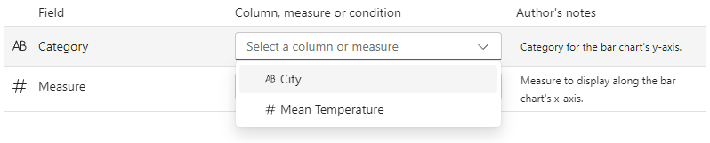
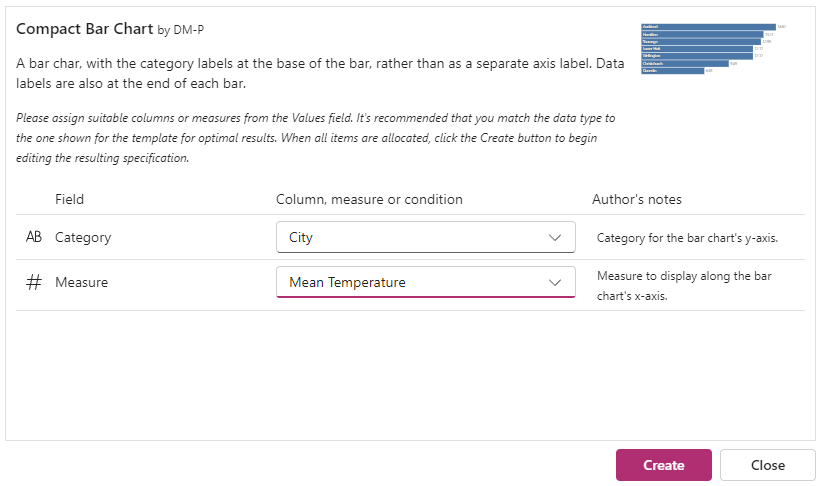
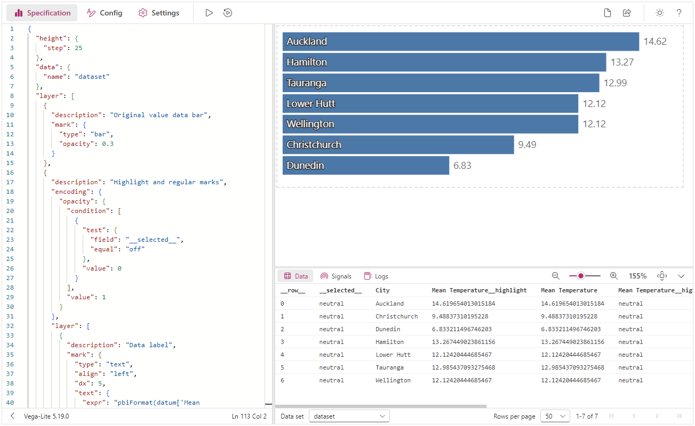
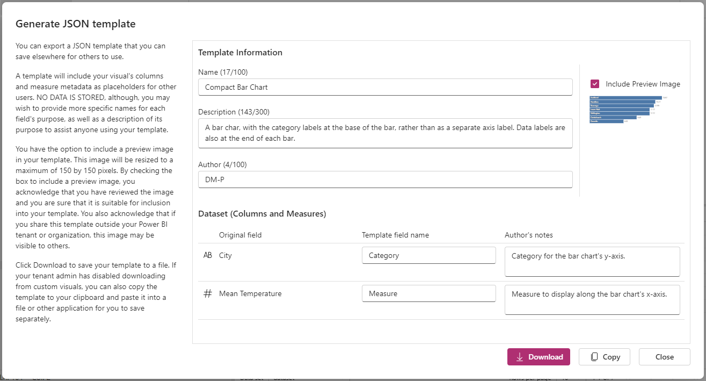
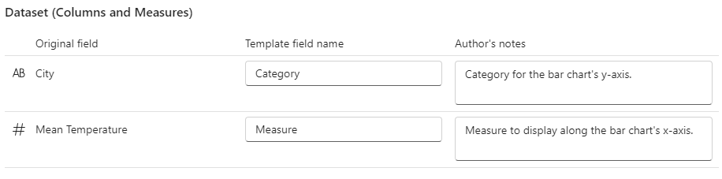

# Working with Templates

Deneb has a number of built-in templates that are available from the **Create New Specification** dialog. This is demonstrated in the [Simple Worked Example](simple-example#selecting-the-template) when we create our first chart.

Of course, we can't capture everything in these templates and they're really to help you in getting started. You are able to generate your own, or import those generated by others.

## Importing a Template

Much like creating from an inbuilt template, to import a template you will need to ensure that you have at least one column or measure in your visual's dataset so that the advanced editor can be accessed.

In the advanced editor's _Create New Specification_ dialog, you have the option to import a template, e.g.:

Navigate to or click **Select JSON Template**, browse to your template's `.json` file and click **Open**.

### Dataset Placeholders

The selected file's JSON will be validated and if successful, the placeholder information will be displayed, e.g.:

:::info Template Compatibility
Only valid Deneb templates can be imported. If you're looking to add a Vega or Vega-Lite specification from elsewhere, it's better to create a blank template for the appropriate provider. Then, paste this into the editor and correct it directly, or manually add the appropriate metadata required for Deneb and then import. [Refer below](#template-structure) for more detail on this.
:::

For each placeholder, the suggested data type (that the author used in their dataset) is shown next to the name.

You are not restricted to choosing columns or measures of the the same data type, but it is likely that your results may vary if you do choose a different one to the author's design. The only restriction is that columns and measures cannot be used interchangeably, and these are greyed-out and disabled accordingly.

If the author decided to enter a description for the placeholder, this can be viewed by interacting with the information icon next to it.

### Populating Placeholders

Click or expand a placeholder's dropdown list to select an appropriate column or measure from your dataset, e.g.:

The data type for each column and measure is shown next to it, so that you can quickly identify eligible candidates. If a suitable candidate does not exist, you can add new columns or measures from the data model and the details in the dropdown list will update to match.

Once all placeholders have been assigned, the _Create_ button is enabled, e.g.:

:::tip Keep your Dataset Tidy
If you have anything from your dataset that is unassigned, (particularly columns), it is recommended that you remove them, in order to preserve the cardinality or row context that the template author orginally intended.
:::

Selecting the _Create_ button will then add the template to the advanced editor, with all placeholders filled-out as specified, e.g.:

Everyone's data is different, so it is highly likely that you'll need to make further tweaks to the specification to make it suit your particular scenario, but otherwise you're good to go! 😄

## Generating a Template

:::note Direct Downloads are Not Possible
**Power BI visuals are not currently permitted to save/download files directly**, so this functionality is the best we can manage at present.
:::

If you're happy with a specification and wish to share with others, or take a copy for re-use or source control, it is possible to 'export' a template.

In the advanced editor, select the [Generate JSON Template](/visual-editor#generate-json-template-ctrl--alt--e) command. This will open the dialog.

### Template Information

In the first tab, fill in a suitable, descriptive name for the template and a more detailed description. This will be displayed to any users when importing it and should help then with filling it in. The author details are currently not shown on import, but will be later on.

### Template Information

In the second tab, you have the opportunity to customize your dataset requirements for your users:

:::tip Keep Only What you Need
Deneb assumes all columns and measures from your dataset are required. If any columns or measures are superfluous to the template, you should remove them from the **Values** data role so that they also get removed from this part of the dialog. This will ensure that they aren't included for your end users and cause potential side-effects or ambiguity as to how they should be used.
:::

Each dataset field has a text box that you can use to rename the placeholder to something more general-purpose for your template. This is also particularly useful if your names might be sensitive. It's recommended to try and use specific terms so this helps to document your template for end users.

If you leave a box empty or delete its contents the original name from your dataset will be used. This can also be seen underneath the box for comparison purposes.

Each field has an optional description. In here, you can type more information for your end users, should it be required. This description will be displayed in the information box next to the field placeholder when used for import.

### Review and Copy to Clipboard

In the final tab, you will see what the JSON for your generated template will look like, including the Deneb-specific metadata:

You cannot modify the data in this box, so if there are aspects of the template that you need to change, then you will need to edit in the appropriate place:

- For the specification and config, this needs to be done in the main editors.
- For the placeholders, navigate back to the appropriate tab and correct information accordingly.

When ready, you can either click the **Copy** button to the right of the dialog, or manually select the template text and copy it with **[ Ctrl + C ]**.

### Saving the Template File

Paste the template into your editor of choice and name it with an extension of `.json`.

## Template Structure

Whilst templates do not include any data from your visual, they are intended to be portable. You would need to supply your own dataset but it should be possible to use this as jumping-off point elsewhere, similar to how you might start with an existing example before refining it in Deneb.

As such, a template is either a Vega or Vega-Lite specification, with a custom `usermeta` object ([Vega](https://vega.github.io/vega/docs/specification/#top-level-specification-properties) | [Vega-Lite](https://vega.github.io/vega-lite/docs/spec.html#top-level)). This would typically be ignored by an external Vega parser but is used to identify the template as valid for Deneb. This has the following objects:

### `deneb`

_All properties are required._

- `build`: Which version the template was built with.
  - Whist this is required, it is purely for the purposes of troubleshooting at these early stages, so is ideally left as-is.
- `metaVersion`: The template metadata version.
  - Only a value of `1` is currently supported.
- `provider`: Which provider should be used when loading and parsing the template.
  - Valid values are `vega` or `vegaLite`.
  - If this is manually modified, Deneb will do its best to auto-resolve this from the top-level `$schema` property (if supplied), falling-back to parsing spec. It's not guaranteed to be successful.

### `information`

The following required properties are populated from the details entered by the author in the _Template Information_ pane from the _Create JSON Template_ dialog:

- `name`: The name of the template that is displayed in the dialog for users, once imported.
- `description`: Longer-form details of the template purpose that are displayed in the dialog for users, once imported.
- `author`: Used to identify the author.
  - Currently not displayed in the dialog upon import (but might be later on).

The following required properties are auto-generated by Deneb:

- `uuid`: unique ID for the template.
- `generated`: time (in UTC) the template was generated.

The following properties are reserved for potential use elsewhere, and are not currently used within Deneb. This may change later on:

- `supportUri`: A URI to indicate where further information about the template can be found (such as a blog or website).
- `videoUri`: A URI to indicate where a supporting video asset, such as a demo or 'how-to' guide can be found.
- `previewImageBase64PNG`: Placeholder for a base64-encoded PNG image, which could be used for displaying a thumbnail or assistive image.
  - This is shown in the **Create New Specification** dialog if included with the template.
  - Images should be no larger than 150x150 pixels.

The `information` object can be further extended with any properties you want for your own needs, but they will be ignored by Deneb upon import.

### `dataset`

_All properties are required._

## Additional Considerations for Developers

If you're looking to generate suitable templates offline that can be imported, then you'll need to ensure that the Vega or Vega-Lite component (i.e. the main spec) validates accordingly.

As the `usermeta` object is extensible, there is a JSON schema you can use to validate that your object will parse correctly in Deneb when imported. This is hosted at:

https://deneb-viz.github.io/schema/deneb-template-usermeta-v1.json
