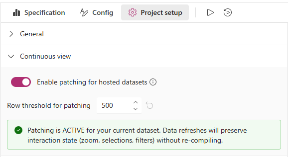
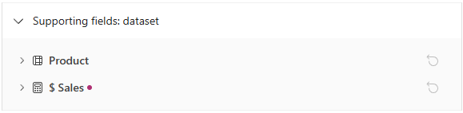
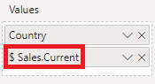
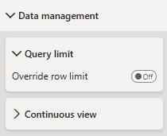

Any data you add to the visual's **Values** data role is automatically bound to an internal dataset named **`dataset`** in the Vega or Vega-Lite view. This will update dynamically as you add or remove columns and measures, or the number of rows in the dataset changes (e.g., filter context).

## Linking Visual Data to a Specification

Even though this is passed through from Power BI, a specification needs to contain a reference to the named `dataset`, otherwise the values cannot be encoded when the specification is parsed. You should always ensure that a specification contains the following content for this to work:

```json title=Vega-Lite
{
    ...
    "data": { "name": "dataset" }
    ...
}
```

```json title=Vega
{
    ...
    "data": [
        { "name": "dataset" }
    ]
    ...
}
```

The visual's starter templates all follow this approach, so if in doubt, create a new specification using the **\[empty]** template as a boilerplate.

## Grain / Row Context

Internally, the visual handles its dataset in much the same way as a core [table](https://learn.microsoft.com/en-us/power-bi/visuals/power-bi-visualization-tables?WT.mc_id=DP-MVP-5003712), i.e., the number of rows in the dataset is equivalent to the combination of all unique values across all columns and measures added.

Let's say that we have the following data in our visual:

 and measure (Mean Temperature).")

If you're used to working with JSON, a representation similar to the following JSON output is patched into the specification when it is parsed:

```json
{
  "dataset": [
    { "City": "Auckland", "Mean Temperature": 14.62 },
    { "City": "Christchurch", "Mean Temperature": 9.49 },
    { "City": "Dunedin", "Mean Temperature": 6.83 },
    { "City": "Hamilton", "Mean Temperature": 13.27 },
    { "City": "Lower Hutt", "Mean Temperature": 12.12 },
    { "City": "North Shore", "Mean Temperature": 14.62 },
    { "City": "Tauranga", "Mean Temperature": 12.99 },
    { "City": "Waitakere", "Mean Temperature": 14.62 },
    { "City": "Wellington", "Mean Temperature": 12.12 }
  ]
}
```

## Continuous View (Data Patching)

When Deneb receives a dataset update from Power BI - for example, after a slicer, cross-filter, or filter-pane change - the default behavior is to recompile the specification and re-initialize the Vega view from scratch. This resets the view state, such as zoom, pan, facet page, and any signal values driven by form widgets.

From 2.0, you can enable the **Enable patching for hosted datasets** option, available in the _Continuous view_ section of the [**Project setup** pane in the Visual editor](visual-editor#settings-pane), which updates the existing Vega view with new data instead, preserving view state across dataset updates. The setting is **off by default**. A companion **Row threshold for patching** setting controls the upper row count at which patching will be used.



Limits and considerations:

- Patching applies only when the updated dataset has no more than the configured row threshold (default: `500` rows). Above the threshold, Deneb will recompile and re-initialize as usual.
- There is a hard upper ceiling of `5,000` rows, above which patching is always bypassed, regardless of the configured threshold - the main thread cannot safely support patching above certain points, and you may notice severe [performance](performance#continuous-view-thresholds) degradation at higher cardinality or complexity.
- If patching fails for reasons other than row count (for example, on specs with force transforms that involve aggregates), Deneb will fall back to a full recompile and log a warning in the [Logs pane](visual-editor#logs-pane) explaining the fallback reason.
- The _Continuous view_ section in the **Project setup** pane will indicate whether patching is currently _active_ or _inactive_ for your dataset, so you can see at a glance whether updates are being patched or recompiled.

As this is a new feature under active evaluation, it is recommended to enable it only after confirming that your visual behaves as expected under realistic dataset updates (slicing, cross-filtering, and so on). If you notice inconsistent behavior, disable the setting and [open an issue](https://github.com/deneb-viz/deneb/issues/new) so we can reproduce and harden the feature accordingly.

## Supporting Fields

When using the [Data Pane](visual-editor#data-pane) to inspect your dataset, or [looking at a mark's datum with tooltips](interactivity-tooltips#debugging-with-tooltips), you will see additional fields that are not present in your data model, but are used to provide access to supporting information from your semantic model, or to hook into specific interaction functionality.

### Row-Level Fields

There is one occurrence of these fields for each row in the dataset.

#### `__row__`

The `__row__` field is a zero-based index of the row context for each record in the dataset. This is always added to help Deneb (and you) trace where a row may come from in relation to the initial query provided, and is necessary to allow Power BI understand how to resolve tooltips, context menu and cross-filtering. You can start by reading the [Interactivity Features](interactivity-overview) section to understand how this works in more detail and how it can help you with adding more interactivity with Power BI into your specifications.

#### `__selected__`

If cross-filtering is enabled for the visual, a `__selected__` field will be added to the dataset to indicate whether the row is the subject of cross-filtering. This also allows you to use this value when building encodings (for example, making a mark more transparent when it's not selected). You can read more about what this means in the [Cross-Filtering](interactivity-selection) section of the interactivity documentation.

### Column or Measure-Level Fields

For columns or measures added to the **Values** data role, Deneb will add an entry for each to the **Supporting Fields: dataset** section of the **Project setup** pane, e.g.:



- By default (and to minimize noise), not all fields are enabled by default, and the rules for each category are detailed in their appropriate section below.

  :::info Exceptions
  The selective configuration of supporting fields is available from version 2.0 onwards. As such, if you are working on a project that has been migrated, you may see all fields available for a particular column or measure. You are welcome to amend these to your preference and they will be remembered across the lifetime of your visual, or when you export your work to a [Template](templates).

  Likewise, if you have imported your project from a template, the author may have specified the inclusion of particular supporting fields and these will be enabled according to their preferences. Again, if you don't need a specific supporting field, you can remove them as needed. Or, if you are importing a template created with a version of Deneb prior to 2.0, all fields will be enabled by default and you can disable those you don't need.
  :::

- Each supporting field is toggled individually from its row in the tree; expand a column or measure to see its available flags and check or uncheck them as needed.
- A small accent dot on the field header indicates that the field is currently producing at least one supporting field in the dataset, whether by default or by explicit configuration.
- If you have changed the assigned supporting fields for a column or measure, there is a **Reset** option at the top-right of the field header that you can select to revert to the defaults for that field.


While there are multiple fields you can add, they cover three broad categories:

#### Cross-Highlight Management

These options are only available if [Cross-Highlighting](interactivity-highlight) is enabled for the visual. They allow you to manage the highlight value for a measure, which is the value that is used when a mark is highlighted as part of cross-highlighting. This allows you to encode the original value and the highlight value separately, which can be useful for certain types of visualizations.

By default, only **Highlight value** is enabled for measures. Columns do not support cross-highlight values and are not available as an option.

#### Field Formatting Information (from Semantic Model)

All columns and measures contain formatting information in the semantic model. A value for a column or measure is always its raw value, because this is the easiest to work with from the ground up. However if you want access to the format string (particularly if it is [dynamic at a row level](formatting#working-with-dynamic-format-strings-for-measures-and-calculation-groups)), or get access to the formatted value, these are selectable.

By default, these fields are not enabled.

#### Field Parameters

If a column or measure belongs to a [field parameter](https://learn.microsoft.com/en-us/power-bi/create-reports/power-bi-field-parameters), it can be consolidated with other component fields from the same parameter into array-valued columns. This is managed via the **Consolidate field parameters** setting in the **Semantic model integration** section of the **Project setup** pane. For full details on how this works, see [Field Parameters](field-parameters).

## Referencing Columns and Measures

Wherever you need to reference a column or a measure in your specification, you should use its **display name** from the **Values** data role rather than those from the data model.

If you rename or remove a column or measure, please remember to update your specification accordingly.

:::info Re-Mapping Encoded Fields
If a renamed/removed field is detected in any encodings or expressions used in your specification, the [**Edit Specification Field Mapping**](dataset#edit-specification-field-mapping) dialog will be automatically displayed.
:::

### 'Special Characters' in Column and Measure Names

You might use all kinds of characters in your data model when naming columns or measures. However, [Vega](https://vega.github.io/vega/docs/types/#Field) and [Vega-Lite](https://vega.github.io/vega-lite/docs/field.html) (and JSON) have some specific considerations to make with certain characters in field binding and expressions, notably `.`, `[`, `]`, `\`, and `"`.

In these cases, Deneb will replace occurrences of these characters with an underscore (`_`) when they are passed into the visual dataset. By doing this, we avoid placing the onus on you, the author, to remember how to escape them using the rules in the linked documentation above.

:::tip Checking field names
If you want to echo the logic in any tooling you have, an equivalent operation would be:

```js
displayName.replace(/([\\".[\]])/g, "_");
```

:::

To further illustrate, let's assume we have this measure:



Using this in a specification's `field` encoding would need to substitute the `.` with an underscore as follows:

```json {4} showLineNumbers
{
    ...
    "x": {
      "field": "$ Sales_Current",
      "type": "quantitative"
    }
    ...
}
```

It is recommended that if you're passing in measures or columns containing special characters and do not wish for this behavior to occur, then rename them in the **Values** data role so that they are not passed through to the dataset.

## Augmenting Other Datasets

In the case of a Vega specification, you can potentially add further `data` objects to the array, and Vega-Lite specifications can also contain layer-specific datasets (or multiple named ones), but bear the following in mind:

- AppSource-certified visuals are not permitted to bring in data or resources from external locations.
  - To this end, loading external files is not permitted in the visual.
  - You can attempt this in the [standalone version](getting-started#standalone-version) of the visual, but loading data from remote endpoints is subject to CORS restrictions due to security restrictions in all Power BI custom visuals. [You can read more about this here](https://www.html-content.com/reference/limitations#custom-visuals-high-level).
- As such, it is recommended that you regard the named `"dataset"` source as where all data for your specification should come from in terms of your data model.

## Considerations for Transforming Data

Both [Vega](https://vega.github.io/vega/docs/transforms/) and [Vega-Lite](https://vega.github.io/vega-lite/docs/transform.html) support the concept of transforms, which ultimately mutate the data from its initial state. Whilst this approach may be necessary to produce particular types of visuals, this changes the row context, and some features may no longer be available (particularly those that leverage interactivity). Please refer to the pages in the [Interactivity Features](interactivity-overview) section for more details.

## Query (Row) Limits

To keep performance usable in most cases, the visual caps the row count at **10,000** by default.

It is, however, possible to override this if you so wish, but the number of rows returned will be subject to resource limits and entirely at Power BI's discretion. If you wish to override this, you can find the _Data management_ menu in the Power BI Format pane:



Switching on the **Override row limit** property will ask Power BI to load more rows into the dataset, in batches of 10,000:


Because there's a lot to consider when enabling this property, the **Show data loading notes** property is enabled by default to provide creators or developers with a bit more detail on the caveats of using this feature in a condensed space.

Whilst the information can probably be seen in the screenshot, the important details are listed here too for you to bear in mind:

- Power BI will cause the visual's data to reload when:
  - You add or remove columns or measures from the _Values_ data role.
  - The visual's filter context is changed.
  - Values in the properties pane are modified.
- Most operations in the visual editor will not trigger this behavior, so with the exception of doing anything above, there should be minimal disruption in terms of Power BI reloading the dataset.
- However, **editing a specification with a lot of data can usually have negative performance implications**. Refer to the [Performance Considerations](performance) page for further details on potential risks and mitigation approaches.

When you're sufficiently used to the behavior of this feature (or when ready to publish and you don't want your users to see them), you can turn off the **Show data loading notes** property to de-clutter this:


