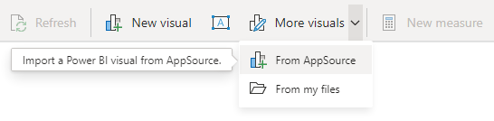
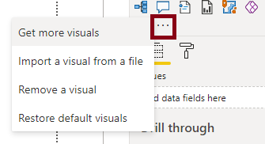
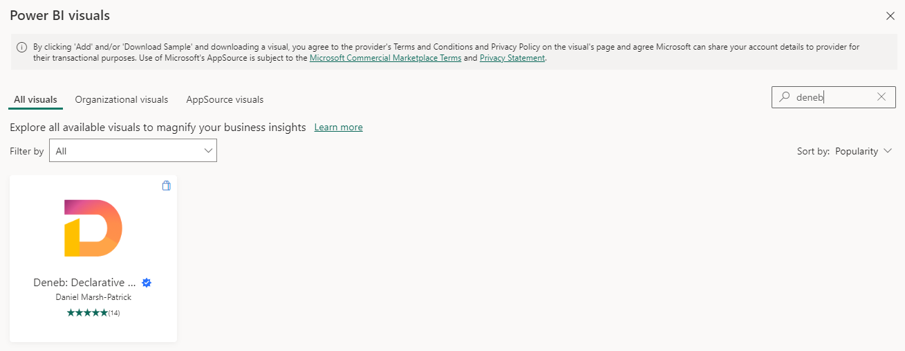
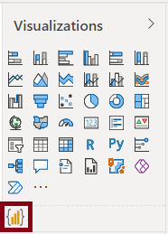
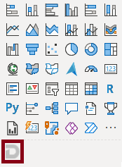
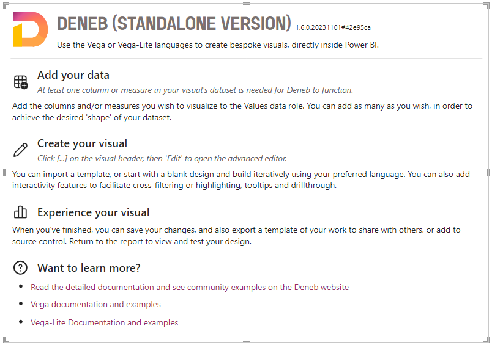

# Getting Started

## Installing from AppSource

Deneb is [available on AppSource](https://deneb.link/appsource?source=website&mktcmpid=getstarted), and this is the most straightforward way to get started and automatically stay up to date with the latest version.

If you like Deneb, please leave us a review - we'd love to know how you're getting on!

### Within Power BI Desktop

1.  To add: in Power BI Desktop, choose _Insert > More visuals > From AppSource_ in the ribbon:

    

    Or by clicking the ellipsis in the _Visualizations_ pane and choosing _Get more visuals_:

    

2.  In the _Power BI Visuals_ dialog, search for _Deneb_ - a shortlist of visuals will be displayed.

    

3.  Click on _Deneb_ in the shortlist to open the visual.

4.  Click the _Get It Now_ button to add to your report.

5.  After a short time, **Deneb** will be visible in your _Visualizations_ pane:

    

You're ready to start creating.

## Standalone Version

Because Deneb is certified, there are [certain restrictions](https://learn.microsoft.com/en-us/power-bi/developer/visuals/power-bi-custom-visuals-certified?WT.mc_id=DP-MVP-5003712#source-code-requirements) imposed upon it. If you wish to use features such as loading images from remote URLs, you will need to download the standalone version.

Note that **the standalone version is not tied to AppSource** and will require manual updates when new versions are published. This can be mitigated by setting it up as an [organizational visual](https://learn.microsoft.com/en-us/power-bi/developer/visuals/power-bi-custom-visuals-organization?WT.mc_id=DP-MVP-5003712) if you are using it across many reports.

The latest version is published via _Releases_ in [Deneb's GitHub repository](https://github.com/deneb-viz/deneb). The packaged .pbiviz file is available in the _Assets_ section for a particular release.

You can also use this link to [jump straight to the latest release page](https://github.com/deneb-viz/deneb/releases/latest).

:::caution Trust Your Sources
**Please be careful when installing custom visuals from unknown or unsolicited sources**. I can assure you that [our intentions are honorable](/privacy-policy), but you should exercise caution around your data. If you have any doubts, work with your admins to ensure all necessary checks and balances are carried out.
:::

### Identification

The standalone build can be identified by its greyscale version of the regular Deneb icon:

The landing page also specifies the standalone version:

## Early Access Build Channels

Due to the AppSource submission process being lengthy, users wishing to trial or provide feedback on early-access releases can find [more information about installing these builds here](/community/early-access).
