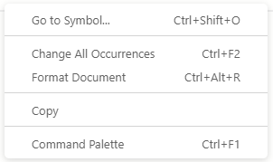

Most operations in the Visual Editor have corresponding keyboard shortcuts, and a number are mentioned in their corresponding area. However, its always good to see them in one place!

:::info Need A Specific Shortcut?
Please [create an issue in the GitHub repo with what you're missing](https://github.com/deneb-viz/deneb/issues) and we'll see if we can get it added :)
:::

## Editor Pane

| Function                         | Shortcut                         |
| -------------------------------- | -------------------------------- |
| Expand or collapse               | **Ctrl** + **Alt** + **Space**   |
| Navigate to Specification pane   | **Ctrl** + **Alt** + **1**       |
| Navigate to Config pane          | **Ctrl** + **Alt** + **2**       |
| Navigate to Settings pane        | **Ctrl** + **Alt** + **3**       |
| Apply Changes                    | **Ctrl** + **Enter**             |
| Toggle Auto-Apply                | **Ctrl** + **Shift** + **Enter** |
| Edit Specification Field Mapping | **Ctrl** + **Alt** + **F**       |
| New Specification                | **Ctrl** + **Alt** + **N**       |
| Generate JSON Template           | **Ctrl** + **Alt** + **E**       |
| Help                             | **Ctrl** + **Alt** + **H**       |

## In-Editor

Deneb utilises Monaco Editor for JSON editing, which comes with its own keyboard shortcuts and can help you quite considerably in-terms of productivity. You can view a list of shortcut keys by accessing the command palette, either from the context menu (right-clicking the editor), or pressing **Ctrl + F1**, e.g.:

##### Context menu

##### Command Palette

 shows all available commands and their keystrokes.")

Some useful commands are:

| Function             | Shortcut            |
| -------------------- | ------------------- |
| Format document      | **Ctrl + Alt + R**  |
| Toggle line comment  | **Ctrl + /**        |
| Toggle block comment | **Shift + Alt + A** |
| Find                 | **Ctrl + F**        |
| Replace              | **Ctrl + H**        |

## Debug Pane

| Function                            | Shortcut                          |
| ----------------------------------- | --------------------------------- |
| Set view to Data Pane               | **Ctrl** + **Alt** + **7**        |
| Set view to Signals Pane            | **Ctrl** + **Alt** + **8**        |
| Set view to Logs Pane               | **Ctrl** + **Alt** + **9**        |
| Expand or collapse pane             | **Ctrl** + **`**                  |
| Zoom preview out by 10%             | **Ctrl** + **Alt** + **Minus(-)** |
| Zoom preview in by 10%              | **Ctrl** + **Alt** + **Plus(+)**  |
| Zoom preview to actual size         | **Ctrl** + **Alt** + **0**        |
| Zoom preview to fit available space | **Ctrl** + **Alt** + **\***       |
