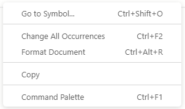

Most operations in the Visual Editor have keyboard shortcuts, and many are listed in their respective areas. However, it's always good to see them in one place!

:::info Need A Specific Shortcut?
Please [create an issue in the GitHub repo with what you're missing](https://github.com/deneb-viz/deneb/issues) and we'll see if we can get it added :)
:::

## Canvas and Visual Focus

Deneb supports [Power BI's keyboard-focus behavior](https://learn.microsoft.com/en-us/power-bi/developer/visuals/supportskeyboardfocus-feature), so you can reach and leave the visual without using a pointer. When the visual has canvas-level focus (by tabbing between visuals on the report page):

| Function                                  | Shortcut                  |
| ----------------------------------------- | ------------------------- |
| Focus into the visual                     | **Enter**                 |
| Move focus between elements in the visual | **Tab** / **Shift + Tab** |

Tab focus wraps at both ends of Deneb's UI, so pressing **Tab** on the last focusable element returns to the first (and vice versa with **Shift + Tab**). This prevents focus from escaping into other visuals on the canvas.

**Esc** behaves differently depending on where you are:

- **When viewing a visual**, **Esc** returns focus to the canvas so you can continue tabbing to the next visual.
- **In the editor interface** (with focus outside the Monaco editor), **Esc** sets focus to Power BI's _Back to report_ action, which you can then activate to return to the canvas.

:::warning Vega views are not keyboard-tabbable
Vega and Vega-Lite don't currently surface their rendered marks, axes, or legends as focusable elements, so in view mode, the only things that can receive Tab focus inside the visual are **parameter inputs bound to HTML elements**. Everything else in your specification is reachable only via the mouse pointer and screen reader (if the marks have been set up accordingly).
:::

:::tip Tabbing out of the JSON editor
When focus is on a JSON editor, Monaco captures **Tab** for indentation. To move Tab back onto Deneb's cycle so you can leave the editor, toggle Monaco's Tab trap:

- **Windows / Linux**: **Ctrl + M**
- **Mac**: **Ctrl + Shift + M**
  :::

## Editor Pane

| Function                       | Shortcut                         |
| ------------------------------ | -------------------------------- |
| Expand or collapse             | **Ctrl** + **Alt** + **Space**   |
| Navigate to Specification pane | **Ctrl** + **Alt** + **1**       |
| Navigate to Config pane        | **Ctrl** + **Alt** + **2**       |
| Navigate to Settings pane      | **Ctrl** + **Alt** + **3**       |
| Apply Changes                  | **Ctrl** + **Enter**             |
| Toggle Auto-Apply              | **Ctrl** + **Shift** + **Enter** |
| New Specification              | **Ctrl** + **Alt** + **N**       |
| Generate JSON Template         | **Ctrl** + **Alt** + **E**       |
| Help                           | **Ctrl** + **Alt** + **H**       |

## In-Editor

Deneb uses Monaco Editor for JSON editing, which comes with its own keyboard shortcuts and can significantly improve your productivity. You can view a list of shortcut keys by accessing the command palette, either from the context menu (right-clicking the editor), or pressing **Ctrl + F1**, e.g.:

##### Context menu

##### Command Palette

 shows all available commands and their keystrokes.")

Some useful commands are:

| Function                | Shortcut            |
| ----------------------- | ------------------- |
| Format document         | **Ctrl + Alt + R**  |
| Toggle line comment     | **Ctrl + /**        |
| Toggle block comment    | **Shift + Alt + A** |
| Find                    | **Ctrl + F**        |
| Replace                 | **Ctrl + H**        |
| Quick Fix / Code Action | **Ctrl + .**        |

## Debug Pane

| Function                            | Shortcut                          |
| ----------------------------------- | --------------------------------- |
| Set view to Source Pane             | **Ctrl** + **Alt** + **6**        |
| Set view to Data Pane               | **Ctrl** + **Alt** + **7**        |
| Set view to Signals Pane            | **Ctrl** + **Alt** + **8**        |
| Set view to Logs Pane               | **Ctrl** + **Alt** + **9**        |
| Expand or collapse pane             | **Ctrl** + **`**                  |
| Zoom preview out by 10%             | **Ctrl** + **Alt** + **Minus(-)** |
| Zoom preview in by 10%              | **Ctrl** + **Alt** + **Plus(+)**  |
| Zoom preview to actual size         | **Ctrl** + **Alt** + **0**        |
| Zoom preview to fit available space | **Ctrl** + **Alt** + **\***       |

## Debug Viewer Tables (Source, Data and Signals)

| Function                                      | Shortcut              |
| --------------------------------------------- | --------------------- |
| Move focus between cells                      | **Arrow keys**        |
| Move focus to start / end of the current row  | **Home** / **End**    |
| Open the value inspector for the focused cell | **Enter** / **Space** |
| Close the value inspector                     | **Escape**            |
| Leave the grid                                | **Tab**               |
