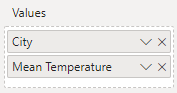

# Simple Worked Example

In the following pages, we'll create a simple bar chart, using the visual, some data, an inbuilt template and [Vega-Lite](http://vega.github.io/vega-lite). Our finished visual is the bar chart on the left:

<iframe
  width="100%"
  height="486"
  src="https://app.powerbi.com/view?r=eyJrIjoiYTcyMDJkZDEtODc0Yy00MDc2LWJiNDAtY2UxODhjZTU2NDBjIiwidCI6IjUzYmJlMGQ3LTU0NzItNGQ0NS04NGY0LWJiNzJiYjFjMjI4OSJ9&pageName=ReportSectionc2e9778dd899bccd64ca"
  frameborder="0"
  allowFullScreen="true"
></iframe>

&nbsp;&nbsp;&nbsp;&nbsp;_[Download this workbook](/pbix/Deneb-Simple-Vega-Lite-Bar-Chart-Example.pbix)_

## Our Starting Data

From the sample workbook, we'll use a single column and measure. Here's how this looks in raw form:

 and measure (Mean Temperature).")

Here, the `[City]` column represents a nominal category, and `[Mean Temperature]` is a simple measure that calculates the average temperature value for the given row context.

:::tip Think with Tables

Try to think about the dataset you wish to add to a Deneb visual in terms of how it will work as a table visual. This will help to understand the granularity of the dataset, and help to "think visually" when it comes to creating marks and layouts.

:::

## Adding the Visual

:::info No Visual in your Report?

If you need assistance with this, refer to the [Getting Started](getting-started) page.

:::

Once you have added Deneb to your report, you should see it in the _Visualizations_ pane, eg.:


You can then click the visual to add it to the report canvas, e.g.:


## Adding the Data

We'll now add the `[City]` column and `[Mean Temperature]` measure to Deneb's **Values** data role, e.g.:



At this point, we need to create a specification, which is required to instruct Vega-Lite (or Vega) how your visualization should be rendered.

## Opening the Visual Editor

We can now open the Visual Editor by selecting the visual header (...) and then _Edit_, e.g.:


This will display the Visual Editor in focus mode, and the _Create New Specification_ dialog will be shown, e.g.:


:::info Can't See the Dialog?
If you accidentally dismiss the dialog, or it doesn't show, you can bring it up by clicking on the **New Specification** button on the command bar, or using **\[Ctrl + Alt + N]**
:::

## Selecting the Template

Using Vega or Vega-Lite requires a specification to be written using JSON. You can either select the **\[empty]** template to begin editing with a bare-minimum specification with the dataset bound to it, or use a predefined template.

Let's choose the **Simple Bar Chart** template by clicking on it. Note that we now get some additional details about the template, as well as some required placeholders:


## Assigning Placeholders

This template expects two placeholders: one for the the category axis and another for the measure axis. As we've already added our data, we can see these are already available in the dropdown lists, e.g.:


In our case, we'll add **City** to the **Category** placeholder.

:::info About Data Types
You can choose either the column or the measure - the recommended data type is shown next to each one so that you can visually confirm the right type of field to bind to the placeholder. Using an different type _might_ work, but be prepared to have to make some changes afterwards if you proceed with this.

Deneb can only see columns or measures added to the **Values** data role. This is a limitation of visuals in Power BI so that they cannot know more about your data model than they are supposed to. You can add or swap out a column or measure if it's not the one you want and the dropdown list will update accordingly.
:::

Next, we'll click on the **Measure** placeholder and select the **Mean Temperature** measure:


## Creating the Initial Specification

Now that all placeholders have been filled, the **Create** button is enabled:


Clicking on this will show the visual specification in the Visual Editor with our assigned placeholders, e.g.:


## Reviewing Generated Specification

In our editor's **Specification** tab, we'll now have the following [Vega-Lite JSON specification](http://vega.github.io/vega-lite/docs/spec.html):

```json title="Generated Specification"
{
  "data": { "name": "dataset" },
  "layer": [
    {
      "mark": {
        "type": "bar",
        "opacity": 0.3,
        "tooltip": true
      },
      "encoding": {
        "x": {
          "field": "Mean Temperature"
        }
      }
    },
    {
      "mark": {
        "type": "bar",
        "tooltip": true
      },
      "encoding": {
        "x": {
          "field": "Mean Temperature__highlight"
        },
        "opacity": {
          "condition": {
            "test": {
              "field": "__selected__",
              "equal": "off"
            },
            "value": 0
          },
          "value": 1
        }
      }
    }
  ],
  "encoding": {
    "y": {
      "field": "City",
      "type": "nominal"
    },
    "x": {
      "type": "quantitative",
      "axis": {
        "title": "Mean Temperature"
      }
    }
  }
}
```

This breaks down as follows:

- There's a `data` object, which has a mapping of `"dataset"` (line 2).
  - This is required for the specification, instructs that our visual's dataset should be used and should be left as-is.
  - Refer to the [Dataset](dataset) page for more details on how this works.
- We have a [`layer`](http://vega.github.io/vega-lite/docs/layer.html) view, which allows us to superimpose chart elements (lines 3-37). Within this layer, we have:

  - One [`bar` mark](http://vega.github.io/vega-lite/docs/bar.html) for each data point (lines 4-15).

    - The width (`x` encoding channel) of this bar is bound to our `Mean Temperature` measure.
    - We're displaying a `tooltip` for this mark (lines 4-15).
    - This is used to display orginal values in the event of a cross-highlight from another visual (more on this below)

  - One `bar` mark for each data point that is bound to our `Mean Temperature` measure's cross-highlight values in the `x` encoding channel (lines 16-36).

    - The `opacity` of our mark (how 'solid' the color appears) is linked to a special field called `__selected__`, which manages cross-filtering for us (lines 16-25). This is also explained further below, so just bear with us for now.

- The [encoding for the visual's top-level](http://vega.github.io/vega-lite/docs/encoding.html) (lines 38-49) maps our data as follows:
  - `City` is mapped to the y-axis and is a nominal/categorical field (lines 39-42).
  - Our x-axis is a quantitative/linear (lines 43-48).

As noted above, this is a [layered](https://vega.github.io/vega-lite/docs/layer.html) view, so that we can try and show you how to make your visual work with Power BI's interactivity features in as simple a way as possible. Vega-Lite also has [single](http://vega.github.io/vega-lite/docs/spec.html#single), [concatenated](https://vega.github.io/vega-lite/docs/concat.html) or [faceted](https://vega.github.io/vega-lite/docs/facet.html) views as well, wo it's worht checking those out (with their associated examples) to learn more.

We also have some other stuff going on in the editor's **Config** tab, thanks to our template...

## Reviewing Generated Config

In our editor's **Config** tab, we'll have the following [Vega-Lite JSON configuration](http://vega.github.io/vega-lite/docs/config.html). There's a lot going on here, and the intention is to provide you with a fleshed-out set of properties so that you can see how things can look with a fleshed-out set of properties. You don't need to worry too much about this for the moment.

```json title="Generated Config"
{
  "autosize": {
    "type": "fit",
    "contains": "padding"
  },
  "view": { "stroke": "transparent" },
  "font": "Segoe UI",
  "arc": {},
  "area": {
    "line": true,
    "opacity": 0.6
  },
  "bar": {},
  "line": {
    "strokeWidth": 3,
    "strokeCap": "round",
    "strokeJoin": "round"
  },
  "path": {},
  "point": { "filled": true, "size": 75 },
  "rect": {},
  "shape": {},
  "symbol": {
    "strokeWidth": 1.5,
    "size": 50
  },
  "text": {
    "font": "Segoe UI",
    "fontSize": 12,
    "fill": "#605E5C"
  },
  "axis": {
    "ticks": false,
    "grid": false,
    "domain": false,
    "labelColor": "#605E5C",
    "labelFontSize": 12,
    "titleFont": "wf_standard-font, helvetica, arial, sans-serif",
    "titleColor": "#252423",
    "titleFontSize": 16,
    "titleFontWeight": "normal"
  },
  "axisQuantitative": {
    "tickCount": 3,
    "grid": true,
    "gridColor": "#C8C6C4",
    "gridDash": [1, 5],
    "labelFlush": false
  },
  "axisBand": { "tickExtra": true },
  "axisX": { "labelPadding": 5 },
  "axisY": { "labelPadding": 10 },
  "header": {
    "titleFont": "wf_standard-font, helvetica, arial, sans-serif",
    "titleFontSize": 16,
    "titleColor": "#252423",
    "labelFont": "Segoe UI",
    "labelFontSize": 13.333333333333332,
    "labelColor": "#605E5C"
  },
  "legend": {
    "titleFont": "Segoe UI",
    "titleFontWeight": "bold",
    "titleColor": "#605E5C",
    "labelFont": "Segoe UI",
    "labelFontSize": 13.333333333333332,
    "labelColor": "#605E5C",
    "symbolType": "circle",
    "symbolSize": 75
  }
}
```

Config is a nice feature of the Vega languages that provides us with the ability to style and set out the cosmetic elements of our visual design away from the main "logic" (which we have in the **Specification** tab). One thing that's handy for Power BI - due to the ability to dynamically size visuals - is [automatic sizing for simpler (single or layered) views](http://vega.github.io/vega-lite/docs/size.html#autosize), so has been included in this template by default.

You can include your config in the specification's JSON at the top-level if you like, but the intention here is to separate the cosmetic aspects of the visual away from its logical ones, so we have a separate tab in the editor for this for those who wish to adopt this approach.

You can extend the config significantly to customize many parts of your visual, so it's worth diving into the [documentation for this](http://vega.github.io/vega-lite/docs/config.html) when you're ready.

:::info That's a Lot of JSON!
The configuration applied above is significantly more than our simple chart needs, but we've prepared this so that the template visuals look "at home" in Power BI, and to give you a jumping-off point for your own ideas. You are free to remove or customize this as much as you like to achieve the visual design you are looking for.
:::

## Tooltips

Our template enables tooltips by default, so we can hover over a data point in our visual and this will display a default tooltip, e.g.:


If we were to set up a tooltip page that included one of the columns from our visual, then, the visual can resolve this, providing that you specify to use a report page tooltip instead of a default one, e.g.:


:::caution Context is Key
Note that report page tooltips will only work if your data point hasn't been transformed or mutated from the row context passed-into your visual's dataset. In the cases where data points cannot be reconciled back to the data model, the visual will display a default tooltip instead. Please refer to the [Interactivity Features](interactivity-overview) or [Tooltips](interactivity-tooltips) pages for further details.
:::

## Cross-Highlighting

Creators often have their visuals enabled for cross-highlighting, which means that if another visual is clicked, then other visuals will adjust their display to show the highlighted values in context with their original ones.

- In our visual, we show the original values with our first mark.

  ```json title="Cross-Highlighting: first (less opaque) mark"
  {
    "mark": {
      "type": "bar",
      "opacity": 0.3,
      "tooltip": true
    },
    "encoding": {
      "x": {
        "field": "Mean Temperature"
      }
    }
  }
  ```

  This is 30% opaque and is displayed underneath the second mark...

- ...and the second mark is used to show the cross-highlight values.

  ```json title="Cross-Highlighting: second (solid) mark"
  {
    "mark": {
      "type": "bar",
      "tooltip": true
    },
    "encoding": {
      "x": {
        "field": "Mean Temperature__highlight"
      },
      ...
    }
  }
  ```

  If there is no cross-highlight applied, the data point values are the same as the original, and this obscures the mark behind it. This encoding uses the same measure, but with a `__highlight` suffix, which Deneb uses to supply the value we need to show this. The rest of the `encoding` section has been omitted as it's used for the next section.

:::caution Cross-Highlight Takes A Bit Of Work
It normally might be a bit much for a simple walkthrough, but it's likely that you're heare because you want to build your own visual that looks and feels at home in Power BI. Cross-highlighting is a part of this journey, so we want to give you a simple way in to this. You can read in more detail in the [Interactivity Features](interactivity-overview) or [Cross-Highlighting](interactivity-highlight) pages for further details.
:::

## Cross-Filtering

Many Power BI visuals allow you to cross-filter others by clicking (or Ctrl-clicking data points). We can also do this with Deneb, but there are elements of user experience that we need to consider: most Power BI visuals will dim or fade the un-selected data points so that our users understand what is happening between our visual and others.

This is normally opt-in, but our template already has a simple version of this set-up already. The relevant section of our specification is on lines 25 through 35:

```json title="Cross-Filtering: second mark encoding"
{
  "mark": { ... },
  "encoding": {
    ...
    "opacity": {
      "condition": {
        "test": {
          "field": "__selected__",
          "equal": "off"
        },
        "value": 0
      },
      "value": 1
    }
  }
}
```

Deneb uses a special field called `__selected__` to track the status of each row of our dataset. We can use this in our `encoding`, along with a `test` to set the `opacity` value of our mark to `0` (or hidden) if it is not one of those that we've clicked (or Ctrl-clicked) on, e.g.:


:::caution Context _Really_ is Key
Note that much like report page tooltips, Cross-Filtering will only work well if your data point hasn't been transformed or mutated from the row context passed-into your visual's dataset. In the cases where data points cannot be reconciled back to the data model, this may not work as intended. You also need to manage the visual effects of your selected and un-selected marks. Please refer to the [Interactivity Features](interactivity-overview) or [Cross-Filtering (Selection)](interactivity-selection) pages for further details.
:::

## Adding Further Config

The config that's present in the loaded template should already make the chart look quite at home in our report, but we'll make some small changes to the bar mark we're using. Update the `bar` property (on line 13) as follows:

```json
  "bar": {
    "color": "#605E5C",
    "cornerRadiusTopRight": 10,
    "cornerRadiusBottomRight": 10
  },
```

We can apply our changes by clicking the **Apply** command, or pressing **\[ Ctrl + Enter ]**:


:::info Auto-Apply
Note that the **Auto-Apply** command can be used to ensure changes are applied as you type rather than manually, although this isn't recommended for complex specifications or ones that use a large number of data points.
:::

Once we've applied the changes, our visual updates as follows:


## Viewing the Finished Product

When you're finished, click on _Back to report_ to bring you back out of focus mode and to the report canvas. Our visual will now be 'regular sized', thanks to the `autosize` configuration we applied earlier on:


## Where Next?

We've used one of the inbuilt templates to produce a simple example, and add some integration features in the form of tooltips, and customized its appearance using config. A simple visual like this is just the tip of the iceberg and the way ahead is quite broad and expansive.

The purpose of this site is to provide detail on how to make the visual work for you within Power BI, rather than repeating the wealth of great documentation that's already out there. To learn more about some of the additional things the visual can offer (or understand some of its limitations) then please continue to read on or use the menu to explore further.

If you're hungry for more examples or further inspiration, then a good place to start is [Vega-Lite's own gallery](http://vega.github.io/vega-lite/examples/), or even [Vega's gallery](https://vega.github.io/vega/examples/).
