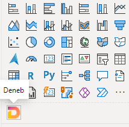
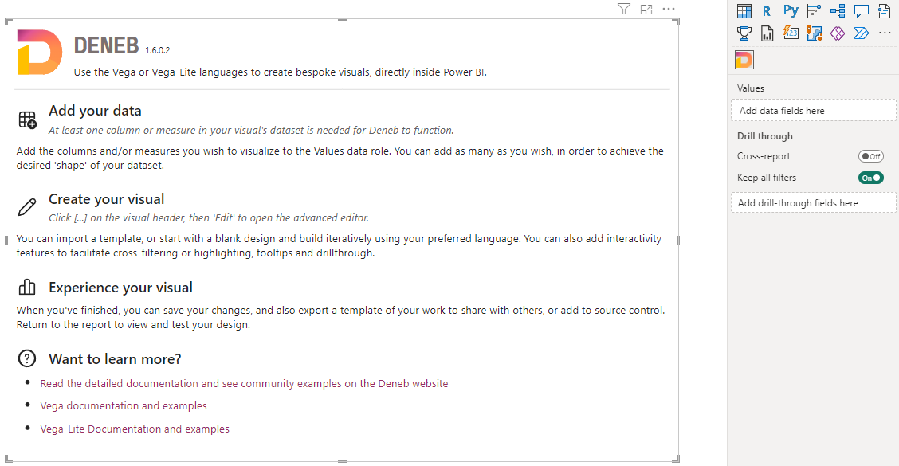
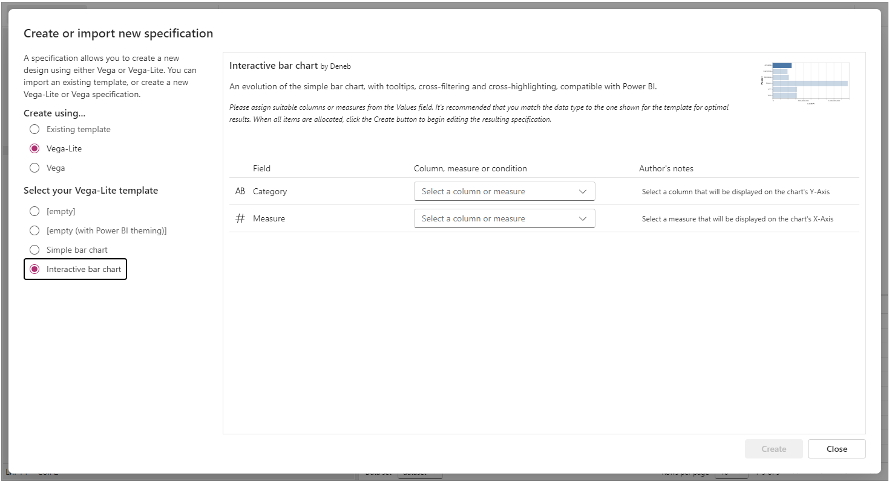
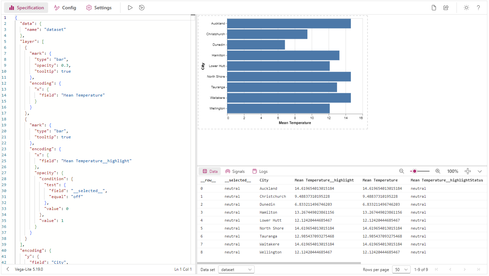
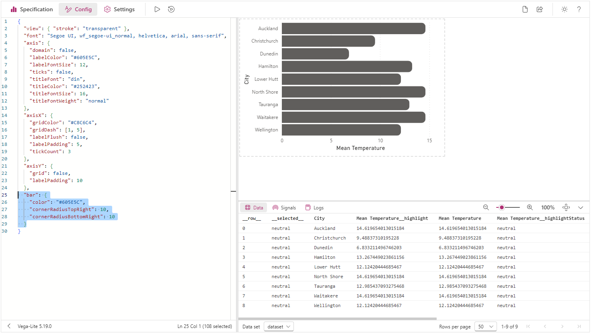

# Simple Worked Example

In the following pages, we'll create a simple bar chart, using the visual, some data, an inbuilt template and [Vega-Lite](http://vega.github.io/vega-lite). Our finished visual is the bar chart on the left:

<iframe
  width="100%"
  height="486"
  src="https://app.powerbi.com/view?r=eyJrIjoiOWFmYjVmZDktMjNlNC00MTNhLThjYTEtNmYwYjIwZWUzODNiIiwidCI6IjUzYmJlMGQ3LTU0NzItNGQ0NS04NGY0LWJiNzJiYjFjMjI4OSJ9"
  frameborder="0"
  allowFullScreen="true"
></iframe>

&nbsp;&nbsp;&nbsp;&nbsp;_[Download this workbook](/pbix/Deneb-Simple-Vega-Lite-Bar-Chart-Example-1.6.0.pbix)_

## Our Starting Data

From the sample workbook, we'll use a single column and measure. Here's how this looks in raw form:

 and measure (Mean Temperature).")

Here, the `[City]` column represents a nominal category, and `[Mean Temperature]` is a simple measure that calculates the average temperature value for the given row context.

:::tip Think with Tables

Try to think about the dataset you wish to add to a Deneb visual in terms of how it will work as a table visual. This will help to understand the granularity of the dataset, and help to "think visually" when it comes to creating marks and layouts.

:::

## Adding the Visual

:::info No Visual in your Report?
If you need assistance with this, refer to the [Getting Started](getting-started) page.
:::

Once you have added Deneb to your report, you should see it in the _Visualizations_ pane, eg.:



You can then click the visual to add it to the report canvas, e.g.:



## Adding the Data

We'll now add the `[City]` column and `[Mean Temperature]` measure to Deneb's **Values** data role, e.g.:


At this point, we need to create a specification, which is required to instruct Vega-Lite (or Vega) how your visualization should be rendered.

:::info Dataset requirements
There is a limitation with custom visuals where at least one measure needs to be present in the visual dataset for it to be able to persist properties back to the report for retrieval later on.
:::

## Opening the Visual Editor

We can now open the Visual Editor by selecting the visual header (...) and then _Edit_, e.g.:


This will display the Visual Editor in focus mode, and the _Create New Specification_ dialog will be shown, e.g.:


:::info Can't See the Dialog?
If you accidentally dismiss the dialog, or it doesn't show, you can bring it up by clicking on the **New Specification** button on the command bar, or using **\[Ctrl + Alt + N]**
:::

## Selecting the Template

Using Vega or Vega-Lite requires a specification to be written using JSON. You can either select the **\[empty]** template to begin editing with a bare-minimum specification with the dataset bound to it, or use a predefined template.

Let's choose **Create using...** > **Vega-Lite** > **Interactive bar chart** template by clicking on it. Note that we now get some additional details about the template, as well as some required placeholders:



## Assigning Placeholders

This template expects two placeholders: one for the the category axis and another for the measure axis. As we've already added our data, we can see these are already available in the dropdown lists, e.g.:


In our case, we'll add **City** to the **Category** placeholder.

:::info About Data Types
You can choose either the column or the measure - the recommended data type is shown next to each one so that you can visually confirm the right type of field to bind to the placeholder. Using an different type _might_ work, but be prepared to have to make some changes afterwards if you proceed with this.

Deneb can only see columns or measures added to the **Values** data role. This is a limitation of visuals in Power BI so that they cannot know more about your data model than they are supposed to. You can add or swap out a column or measure if it's not the one you want and the dropdown list will update accordingly.
:::

Next, we'll click on the **Measure** placeholder and select the **Mean Temperature** measure:


## Creating the Initial Specification

Now that all placeholders have been filled, the **Create** button is enabled:


Clicking on this will show the visual specification in the Visual Editor with our assigned placeholders, e.g.:



## Reviewing Generated Specification

In our editor's **Specification** tab, we'll now have the following [Vega-Lite JSON specification](http://vega.github.io/vega-lite/docs/spec.html):

```json title="Generated Specification" showLineNumbers
{
  "data": {
    "name": "dataset"
  },
  "layer": [
    {
      "mark": {
        "type": "bar",
        "opacity": 0.3,
        "tooltip": true
      },
      "encoding": {
        "x": {
          "field": "Mean Temperature"
        }
      }
    },
    {
      "mark": {
        "type": "bar",
        "tooltip": true
      },
      "encoding": {
        "x": {
          "field": "Mean Temperature__highlight"
        },
        "opacity": {
          "condition": {
            "test": {
              "field": "__selected__",
              "equal": "off"
            },
            "value": 0
          },
          "value": 1
        }
      }
    }
  ],
  "encoding": {
    "y": {
      "field": "City",
      "type": "nominal"
    },
    "x": {
      "type": "quantitative",
      "axis": {
        "title": "Mean Temperature"
      }
    }
  }
}
```

This breaks down as follows:

- There's a `data` object, which has a mapping of `"dataset"` (lines 2-4).
  - This is required for the specification, instructs that our visual's dataset should be used and should be left as-is.
  - Refer to the [Dataset](dataset) page for more details on how this works.
- We have a [`layer`](http://vega.github.io/vega-lite/docs/layer.html) view, which allows us to superimpose chart elements (lines 5-39). Within this layer, we have:

  - One [`bar` mark](http://vega.github.io/vega-lite/docs/bar.html) for each data point (lines 6-17).

    - The width (`x` encoding channel) of this bar is bound to our `Mean Temperature` measure (lines 13-15).
    - We're displaying a `tooltip` for this mark (line 10).
    - This is used to display orginal values in the event of a cross-highlight from another visual (more on this below)

  - One `bar` mark for each data point that is bound to our `Mean Temperature` measure's cross-highlight values in the `x` encoding channel (lines 18-38).

    - The `opacity` of our mark (how 'solid' the color appears) is linked to a special field called `__selected__`, which manages cross-filtering for us (lines 27-36). This is also explained further below, so just bear with us for now.

- The [encoding for the visual's top-level](http://vega.github.io/vega-lite/docs/encoding.html) (lines 40-51) maps our data as follows:
  - `City` is mapped to the y-axis and is a nominal/categorical field (lines 41-44).
  - Our x-axis is a quantitative/linear (lines 45-49).

As noted above, this is a [layered](https://vega.github.io/vega-lite/docs/layer.html) view, so that we can try and show you how to make your visual work with Power BI's interactivity features in as simple a way as possible. Vega-Lite also has [single](http://vega.github.io/vega-lite/docs/spec.html#single), [concatenated](https://vega.github.io/vega-lite/docs/concat.html) or [faceted](https://vega.github.io/vega-lite/docs/facet.html) views as well, wo it's worth checking those out (with their associated examples) to learn more.

We also have some other stuff going on in the editor's **Config** tab, thanks to our template...

## Reviewing Generated Config

In our editor's **Config** tab, we currently have an empty JSON object:

```json title="Generated Config" showLineNumbers
{}
```

Config is there for you to be able to apply specific cosmetic attributes to things in your specification, without having everything tightly-coupled. You can do this in your specification if you like, but abstracting as much as you can into this editor allows you to make cosmetic changes more easily. It's very versatile and you can read more about it for each language in more detail on each documentation site ([Vega](https://vega.github.io/vega/docs/config/) | [Vega-Lite](https://vega.github.io/vega-lite/docs/config.html)).

One thing that's handy for Power BI - due to the ability to dynamically size visuals - is [automatic sizing for simpler (single or layered) views](http://vega.github.io/vega-lite/docs/size.html#autosize) - and this is automatically applied for you without needing to specify it.

By default, this template doesn't apply any config, so that you can learn what the defaults look like and build from there. Power BI does not always have sensible defaults for a lot of their core chart types, so you can learn a lot about what is available and how much you can customize by experimenting with this.

## Intial Config for Our Visual

We will make some changes to this config so that we can see how we might go about making a design look "at home" with the Power BI defaults. Modify the JSON as follows and click the **Apply** (▶️) button (or pressing [Ctrl + Enter]):

```json title=Updated Initial Config showLineNumbers
{
  "view": { "stroke": "transparent" },
  "font": "Segoe UI, wf_segoe-ui_normal, helvetica, arial, sans-serif",
  "axis": {
    "domain": false,
    "labelColor": "#605E5C",
    "labelFontSize": 12,
    "ticks": false,
    "titleFont": "din",
    "titleColor": "#252423",
    "titleFontSize": 16,
    "titleFontWeight": "normal"
  },
  "axisX": {
    "gridColor": "#C8C6C4",
    "gridDash": [1, 5],
    "labelFlush": false,
    "labelPadding": 5,
    "tickCount": 3
  },
  "axisY": {
    "grid": false,
    "labelPadding": 10
  }
}
```

Our visual will update with these cosmetic changes:


A brief summary of what this has done to our visual:

- We've removed the border (stroke) from around our plot area.
- We've set the general font to use Segoe UI. Note that here we have added [fallback options](https://www.w3schools.com/css/css_font_fallbacks.asp) for non-Windows devices.
- We've made a generic configuration for both axes to:
  - Remove the domain (origin) line.
  - Set the color and font size of the axis labels.
  - Remove the tick markers.
  - Update the title to use the DIN font, and style it accordingly.
- We have styled the x-axis as follows:
  - We have modified the color and style (dash) of the gridlines.
  - We have modified the distance (padding) of the labels from the domain, and made the start and end labels sit central to their grid line, rather than flush to them.
  - We have specified a reduced density of the ticks, which will also affect the labels.
- The y-axis has the following changes:
  - We have turned off the grid lines.
  - We have increased the padding of the labels from the domain line (slightly larger than the x-axis)

:::info Extended Config Option for New Templates
If you want a more fully-featured config that matches Power BI more generically, you can create a new specification using the inbuilt **[empty (with Power BI theming)]** template, which uses the [`powerbi` vega theme](https://vega.github.io/vega-themes/?theme=powerbi).
:::

## Further Bar Styling

Let's make one more change, so that our bars look a little different to the conventional bar chart. After the closing brace on line 24, add the following:

```json
{
  ...
  "bar": {
    "color": "#605E5C",
    "cornerRadiusTopRight": 10,
    "cornerRadiusBottomRight": 10
  }
}
```

Again, let's apply our changes and see the results. Your visual should update as follows:



## Interactivity Review

There are some features of the specification and settings that allow the visual to be interactive with others in the report. Interactivity is a more advanced topic, but the goal of this example is to show you the art of the possible. It's worth reading up on the interactivity features and understanding the quirks of Power BI and how Deneb tries to bridge these gaps (available in the sidebar), but a short overview of these features and how they are applied in our example are as follows:

### Tooltips

Our template enables tooltips by default, so we can hover over a data point in our visual and this will display a default tooltip, e.g.:


If we were to set up a tooltip page that included one of the columns from our visual, then, the visual can resolve this, providing that you specify to use a report page tooltip instead of a default one, e.g.:


:::caution Context is Key
Note that report page tooltips will only work if your data point hasn't been transformed or mutated from the row context passed-into your visual's dataset. In the cases where data points cannot be reconciled back to the data model, the visual will display a default tooltip instead. Please refer to the [Interactivity Features](interactivity-overview) or [Tooltips](interactivity-tooltips) pages for further details.
:::

### Cross-Highlighting

Creators often have their visuals enabled for cross-highlighting, which means that if another visual is clicked, then other visuals will adjust their display to show the highlighted values in context with their original ones.

- In our visual, we show the original values with our first mark.

  ```json title="Cross-Highlighting: first (less opaque) mark" showLineNumbers
  {
    "mark": {
      "type": "bar",
      "opacity": 0.3,
      "tooltip": true
    },
    "encoding": {
      "x": {
        "field": "Mean Temperature"
      }
    }
  }
  ```

  This is 30% opaque and is displayed underneath the second mark...

- ...and the second mark is used to show the cross-highlight values.

  ```json title="Cross-Highlighting: second (solid) mark" showLineNumbers
  {
    "mark": {
      "type": "bar",
      "tooltip": true
    },
    "encoding": {
      "x": {
        "field": "Mean Temperature__highlight"
      },
      ...
    }
  }
  ```

  If there is no cross-highlight applied, the data point values are the same as the original, and this obscures the mark behind it. This encoding uses the same measure, but with a `__highlight` suffix, which Deneb uses to supply the value we need to show this. The rest of the `encoding` section has been omitted as it's used for the next section.

:::caution Cross-Highlight Takes A Bit Of Work
It normally might be a bit much for a simple walkthrough, but it's likely that you're heare because you want to build your own visual that looks and feels at home in Power BI. Cross-highlighting is a part of this journey, so we want to give you a simple way in to this. You can read in more detail in the [Interactivity Features](interactivity-overview) or [Cross-Highlighting](interactivity-highlight) pages for further details.
:::

### Cross-Filtering

Many Power BI visuals allow you to cross-filter others by clicking (or Ctrl-clicking data points). We can also do this with Deneb, but there are elements of user experience that we need to consider: most Power BI visuals will dim or fade the un-selected data points so that our users understand what is happening between our visual and others.

This is normally opt-in, but our template already has a simple version of this set-up already. The relevant section of our specification is on lines 25 through 35:

```json title="Cross-Filtering: second mark encoding" showLineNumbers
{
  "mark": { ... },
  "encoding": {
    ...
    "opacity": {
      "condition": {
        "test": {
          "field": "__selected__",
          "equal": "off"
        },
        "value": 0
      },
      "value": 1
    }
  }
}
```

Deneb uses a special field called `__selected__` to track the status of each row of our dataset. We can use this in our `encoding`, along with a `test` to set the `opacity` value of our mark to `0` (or hidden) if it is not one of those that we've clicked (or Ctrl-clicked) on, e.g.:


:::caution Context _Really_ is Key
Note that much like report page tooltips, Cross-Filtering will only work well if your data point hasn't been transformed or mutated from the row context passed-into your visual's dataset. In the cases where data points cannot be reconciled back to the data model, this may not work as intended. You also need to manage the visual effects of your selected and un-selected marks. Please refer to the [Interactivity Features](interactivity-overview) or [Cross-Filtering (Selection)](interactivity-selection) pages for further details.
:::

## Viewing the Finished Product

When you're finished, click on _Back to report_ to bring you back out of focus mode and to the report canvas. Our visual will now be 'regular sized', thanks to the `autosize` configuration we applied earlier on:


## Where Next?

We've used one of the inbuilt templates to produce a simple example, and add some integration features in the form of tooltips, and customized its appearance using config. A simple visual like this is just the tip of the iceberg and the way ahead is quite broad and expansive.

The purpose of this site is to provide detail on how to make the visual work for you within Power BI, rather than repeating the wealth of great documentation that's already out there. To learn more about some of the additional things the visual can offer (or understand some of its limitations) then please continue to read on or use the menu to explore further.

If you're hungry for more examples or further inspiration, then a good place to start is [Vega-Lite's own gallery](http://vega.github.io/vega-lite/examples/), or even [Vega's gallery](https://vega.github.io/vega/examples/).
