import ReactPlayer from "react-player";

The Visual Editor is used to define your specification, configuration, and any other options.

## Opening the Editor

The Visual Editor is only available when your report is in edit mode - when you're editing in Power BI Desktop or in the Service. If the report is viewed in the Power BI Service or another application, it is not eligible for editing, and any such options will be unavailable to your end users.

To use the editor, you first need some data, so please ensure that you have added any appropriate columns or measures to the **Values** data role.

Once data has been provided, the Visual Editor is accessed by selecting the visual header (...) and then **Edit**:

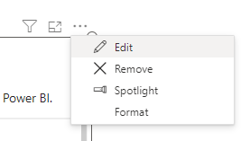

This will put the visual into focus mode and display the Visual Editor for you to begin creating or amending your specification.

:::tip Keyboard access
Deneb participates in Power BI's keyboard-focus behavior. When the visual has tab focus on the report canvas, press **Enter** to move focus into the visual; from there, **Tab** and **Shift + Tab** cycle through Deneb's focusable elements — focus wraps at both ends of the UI so it never escapes into another visual. **Esc** returns to the canvas in view mode, or focuses Power BI's _Back to report_ action when you're inside the editor. See [Keyboard Shortcuts](keyboard#canvas-and-visual-focus) for details, including how to tab out of the JSON editor.
:::

## Finding your Way Around

The Visual Editor has 4 main components, or panes:

1. Command Bar - for performing actions on your visual and the editor.
2. Editor Pane - for creating your visuals' definitions.
3. Preview Area - for seeing what your visual will look like in your report.
4. Debug Pane - for assisting with the development and refinement process.

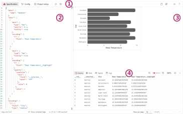

:::info Here's One We Made Earlier
We're showing a pre-built specification here; if this is your first time opening the editor in a new visual, then the **New Specification** dialog will be visible to help you get started. Refer to the [Simple Worked Example](simple-example) page for an example of this functionality, or the [New Specification](#new-specification-ctrl--alt--n) section below for more details.
:::

## The Command Bar

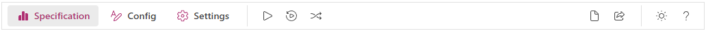

The Command Bar contains the following operations (from left to right):

### Specification Editor pane (Ctrl + Alt + 1)

- Selecting this option will display the Specification Editor pane. You can read more about this in the [Specification Editor Pane section below](#specification-editor-pane).

### Config Editor pane (Ctrl + Alt + 2)

- Selecting this option will display the Config Editor pane. You can read more about this in the [Config Editor Pane section below](#config-editor-pane).

### Settings pane (Ctrl + Alt + 3)

- Selecting this option will display the Settings pane. You can read more about this in the [Settings Pane section below](#settings-pane).

### Apply Changes (Ctrl + Enter)

- Selecting this option will apply any changes you have made in either the _Specification_ or _Config_ and update your visual.
- This option is disabled if you have _Auto-Apply_ enabled (see below).

:::caution Apply Often
If you exit focus mode (and out of the Visual Editor) **any unapplied changes may not be saved**, so please ensure that you apply changes before returning to the standard view. Refer to the [Unapplied Changes](#unapplied-changes) section below for more details as to how you can mitigate this.
:::

### Auto-Apply Changes as you Type (Ctrl + Shift + Enter)

- Selecting this option will apply changes to the _Specification_ or _Config_ editors as you type them.
- Enabling this option will disable the _Apply_ command.

:::caution Consider Performance
Whilst this option is convenient for seeing changes take effect immediately, it can have negative performance implications when working with a large number of data points or elements in your visualization. Please refer to the [Performance Considerations](performance) page for further details on potential risks and mitigation approaches.
:::

### New Specification (Ctrl + Alt + N)

- Selecting this option will open the _Create New Specification_ dialog.
- The dialog can be used to replace the current Specification and Config with either a bare-minimum set of JSON for each, or you can choose from a number of simple templates to get started.
- Templates are currently packaged in with the visual, and it's not yet possible to import them, although hopefully this will be something we can work on bringing in later on.

:::info First Time Use
This dialog is also displayed by default when you open the Visual Editor for the first time in any new instance of Deneb you add to the report canvas.
:::

### Generate JSON Template (Ctrl + Alt + E)

- Selecting this option will open the **Generate JSON Template** dialog.
- The dialog can be used to create an exportable version of your specification. Refer to the [appropriate section in the Templates page](templates#generating-a-template) for more information on usage.

### Theme Toggle (Ctrl + Shift + Alt + T)

- Selecting this option will toggle the theme of the Visual Editor between light and dark modes.
- By default, this will not affect the preview area, which will always attempt to mimic the background color of the report canvas. You can disable this in the [Preview Area settings](#preview-area) if you wish to see the visual in a consistent theme.

### Help (Ctrl + Alt + H)

- Selecting this option will cause Power BI to confirm you wish to open the link to this documentation site. Selecting **OK** will open it in a new browser tab.

## Editor Pane

The Editor Pane is where you will edit your specification and config, and apply any other settings you need.

### Resizing the Editor Pane

The Editor Pane can be resized to allocate more screen space to your Preview and/or Debug panes.

Some points to note:

- The pane can be resized to use a maximum of 60% of the visible canvas by click-dragging.
- Double-clicking the resizer will revert the pane to its default size (40% of the visible canvas).

### JSON Editor Properties

The **Advanced editor > JSON editor** property card in Power BI's formatting pane lets you modify the following properties of the JSON editor:

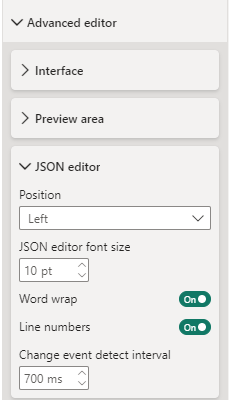

#### Position

Allows you to toggle the Editor Pane between the left and right sides of the screen. By default, the editor is on the left.

#### JSON Editor Font Size

Allows you to adjust the font size in the JSON editor. By default, this is set to 10px.

#### Word Wrap

By default, any content in the editor that overflows the width wraps to a new line. By disabling this property, you can keep content on a single line, and the editor will display a horizontal scrollbar as appropriate.

#### Line Numbers

By default, the editor will show line numbers in the left-hand gutter. You can disable this property to hide them.

#### Change Event Detect Interval

This property specifies the interval (in milliseconds) at which the editor checks for changes. By default, this is set to 700ms. It's recommended that you don't change this setting unless you're experiencing performance issues with the editor.

### Specification Editor Pane

:::note Keyboard shortcut
**\[ Ctrl + Alt + 1 ]**
:::

- This pane contains an editor that you can use to enter and amend your specification's JSON as desired.
  - The Vega JSON specification reference [can be found here](https://vega.github.io/vega/docs/specification/).
  - The Vega-Lite JSON specification reference [can be found here](https://vega.github.io/vega-lite/docs/spec.html).

- To view the results of your changes, you can either **Apply** your changes, or ensure that **Auto-apply changes as you type** is enabled.
- The JSON must produce a valid specification for your selected provider (either Vega or Vega-Lite).
- The editor will perform validation against the schema for the specified provider, and warnings are displayed that you can inspect:

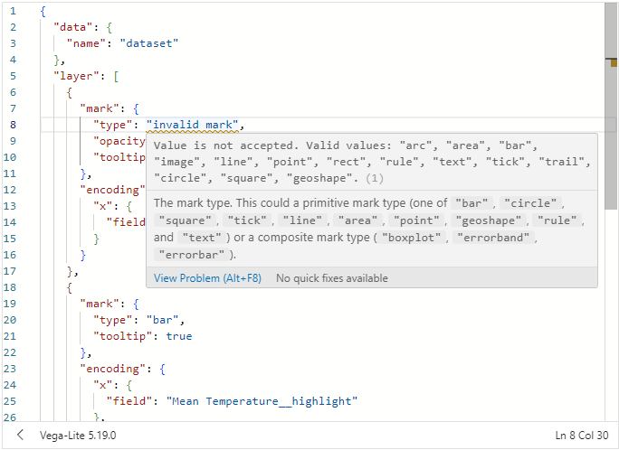

:::warning Deneb flags root-level `$schema` properties
If your specification contains a root-level `$schema` property (for example, after pasting in a spec from an external tool), the Specification editor will mark it with a warning. Deneb resolves Vega and Vega-Lite schemas internally - leaving `$schema` in place forces the editor to try to fetch it from that URL, which isn't permitted in the certified AppSource version and prevents auto-completion, inline documentation, and validation from working.

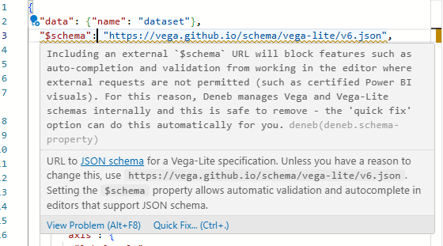

Hover the marker for the full explanation, then use the Monaco **Quick Fix** action - either click the lightbulb that appears on the line, or press **Ctrl + .** with the cursor on the line — to remove the property. The check only runs at the root level of the Specification editor; `$schema` values elsewhere (including in the Config editor) are not flagged.
:::

### Config Editor Pane

:::note Keyboard shortcut
**\[ Ctrl + Alt + 2 ]**
:::

- This pane contains an editor that you can use to enter and amend any JSON you wish to add for your visual's config as desired.
  - The Vega JSON config reference [can be found here](https://vega.github.io/vega/docs/config/).
  - The Vega-Lite JSON config reference [can be found here](https://vega.github.io/vega-lite/docs/config.html).
- To view the results of your changes, you can either **Apply** your changes, or ensure that **Auto-apply changes as you type** is enabled.
- The JSON must produce a valid config for your selected provider (either Vega or Vega-Lite).
- It's generally advised to try to use the config for anything that can "theme" your chart and keep this separate from the specification. This makes it easier to port across to other instances of the visual.

### Status Bar

The status bar at the bottom of each editor re-states which provider you are using (Vega or Vega-Lite) and which version is embedded.

:::tip Check the Provider Version Can Do What You're Looking Up
Deneb doesn't automatically support new releases of Vega or Vega-Lite. Because the runtimes are embedded, any new releases need to be tested, implemented, and deployed to AppSource, which can take some time. As such, you can use this information in the toolbar to confirm if the embedded version might be behind any new features published by the Vega team.
:::

The status bar also shows the current cursor position.

When the [Provider](#settings-pane) is set to Vega-Lite, the Specification editor's status bar also includes a toggle to show or hide the [Compiled Vega Pane](#compiled-vega-pane).

### Compiled Vega Pane

:::note Vega-Lite only
This pane is only available when the [Provider](#settings-pane) is set to Vega-Lite.
:::

Vega-Lite specifications are compiled down to Vega prior to rendering. This pane displays that compiled output in a read-only editor, which is useful for:

- Understanding how Vega-Lite maps to Vega, as a stepping stone into "thinking in Vega".
- Using the generated Vega as a starting point for a new Vega specification, rather than building one from scratch.

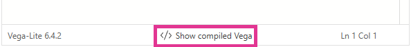

The pane can be toggled on or off from the [Specification editor's status bar](#status-bar), using the **Show compiled Vega** / **Hide compiled Vega** control in the JSON editor status bar.

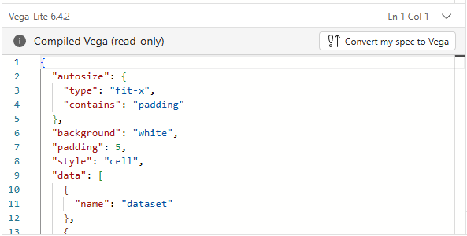

#### Convert my Spec to Vega

The **Convert my spec to Vega** action, available from within the Compiled Vega Pane, will replace your current Vega-Lite specification with the compiled Vega output and switch the project's [Provider](#settings-pane) to Vega.

:::caution This action cannot be undone
Once your Vega-Lite specification has been replaced with the compiled Vega output, it cannot be recovered from within Deneb. It is strongly recommended that you save a copy of your Vega-Lite specification before using this action, in case you want to revert to it.
:::

A couple of things are worth noting about the compiled output:

- The `$schema` property is stripped from the compiled Vega output.
  - Deneb resolves Vega schemas internally. Leaving `$schema` in the spec would force the editor to try to fetch it from the schema URL rather than use the embedded one.
  - Because external requests will fail from within the visual (the [standalone version](getting-started#standalone-version) is unaffected), keeping `$schema` would prevent features like auto-completion, inline documentation, and validation from working.

- The `config` block is stripped from the compiled output.
  - Your Config editor contents are preserved across a conversion, so `config` is intentionally omitted from the spec to avoid it being applied twice (once from the spec, once from the Config editor).
  - If you want the config inlined into the spec after converting, copy it across from the Config editor manually.

### Settings Pane

:::note Keyboard shortcut
**\[ Ctrl + Alt + 3 ]**
:::

- This pane is used to configure specific behavior of Deneb when generating output:

  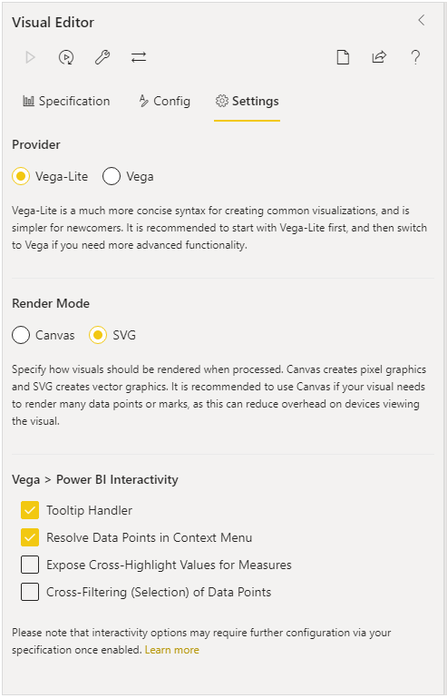

- The **Provider** section allows you to specify whether to use Vega or Vega-Lite for your Specification and Config.
  - Vega-Lite is much simpler for newcomers as it is much more concise and abstracts away a lot of the things that you would normally need to prescribe when using Vega.
  - Vega does provide a lot more in the way of control over your visualization at the cost of a higher learning curve.
- The **Continuous view** section controls whether Deneb patches dataset updates into the existing Vega view rather than recompiling the specification from scratch each time.
  - Enabling the **Enable patching for hosted datasets** option lets the view stay durable across dataset updates (slicing, cross-filtering, etc.), preserving zoom/pan, signal values, and selection state. It is off by default and only applies when the updated dataset is within the configured **Row threshold for patching**. Refer to [Continuous View (Data Patching)](dataset#continuous-view-data-patching) for eligibility rules and caveats.
  - The section also displays whether patching is currently _active_ or _inactive_ for your dataset, so you can see at a glance whether updates are being patched or recompiled.
- The **Render mode** section specifies whether to use either Vega's SVG renderer or Canvas renderer when compiling, parsing, and producing your design.
  - _Canvas_ renders your design as pixel graphics.
  - _SVG_ creates your design from vector graphics, resulting in a number of component elements within the visual to produce the output.
  - Please refer to the [Performance Considerations](performance#selection-of-renderer) page for further details on potential risks and mitigation approaches when it comes to selecting a renderer.
  - **Scale to report zoom level** (off by default) can be enabled when Canvas is selected, to compensate for the blurriness Canvas produces at non-100% zoom. When enabled, Deneb multiplies the canvas resolution by the current report zoom level - and, when viewed in the editor, also by the [preview zoom level](#zoom-controls) - so the output stays sharper at higher zoom levels. This won't reach full SVG crispness, but it is a meaningful improvement. The toggle is disabled when SVG is selected.
- The **Vega > Power BI interactivity** section specifies which interactivity features to enable.
  - As these require some additional setup in your specification, as well as some internal logic to link everything together, you are able to specify whether they should be set up or not.
  - Please refer to the [Interactivity Features](interactivity-overview) and related pages ([Tooltips](interactivity-tooltips) | [Context-Menu](interactivity-context-menu) | [Cross-Filtering](interactivity-selection) | [Cross-Highlighting](interactivity-highlight)) for further details on how to configure these for your specification.

### Column and Measure Completion

:::note Specification editor only
:::

Deneb offers auto-completion based on the Vega and Vega-Lite language schemas. In addition to this, any columns or measures that are added to the **Values** data role will be offered in the Specification editor’s auto-completion:

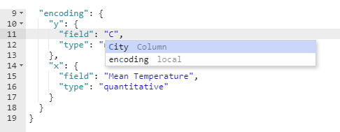

### Unapplied Changes

If you've made changes in the Visual Editor and select _Back to report_ without applying them, you will get a prompt alerting you of this:

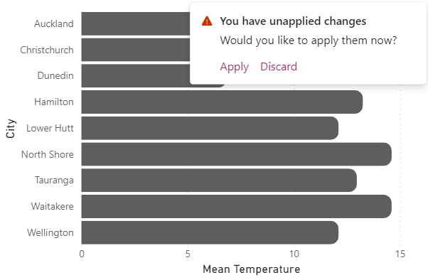

:::caution
This is a 'last chance' to make sure that any changes you want to keep are applied. If changes are discarded, they cannot be recovered.
:::

## Preview Area

Deneb captures the dimensions of your visual before opening the Visual Editor and displays them at 100% scale. This is so that you know how your design should look within the confines of the visual viewport when you return to the report:

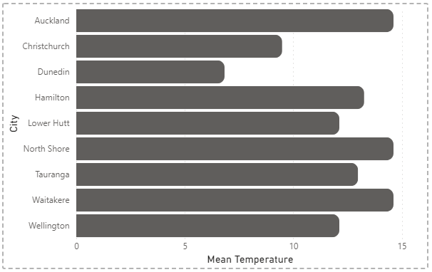

Your visual may not fit entirely into the preview area at 100% scale, so you can use the [Zoom Controls in the Debug Pane](#zoom-controls) (or collapse it) to adjust this accordingly, [or resize (or collapse) the editor pane](#editor-pane) to accommodate.

The **Advanced editor > Preview area** property card in Power BI's formatting pane lets you modify the following properties of the Preview Area:

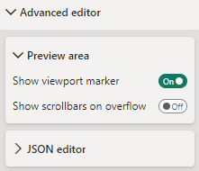

#### Viewport Marker

The dashed line represents the viewport (boundaries) of your visual in standard view. **Power BI does not allow visuals to resize themselves dynamically**, so if you wish to change the physical width and/or height of your visual in the report view, you will need to exit the Visual Editor, resize your visual, and then re-open the Visual Editor.

If you would prefer not to see the viewport marker, you can disable this in the properties pane by selecting **Show viewport marker > Off**.

#### Show Scrollbars

If your visual specification overflows the viewport, the default behavior of the preview area is to show the output overflowing the content. This is so that you can see the full output of your specification and what might get truncated in the report view.

If you wish to mimic the behavior of the report view, you can enable the **Show scrollbars on overflow** property. This will cause the preview area to use scrollbars as appropriate, rather than overflowing the content beyond the viewport marker.

To learn more about scrolling and overflow behavior, please refer to the [Scrolling and Overflow](scrolling-overflow) page.

#### Background Settings

This setting attempts to mimic the background color of the report canvas, so that you can see how your visual will look in the report. If this is not to your liking (for instance, you would like dark mode to affect the entire interface, even though your visual preview might not accurately reflect how it appears in your report), you can disable this property.

## Debug Pane

The Debug Pane provides you with additional tooling to inspect and debug your visual design, as well as exposing information about the Vega or Vega-Lite view used to generate it.

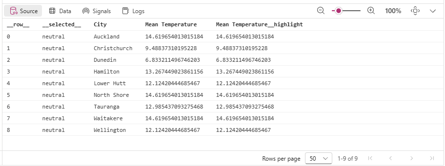

From left to right, the components of the pane are as follows:

### Source Pane

The Source Pane displays the dataset Deneb hands to Vega - that is, the data your visual receives _before_ any Vega-side transforms are applied. It is the default view in the Debug Pane, since it is typically the most useful starting point for checking that fields are bound and that [supporting fields](dataset#supporting-fields) are configured as you expect.

- Rows include any [additional datum fields](interactivity-overview#additional-datum-fields) Deneb has added to support interactivity (for example `__highlight__`, `__selected__`, `__format__`, `__formatted__`), so you can inspect their values directly without going via [tooltips on a mark's datum](interactivity-tooltips#debugging-with-tooltips).
- The table behaves the same way as the [Data Pane](#data-pane) - cells are inspectable on click or via **Enter** / **Space**, and the grid is keyboard-navigable.
- If Deneb cannot produce a source dataset (for example, no fields are bound yet), an explicit empty-state message is shown.

### Data Pane

The Data Pane displays information about the named datasets produced by the Vega view _after_ its transforms have run. This will provide a dropdown to select the desired data stream to inspect, and the details will then be shown in the table below.

- The default selection is the first dataset Vega lists in its view. If you want to see what Deneb handed Vega _before_ any transforms - including the supporting fields used for interactivity - use the [Source Pane](#source-pane) instead.

- If the Vega view is unavailable (for example, while the spec has a compile error) or the selected named dataset cannot be resolved, an explicit empty-state message is shown that points you at the [Logs Pane](#logs-pane) for details.

- Any cell can be inspected in depth by clicking it, or by pressing **Enter** / **Space** when the cell is focused. This opens a read-only Monaco editor showing the full value:
  - For **scalar values** (strings, numbers, booleans), the inspector appears as a compact popover rendering the value as plain text.
  - For **objects and arrays**, the inspector appears as a larger popover with JSON formatting, syntax highlighting, and code folding, which is useful for drilling into deeply-nested structures or the [additional datum fields](interactivity-overview#additional-datum-fields) Deneb adds to assist with interactivity.
  - To close the inspector, press **Escape**, click outside the popover, or **Tab** out of the grid.

- Long or complex values are truncated in the table cell itself, with a `{...}` placeholder for complex structures. Hovering on a truncated cell shows a tooltip noting that you can view a shallow representation in the inspector.

  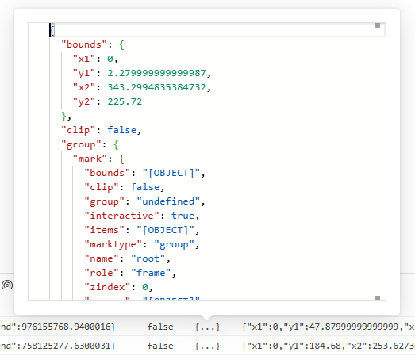

- Tooltips for interactivity values and column headers are also contextual, to better assist you with what things might mean:

  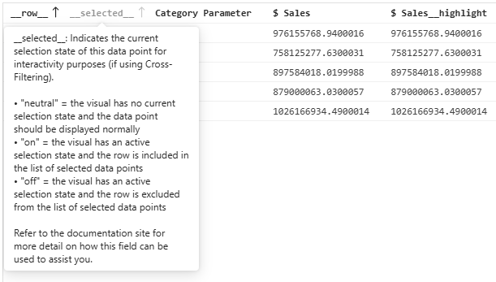

- The table is keyboard-navigable as a grid: **arrow keys** move the focused cell, **Home** / **End** jump to the start or end of a row, and **Tab** leaves the grid entirely.

- For performance reasons with rendering (mainly because a data stream can contain complex objects), the number of visible rows is capped at a fixed amount per page (configurable using the _Rows per page_ dropdown). You may therefore need to navigate the table using the pagination controls below to view specific records; however, columns can be sorted by clicking the appropriate header.

### Signals Pane

The Signals Pane can be used to inspect the state of [signals](https://vega.github.io/vega/docs/signals/) from the Vega view. Signals are often auto-generated for features in Vega-Lite, such as [parameters](https://vega.github.io/vega-lite/docs/parameter.html).

The functionality of the table is very similar to that of the Data Pane, with two differences:

- The `key` column is not inspectable; only the `value` column opens the inspector on click or keyboard activation.
- When the inspector is open for a signal, it refreshes in place as the signal updates.

### Logs Pane

The Logs pane is used to monitor [logging](https://vega.github.io/vega/docs/api/util/#logging) events emitted by the Vega view. Here, you can set the desired log level, which will be updated when the specification is (re)parsed.

- The default logging level is `warn`.
- Note that due to the verbosity of the output created by the `debug` level, this is not available in Deneb.

### Zoom Controls

The Zoom Controls are intended to assist you with detailed work, particularly because Power BI custom visuals can only occupy a limited area of the main interface. These functions are:

- Zoom preview out by 10%

- Zoom level slider - allows manual adjustment of zoom level from 10% to 400%.

- Zoom preview in by 10%

- Current zoom level - click to set a specific zoom level:

  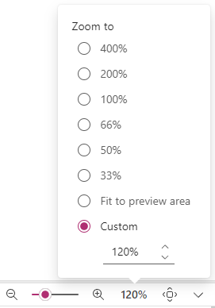

- Zoom preview to fit available space

### Collapse or Expand Debug Pane

This control lets you toggle the visibility of the Debug Pane.
