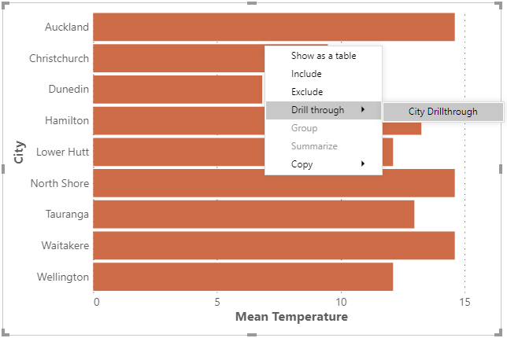
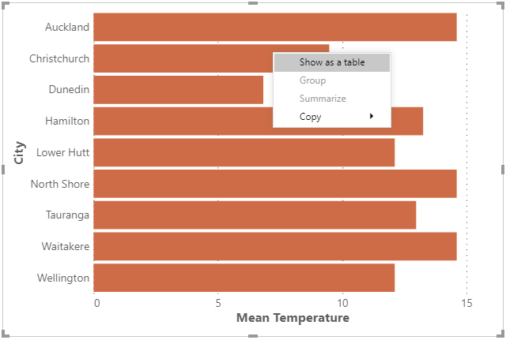

# Context Menu

If you or a user right-clicks the visual canvas, Deneb will display the Power BI context menu.

The context menu is managed by the main Power BI window, so Deneb handles integration between the Vega view and Power BI to delegate as much as possible on your behalf.

## Context Menu Settings

Deneb provides two settings that control the Power BI context menu, available in the _Context menu_ section of the [**Project setup** pane in the Visual editor](visual-editor#settings-pane). Both are enabled by default.

- **Show context menu on right-click**: controls whether the Power BI context menu appears when right-clicking the visual canvas (or within the boundary representing the visual viewport in the Advanced Editor's [Preview Area](visual-editor/#preview-area)).

- **Attempt to resolve data point-specific actions**: when the context menu is enabled, this controls whether Deneb attempts to resolve the clicked data point for drill-through and other data-specific menu options. This setting is only available when the context menu is enabled.

## Context Menu Disabled

When **Show context menu on right-click** is disabled, right-click events are silently consumed, and no menu is displayed. This allows authors to use right-click for their own Vega/Vega-Lite event handlers without the Power BI context menu appearing.

Note that even with the Power BI context menu disabled, context events from the Vega view can still be used - so if you wanted to create a custom context menu in Vega, this will work as expected.

## Data Point Resolution

With **Attempt to resolve data point-specific actions** enabled: if the right-click target area is a mark, and represents an un-transformed row from your `"dataset"`, Deneb will attempt to resolve the current row context and present any options that Power BI makes available from the main window, e.g.:

## Regular Context Menu (or Resolution Not Possible)

If **Attempt to resolve data point-specific actions** is disabled, or a datum cannot be resolved from a mark (or the target area is not a mark), Deneb will display the regular context menu, e.g.:

## Limitations and Considerations

- Data resolution integration with Power BI is wholly dependent on the correct row context. [Refer above](#data-point-resolution), or to the [Overview](interactivity-overview) page for more information about ensuring this is preserved.

- The Power BI context menu only accepts a single datum, or row. This means that if you are aggregating rows into marks, then we cannot resolve the context menu in these cases.
