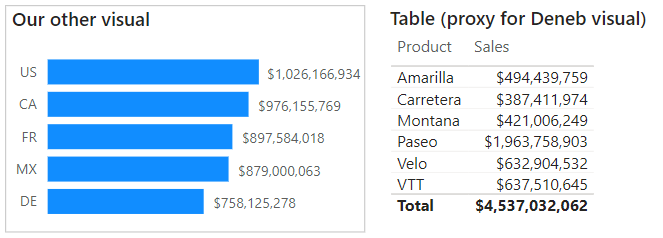
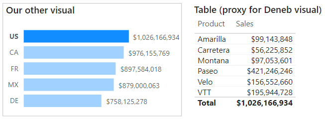
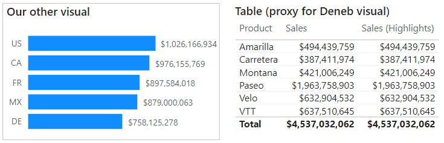
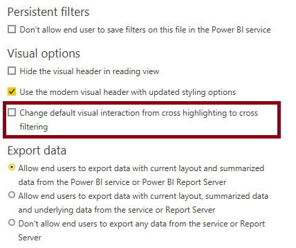
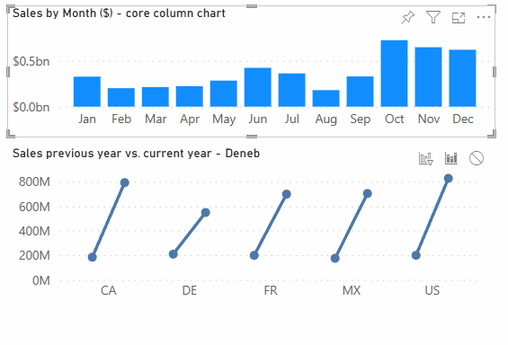
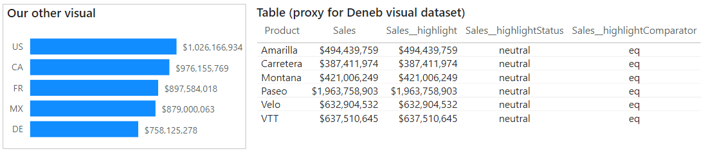

# Cross-Highlighting

It is possible to make your visual respond to cross-highlight interactions from other visuals. Much like [Cross-Filtering](interactivity-selection), this requires some additional work to implement the necessary visual effects that you want your visual to have, so as such the properties are **disabled** by default. This page shows how to enable this, and provides some guidance on how you can work with the data that gets sent to the visual dataset.

:::info This is A Deep and Info-Dense Topic
This whole page provides valuable knowledge about how cross-highlighting works in Power BI, and the theory you need to consider how to approach it in your own visuals.

If you're the sort of person that just wants to get on with it, the one thing you absolutely need to bear in mind is: **any visual you want to build that supports cross-highlighting is really 2 visuals in one**:

1. A visual that shows the original values.
2. A visual that shows the highlighted values in context with the originals.

It is recommended that you read the page in order so you can best understand what cross-highlighting involves. If you want to jump straight in, you can head down to the [Recommended Approaches](#recommended-approaches) section, but for those who read the whole thing, it may make your life a bit easier 🙂
:::

## Filtering vs. Highlighting: Conceptually

Power BI offers three types of [interactions between visuals](https://docs.microsoft.com/en-us/power-bi/create-reports/service-reports-visual-interactions?WT.mc_id=DP-MVP-5003712): **Filter**, **Highlight** and **None**.

As creators, a lot of what goes on under the hood is abstracted away from us with visuals that we directly consume in Power BI. If we want to tear off the mask and manage this ourselves, we need to know more about this at a basic level. What follows is a simple guide on how these interactions may work (this can also be dug into at a lower-level [in the custom visuals SDK documentation](https://docs.microsoft.com/en-us/power-bi/developer/visuals/highlight?WT.mc_id=DP-MVP-5003712)).

Let's say we have a chart which shows **Sales** by **Country Code**, but we intend to build a visual with Deneb that used **Sales** by **Product**. For now we will represent this using a table visual:



### Filtering

When it comes to the **Filter** interaction, our visual dataset's fields are directly updated by Power BI with the revised values, e.g.:



It should be fairly evident that the totals have updated in our table to reflect the values from the _US_ category. In our Deneb dataset, the **Sales** field will contain the same value and our chart would update as we expect.

### Highlighting

With the **Highlight** interaction, we want to be able to show the values in context to the original values. With this enabled, things change a bit. Our dataset now looks similar to the following representation:

, as well as the values for the current highlight, which is the US.")

Here we can see that this is a combination of _both_ of the above tables - our **Sales** measure shows the original values that were provided, and we have an additional set of values showing the amount for the highlighted **Country** in our other visual.

If we flip things the other way around and click on a row in our table, we can see a similar effect on the bar chart, e.g.:

, as well as the values for the current highlight, which is the 'Amarilla' Product.")

What we see in the bar chart, is almost the same thing as our table: (ignoring the data labels for a second) each **Country** has:

- A solid bar - representing the **Sales** amount for the highlighted **Product**.
- A less opaque bar - representing the original **Sales** amount for each **Country** (for all **Products**).

Without spoiling things too much, this is the type of approach we need to think about if we want to build a visual using Deneb that implements cross-highlighting.

To complete the loop, if we have no filtering applied, but our visual is enabled for cross-highlight, we can consider that both of these "measures" exist in the dataset, but have the same value, e.g.:



## What this Means for Deneb

With the above in-mind, and before we talk about the strategy and how to work with cross-highlighting in Deneb, there are some other considerations to think about.

### Deneb is the Visual

- Deneb is the actual custom _Visual_ that you're adding to your report, and the features it supports at a high-level are what Power BI knows about.

- Your specification is executed within Deneb's environment.

- If a Power BI _Visual_ wants to support cross-highlighting, it's assumed that you're going to handle it in your code, and if you're writing a specific custom visual that you're going to package and distribute, that's normally fine.

- Deneb is different in that it's a host for a language that lets you create your own visual, but as far as Power BI is concerned, it's the one that _should_ be cross-highlighting (as we told Power BI that the feature is supported at the _Visual_ level).

- For us to offer the functionality for creators who wish to leverage it, we have to enable this support at the visual (Deneb) level.

### Cross-Highlighting = Additional Thinking

As such, having the feature enabled essentially creates the challenge that you need to start thinking about it:

- With Deneb, you as a creator _might_ want to enable support and spend the time building everything around it. But, you might not, and that's fine too.

- Many users have their default interaction set to cross-highlight rather than cross-filter in Power BI's **Options** dialog:

  

- If you don't want to go to the effort of implementing cross-highlight, this situation may cause confusion if you haven't explicitly set all interactions from other visuals to your Deneb visual to highlight rather than filter.

Based on the above explanation of how the different interaction modes work, you would normally see no change in your visual, because the 'base' or original values remain in-place.

Whilst this is not intuitive, it is technically correct. However, we understand that there's a lot to think about when learning a language, and having to understand more about how Power BI works under the hood when it comes to this kind of thing.

### "Out of the Box" Assumptions

Therefore, Deneb's approach to cross-highlighting assumes the following:

1. You're unlikely to want to implement it without understanding what all the above means.

2. It may not make sense to you until you do.

3. When you do understand, you're aware of what this might entail and are ready to opt-in.

Therefore, we want to try and meet you halfway. As such, we assume that cross-highlighting functionality should not be on by default if you want to op-in to add cross-highlight functionality in your visual, it's a 2-stage process. This is detailed further below.

## Recommended Approaches

You probably want to get into this as quickly as possible, so use the appropriate directions under each section to set up the visual how you need it for the situation you want. However, the sections that follow afterwards are pretty much recommended reading if you want to understand how or why things work the way they do, and what you need to understand what's happening inside your visual.

Bear in mind that **we cannot control the default interactions in the visual header from inside Deneb**; these are outside the body of the visual and as such need to be manually specified by the report creator.

### Cross-Filtering Only

If you don't want cross-highlighting support in your specification at all:

- Ensure that the **Expose Cross-Highlight Values for Measures** property is disabled in the _Vega > Power BI Interactivity_ section of the [**Settings** pane](visual-editor#settings-tab) of the Visual Editor. This should be disabled by default, unless you have loaded a template that utilises it.

- Confirm that any other visuals that can interact with your visual are set to **Filter** your visual in the visual header.

#### How We Try to Help (if you don't do this)

If the **Expose Cross-Highlight Values for Measures** property is disabled, but the interaction in the visual header has not been set, we will attempt to map highlight values to measure values by their original name internally, e.g.:



:::warning Always Check Behavior
Note that this may not be 100% reliable but is the best we can do due to custom visual limitations. If leaving this as-is, you should really ensure that your data is correct for your readers, and explicitly set the correct interactions if not.
:::

### Cross-Highlighting

If you want to take-up cross-highlighting support in your specification:

- Ensure that the **Expose Cross-Highlight Values for Measures** property is enabled in the _Vega > Power BI Interactivity_ section of the [**Settings** pane](visual-editor#settings-tab) of the Visual Editor. This should be disabled by default, unless you have loaded a template that utilises it.

- Confirm that any other visuals that can interact with your visual are set to **Highlight** your visual in the visual header.

To know more about how this works at a lower level, and how to access the necessary fields in your dataset to leverage the functionality, you can keep reading.

## Cross-Highlighting Strategy

Now, we can talk about how to get started. As this is a dense topic, some points may be repeated from above, just to ensure that everything is laid out in one place.

- You can configure whether Deneb should expose highlight values to the dataset, through the **Expose Cross-Highlight Values for Measures** property is enabled in the _Vega > Power BI Interactivity_ section of the [**Settings** pane](visual-editor#settings-tab) of the Visual Editor.

- This setting is **disabled** by default.

- For each row in the visual dataset, Deneb will expose and generate [special fields for each measure](#special-__highlight-fields), which you can use to assign encoding of mark properties (or use other functionality such as conditions or expressions) and represent data points that are highlighted vs. their original values.

- When data points in another visual are selected, **and** Deneb's interaction with the visual is set to **Highlight**, your dataset will respond to these changes:

  - The original measure value prior to the highlight operation is preserved.
  - The highlight fields are updated with the information Power BI provides from the main window.

- If there is no active selection in another visual, the highlight and original values of measures are equal to each other (but still exist). You can get a visual representation of what tis might look like in our [walkthrough of the concept above](#highlighting).

- It is up to you as a creator to use this field to [manage the visual effects within your specification](interactivity-overview#visual-effects-and-behavior) for highlighted vs. original data points or field values. A simple illustration of this is covered [in the worked example](simple-example#cross-highlighting) and some further simple examples are [covered further down the page](#managing-highlight-state-visually-through-encodings).

- We [try to map highlight values internally](#how-we-try-to-help-if-you-dont-do-this) to our regular values, if the option has not been enabled.

## Special `__highlight` Fields

Where [cross-filtering](interactivity-selection) works for the whole row, cross-highlighting works at the measure-level. If the the **Expose Cross-Highlight Values for Measures** property is enabled, then your visual dataset contains additional fields for each measure.

- `[measure name]__highlight` - this is the highlight value for the measure, as opposed to its original value, which is stored in the regular measure field. This provides a way of being able to encode original vs. highlight.

- `[measure_name]__highlightStatus` - this provides additional state about this specific measure for this particular row context has a higlight applied or not (like the `__selected__` field, but more-specific). This can be one of the following values:

  - **`on`**: the visual has an active cross-highlight state and the measure is actively highlighted
  - **`off`**: the visual has an active cross-highlight state, but the measure is not highlighted (this tends to be a likely scenario when using multiple measures rather than a single measure)
  - **`neutral`**: there is no cross-highlight state applied to the visual. The orginal and highlight values will be equal to each other.

- `[measure_name]__highlightComparator` - this provides a pre-calculated way of determining if a highlight value is equal to its original value or not and allow you to apply conditional encodings without the need to derive this separately in a `calculate` transform or similar. This can be one of the following values:

  - **`eq`**: the original and highlight values are equal to each other
  - **`lt`**: the highlight value is less than the original value
  - **`gt`**: the highlight value is greater than the original value
  - **`neq`**: the highlight value and original value are not equal, or not directly comparable (this will typically be used for text-based measures)

#### Simple Example of How Fields Respond to Cross-Highlighting from Other Visuals

Using a similar example as our walkthrough above (using the same Product column and $ Sales measure), here's how our dataset will look if we enable the **Expose Cross-Highlight Values for Measures** property:



Selecting a data point in our other visual will now cause Power BI to update our visual's higlight values, and Deneb will update the additional fields accordingly, e.g.:

, as well as the values for the current highlight, which is the US. The 'Highlight Status' fields shows 'on', indicating the measure is actively highlighted. The 'Highlight Comparator' value shows 'lt', which specifies that the highlighted value is less than the original value.")

## Managing Highlight State Visually Through Encodings

Much like for cross-filtering, you will need to ensure that you design your visual and its encodings to effectively communicate cross-highlight status for your readers. This is often uncharted territory when it comes to bespoke visuals in Power BI, as there are often no existing visuals or patterns to crib ideas from.

It's generally regarded to try and communicate where your highlights are vs. your original values, so that your readers can contextually resolve this information.

The [Simple Worked Examples](#simple-examples) section below shows how you may be able to get started with exploring this further. While these focus on Vega-Lite, both versions of the _Simple Bar Chart_ template available from the _New Specification_ dialog contain simple bindings for cross-highlighting to help you get started.

## Limitations and Considerations

:::info This Sounds Hard...
Well, it's not always straightforward! It is early days for this type of "visual thinking" within Power BI, and it is likely that the community will be able to uncover better design patterns than the ones outlined on this page. They will certainly help you get on your way.

If you have found an alternative approach, or have a great idea on how to help us improve this, then [please let us know](https://github.com/deneb-viz/deneb/issues)! We would love to continue to evolve this functionality and make it more accessible if we can do so.
:::

- Cross-highlight values are only applicable to measures; Power BI does not apply this to columns.

## Simple Worked Examples

The following examples are for Vega-Lite but similar principles can be applied for Vega.

This report shows the three examples below how they would be rendered in Power BI, using a model based on the sample finanical data available in Power BI Desktop. In each case, the full tooltip data is exposed so that you can observe the state of the `__highlight` fields. A table is also visible to show what the highlight fields look like as the visual is being cross-highlighted from our core visual on the left. We'll provide basic example JSON for each underneath.

<iframe
    width="100%"
    height="486"
    src="https://app.powerbi.com/view?r=eyJrIjoiZTAxMDg4NGUtMDgxMC00YmFjLWJlNDctYjM0ZjI0NzNlM2QyIiwidCI6IjUzYmJlMGQ3LTU0NzItNGQ0NS04NGY0LWJiNzJiYjFjMjI4OSJ9"
    frameborder="0"
    allowFullScreen="true"
></iframe>

&nbsp;&nbsp;&nbsp;&nbsp;_Download this workbook (will be provided later)_

#### Example 1: Simple Cross-Highlight Handling Using Layers

Here, we're altering the approach of our bar chart slightly, using [layers](http://vega.github.io/vega-lite/docs/layer.html) to draw 2 bars - one for the original values and another for the highlights. The `x` position of each bar is bound accordingly, e.g.:

```json highlight={5-12,15-22}
{
  "data": { "name": "dataset" },
  "layer": [
    {
      "name": "Original Value",
      "mark": {
        "type": "bar",
        "opacity": 0.3
      },
      "encoding": {
        "x": { "field": "Sales" }
      }
    },
    {
      "name": "Highlight Value",
      "mark": {
        "type": "bar"
      },
      "encoding": {
        "x": {
          "field": "Sales__highlight"
        }
      }
    }
  ],
  "encoding": {
    "y": {
      "field": "Product",
      "type": "nominal"
    },
    "x": { "type": "quantitative" }
  }
}
```

#### Example 2: Extending Design to Include Cross-Filtering

Example 1 will work for cross-highlight only; in order to ensure that our design allows our visual to cross-filter other visuals _and_ handle incoming cross-highlight, we extend the `opacity` encoding in our highlights layer to effectively toggle visibility of the mark if the `__selected__` field is off. This will utilise the underlying mark for the orignal values for the 'dimmed' value, e.g.:

```json highlight={23-32}
{
  "data": { "name": "dataset" },
  "layer": [
    {
      "name": "Original Value",
      "mark": {
        "type": "bar",
        "opacity": 0.3
      },
      "encoding": {
        "x": { "field": "Sales" }
      }
    },
    {
      "name": "Highlight Value",
      "mark": {
        "type": "bar"
      },
      "encoding": {
        "x": {
          "field": "Sales__highlight"
        },
        "opacity": {
          "condition": {
            "test": {
              "field": "__selected__",
              "equal": "off"
            },
            "value": 0
          },
          "value": 1
        }
      }
    }
  ],
  "encoding": {
    "y": {
      "field": "Product",
      "type": "nominal"
    },
    "x": { "type": "quantitative" }
  }
}
```
