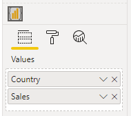

# Interactivity Features - An Overview

Power BI provides the ability to create visuals using [R](https://docs.microsoft.com/en-us/power-bi/create-reports/desktop-r-visuals?WT.mc_id=DP-MVP-5003712) and [Python](https://docs.microsoft.com/en-us/power-bi/connect-data/desktop-python-visuals?WT.mc_id=DP-MVP-5003712). Whilst these extend your options significantly, these are typically rendered as a static image and mean that it's currently not possible for you to interact back from these visuals to the rest of the report.

On occasion, these visuals may also require some additional dependencies if you want to share with a wider pool of end-users, or a library may not be available in the Power BI Service when it comes to deployment.

## How Deneb Can Be Different from R & Python Options

In addition to the JSON-based declarative syntax, Deneb is packaged with the Vega and Vega-Lite libraries. Because they are built for the web, anything you produce should ideally be portable within the Power BI ecosystem, irrespective of which device you're using.

Both [Vega](https://vega.github.io/vega/docs/event-streams/) and [Vega-Lite](https://vega.github.io/vega-lite/docs/selection.html) have their own approaches to interactivity and it's only logical to start thinking about how we can make use of this to make the visual "fit in" with the functionality on offer in other Power BI visuals...

## Managing your Expectations

The interactivity part is one of the harder elements of developing your own custom visual and as such, it's going to be challenging to make this work in a visual like Deneb in a generic way, particularly as the Vega tooling provides a lot of creative freedom.

We fundamentally have three challenges when it comes to building visuals that are interactive within Power BI:

1. Ensuring that Deneb visuals can interact with the main Power BI window (which handles interactivity events on a visual's behalf).

2. Reconciling data and row context to other visuals or the data model when events happen in our visual.

3. Prescribing how the our visual should behave and respond _visually_ when our end-users interact with it.

As such, we have some considerations to make when trying to deliver functionality are interactivity so that you can produce visuals that look and feel at home in Power BI, and your end-users get a consistent experience with your visual vs. others.

The below is going to attempt to summarize some of the considerations we need to think about and this is a challenge to do concisely. For a deeper understanding, you're welcome to dive into the [developer documentation for visuals](https://docs.microsoft.com/en-us/power-bi/developer/visuals?WT.mc_id=DP-MVP-5003712).

## Reconciliation of Data and/or Row Context

### Getting Data from the Model

- Visuals in Power BI can't read from the model of their own volition - they are effectively ring-fenced away from the main interface for a lot of (sensible) reasons.

- When you add columns and measures to the data roles, this is part of Power BI's interface, rather than the visual's.

- Power BI looks at all of these, plus the current filter context and runs a DAX query on the visual's behalf.

To illustrate, we can use the Financial sample dataset that comes with Power BI Desktop to add the `Country` column and specify a sum of `Sales` to Deneb's _Values_ data role:



After doing this, Power BI will generate the following query against the data model (which can be verified using the [Performance Analyzer](https://docs.microsoft.com/en-us/power-bi/create-reports/desktop-performance-analyzer?WT.mc_id=DP-MVP-5003712)):

```dax
// DAX Query
DEFINE
    VAR __DS0Core =
        SUMMARIZECOLUMNS (
            'financials'[Country],
            "Sumv_Sales", CALCULATE ( SUM ( 'financials'[ Sales] ) )
        )
    VAR __DS0PrimaryWindowed =
        TOPN ( 10001, __DS0Core, 'financials'[Country], 1 )
EVALUATE
__DS0PrimaryWindowed
ORDER BY 'financials'[Country]
```

This would produce the following dataset (visualized using a table):

.")

...and this dataset is supplied by Power BI into the visual. At this point, Deneb's logic will process the dataset and things continue as normal.

:::tip
Refer to the [Dataset](/docs/dataset#grain--row-context) page if you want to see how this data would get represented internally.
:::

### Signaling Back to Power BI

Now using the above as an example, we can talk about the following interactivity scenarios:

- Displaying a report page tooltip or leveraging modern tooltip features
- Drilling-through from the context menu
- Cross-filtering other visuals
- Having other visuals cross-highlight ours

All of these situations require the visual to tell Power BI what data it needs to work with... but here's the thing: just like how visuals can't just read whatever they like from the data model, they _definitely_ can't send anything back.

For these situations, Power BI provides APIs for a visual to request that Power BI try to do these things on its behalf. For Power BI to fulfil this, it needs to know which row(s) from the original dataset it has to resolve.

- If you have just taken the dataset as-is and created a mark using Vega or Vega-Lite, then a mark's datum still has the correct row context and identifying information that Power BI needs.

- However, if you apply an operation in your specification that mutates the data from its original dataset - for example a transform ([Vega](https://vega.github.io/vega/docs/transforms/) | [Vega-Lite](https://vega.github.io/vega-lite/docs/transform.html)) - then we lose the ability to leverage this functionality in the resulting outputs.

Any functionality we can deliver needs to bear these constraints in mind.

#### Additional Datum Fields

Provided that there are no such mutations, a Vega or Vega-Lite datum will contain the following additional fields for reconciliation purposes. These field values represent the row of your dataset as a whole:

- `__row__` - this is the (zero-based) index of the visual dataset's corresponding entry. The presence of this field indicates that the datum can be reconciled back to the original dataset, and therefore Power BI can resolve the row context for interactivity events.
- `__selected__` - whether this particular row context is selected for [cross-filtering](interactivity-selection).

These may become visible to you when [inspecting a datum using tooltips](interactivity-tooltips#debugging-with-tooltips) or similar, but they aren't currently supported for use outside of anything Deneb does for you.

#### Additional Cross-Highlighting Fields for Measures

The following additional entries will get created for all measures in your dataset in the event of having [cross-highlighting](interactivity-highlight) enabled on your visual:

- `[measure name]__highlight` - this is the highlight value for the measure, as opposed to its original value, which is stored in the regular measure field. This provides a way of being able to encode original vs. highlight.

- `[measure_name]__highlightStatus` - this provides additional state about this specific measure for this particular row context has a highlight applied or not (like the `__selected__` field, but more-specific).

- `[measure_name]__highlightComparator` - this provides a pre-calculated way of determining if a highlight value is equal to its original value or not.

These are covered in more detail on the [Cross-Highlighting](interactivity-highlight#special-__highlight-fields) page.

### What About..?

There's a couple of interactivity scenarios we've missed out from above:

- Default tooltips are different to report page or modern tooltips.
  - In these cases Deneb can pass a list of values to display and ask Power BI to display them inside a standard tooltip.
  - This is also the fall-back behavior if the row context cannot be resolved by Power BI, or a suitable tooltip page cannot be found.
  - Tooltip functionality within Deneb is covered in much more detail on the [Tooltips](interactivity-tooltips) page.
- Slicer filtering works differently to cross-filtering, but as Deneb is not a slicer, we're skipping that one.

## Visual Effects and Behavior

Whilst this section is not as large as the above one, it is still very important to consider.

In defining a specification, you have control over how Vega or Vega-Lite renders the output for interaction events. You may choose to employ dimming or opacity-based effects for non-selected marks, or you may choose to alter their color, or try something completely unique and original. You can read more about how to start working with these approaches on the [Cross-Filtering](interactivity-selection) and [Cross-Highlighting](interactivity-highlight) pages.
