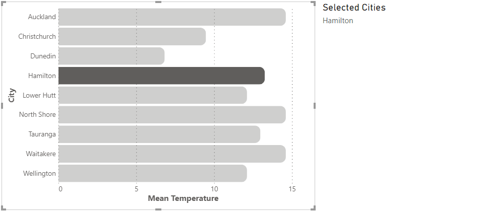
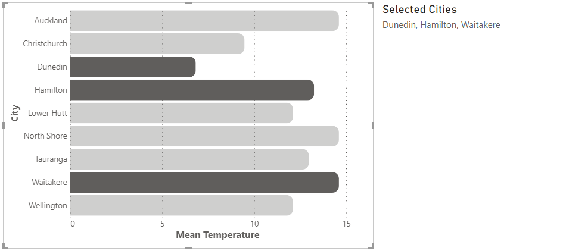
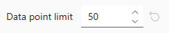

# Cross-Filtering (Selection)

It is possible to enable cross-filtering of other visuals when a mark containing a resolvable datum is clicked (or Ctrl/Shift-Clicked for multi-select).

However, cross-filtering is a bit of a special case vs. [tooltips](interactivity-tooltips) and the [context menu](interactivity-context-menu). As such, this is **disabled** by default, so as not to create potential UX issues prior to ensuring your visual effects are applied based on selection state. We'll explain on this page what you need to think about if you want to enable this for your visuals, and what to think about from an implementation perspective when creating your specification.

## Cross-Filtering Strategy

Both [Vega](https://vega.github.io/vega/docs/event-streams/) (with Signals and Events) and [Vega-Lite](https://vega.github.io/vega-lite/docs/parameter.html) (with Parameters) both have their own ways of managing interactivity internally when it comes to clicking on marks. However we also have to think about [how Power BI manages selection state between visuals](https://docs.microsoft.com/en-us/power-bi/developer/visuals/selection-api?WT.mc_id=DP-MVP-5003712) and apply this in a generic manner, so Deneb again bridges this particular gap as much as possible. Therefore, cross-filtering works as follows:

- You can configure whether Deneb should attempt to [resolve data points](#data-point-resolution) when clicking on marks, through the **Expose cross-filtering values for dataset rows** property in the _Vega > Power BI Interactivity_ section of the [Settings pane in the Visual editor](visual-editor#settings-tab).

- This setting is **disabled** by default.

- For each row in the visual `"dataset"`, Deneb will generate a [special field for each row](#the-__selected__-field) called `"__selected__"`, and will update this based on click events, or eligible external events to your visual, such as restoring a bookmark with an active selection state.

### Management Mode of Cross-Filtering Events

With the **Expose cross-filtering values for dataset rows** property enabled, Deneb will then display a **Cross-filtering management** setting, with two options:

 and Advanced.")

:::caution 'Advanced' Really Means Advanced
The documentation on this page continues under the assumption that you will be working with the _Simple_ (default) management mode. It is worth starting with this mode to allow Deneb to handle as much as it can for you, although you will still need to do some work. If you are using Vega and have a need to do more than the _Simple_ mode can offer (and are comfortable with how things work), then you can explore [Advanced Cross-Filtering](interactivity-selection-advanced).
:::

### Additional Strategy for the _Simple_ Management Mode

- If multiple data points are selected (i.e. by holding the Ctrl or Shift key), Deneb will add these to the current list of selected data points and update the `__selected__` value accordingly.

- Clicking anything other than a mark within the visual canvas (or a mark that cannot be resolved to one or more data points) will clear the current selection from the visual, and signal to Power BI to do the same for other visuals on the page.

- It is up to you as a creator to use this field to [manage the visual effects within your specification](interactivity-overview#visual-effects-and-behavior) for selected vs. unselected marks. A simple illustration of this is covered [in the worked example](simple-example#cross-filtering) and some further simple examples are [covered further down the page](#managing-selection-state-visually-through-encodings).

## Data Point Resolution

With the **Expose cross-filtering values for dataset rows** property enabled, Deneb will monitor marks for click events. If the mark represents an un-transformed row's datum from your `"dataset"` (or has enough information for Deneb to resolve it), it will be added to the list of currently selected data points and delegated to Power BI for handling other visuals in a page, e.g.:



:::caution You Must Manage Visual Effects and Encodings
Note that the above is based on the visual produced [in the worked example](simple-example#adding-cross-filtering). As such this has an encoding applied to add an effect to marks that are in the current list of selected data points and is to help illustrate the concept. You will need to [manage such encodings yourself](#managing-selection-state-visually-through-encodings). The card to the right of the visual is merely for illustrative purposes: it helps us to re-state the selected values via another measure and confirm selections are propagated.
:::

Holding the Ctrl or Shift key and clicking additional marks that contain resolvable data points will add these to the current list and affect other visuals, e.g.:



### Primitive Aggregate Resolution

For marks or layers that contain simple aggregates, Deneb can attempt to resolve and collect the individual data points, based on the unique values of grouped fields. This can be useful but there are a couple of considerations here:

- Any columns and measures need to be aliased in this new data stream as the corresponding columns and measures they are derived from.
- If you are applying filtering or additional transforms that remove the compent rows, this is not taken into account.
- As the data is a new stream, the granularity (and therefore the row context) is different to the base `"dataset"`. This means that there is no [corresponding `__selected__` field](#the-__selected__-field) to help manage selection state, but it is possible to be creative here and give the impression of selection at a higher level; there is an example of this below.

## Data Point Limit

A high number of active selections can give Power BI a lot of work to do in terms of managing state between all the visuals on a page and can potentially cause performance issues. Given the flexible nature of Vega/Vega-Lite and the types of visuals you can produce, there is a limit on the number of data points that can be supplied to Power BI. This can start to add up, particularly if you use a low level of granularity but are attempting to select a mark that [aggregates many data points](#primitive-aggregate-resolution).

A **Data Point Limit** property is exposed in the **Settings** pane when cross-filtering is enabled, e.g.:



As you can see from the above screenshot, this defaults at **50**, but can be set from anywhere between **1** and **250**.

When interacting with your visual, if you accumulate enough data points in the current selection list, you will see this message in the visual header:

.")

In this situation, Deneb will keep the current selection active, but will not add any more rows to it.

This warning can then be dismissed by either:

- Clicking the **Dismiss** option (continuing to preserve the current selection)
- Clicking on another mark (initializing a new selection, if eligible)
- Clicking elsewhere in the visual, or on the **Clear selection** option (clearing the current selection)

## The `__selected__` Field

Deneb will maintain the value of this field for each row in your dataset as follows:

- **`on`**: the visual has an active selection state and the row is **included** in the list of selected data points.
- **`off`**: the visual has an active selection state and the row is **excluded** from the list of selected data points.
- **`neutral`**: the visual has no current selection state and the data point should be displayed normally.

:::tip Why 3 States?
The reason we have three states rather than a simple **`on`**/**`off`**, or binary state, is to allow us the (optional) opportunity to style elements that are explicitly highlighted differently to those that are displayed regulary (**`neutral`**) and open up further possibilities for our readers.
:::

Some further examples of leveraging this state management are [detailed further below](#simple-examples).

## Managing Selection State Visually through Encodings

As mentioned higher up, if you want Cross-Filtering to work effectively for your readers, you will need to use the state of the `__selected__` field for each row and encode marks accordingly, so that your visuals communicate selected vs un-selected marks effectively. We'd recommend a similar approach to most other Power BI visuals in at least setting the opacity of effected marks accordingly, but the flexibility of the Vega languages gives you the ability to explore other possibilities.

The [Simple Worked Examples](#simple-examples) section below shows how you may be able to get started with exploring this further. While these focus on Vega-Lite, both versions of the _Simple Bar Chart_ template available from the _New Specification_ dialog contain simple bindings for Cross-Filtering to help you get started.

## Limitations and Considerations

:::info This Sounds Hard...
Well, it's not always straightforward! It is early days for this type of "visual thinking" within Power BI, and it is likely that the community will be able to uncover better design patterns than the ones outlined on this page. They will certainly help you get on your way.

If you have found an alternative approach, or have a great idea on how to help us improve this, then [please let us know](https://github.com/deneb-viz/deneb/issues)! We would love to continue to evolve this functionality and make it more accessible if we can do so.
:::

- Data resolution integration with Power BI is wholly dependent on the correct row context. [Refer above](#data-point-resolution), or to the [Overview](interactivity-overview) page for more information about how to to try and ensure that this is preserved.

- It might sometimes be possible to simulate a selection effect when using aggregates, but this will require some lateral thought. [Example 3 below](#example-3-approach-for-styling-aggregate-marks) shows one potential approach to how this could be solved.

## Simple Worked Examples

The following examples are for Vega-Lite but similar principles can be applied for Vega.

This report shows the three examples below how they would be rendered in Power BI, using a model based on the sample finanical data available in Power BI Desktop. In each case, the full tooltip data is exposed so that you can observe the state of the `__selected__` field. We've also added some additional marks to the examples to show this value explicitly as interaction events occur. We'll provide basic example JSON for each underneath.

<iframe
    width="100%"
    height="486"
    src="https://app.powerbi.com/view?r=eyJrIjoiMmI5OTRhMGMtODJiMi00MTIyLTgzZDgtYjU2N2M2NWM3ZDk4IiwidCI6IjUzYmJlMGQ3LTU0NzItNGQ0NS04NGY0LWJiNzJiYjFjMjI4OSJ9"
    frameborder="0"
    allowFullScreen="true"
></iframe>

&nbsp;&nbsp;&nbsp;&nbsp;_[Download this workbook](/pbix/Deneb-Simple-Cross-Filtering-Examples.pbix)_

#### Example 1: Simple Encoding of Opacity with Conditions

As per the worked example and the in-built templates for the bar chart, we can encode our `opacity` based on the value of `__selected__` being set to `"off"`, e.g.:

```json highlight={16-25} showLineNumbers
{
  "data": { "name": "dataset" },
  "mark": {
    "type": "bar",
    "tooltip": true
  },
  "encoding": {
    "y": {
      "field": "Country (Short)",
      "type": "nominal"
    },
    "x": {
      "field": "$ Sales",
      "type": "quantitative"
    },
    "opacity": {
      "condition": {
        "test": {
          "field": "__selected__",
          "equal": "off"
        },
        "value": 0.3
      },
      "value": 1
    }
  }
}
```

#### Example 2: Styling Explicitly Selected Marks vs. Standard (neutral)

We can extend the above example to explicitly style selected marks when `__selected__` is set to `on` rather than just having a binary state if we so wish. Here we have applied a [pattern fill](pattern-fills) when `__selected__` for a row is `neutral`, making it more emphasized, e.g.:

```json highlight={25-35} showLineNumbers
{
  "data": { "name": "dataset" },
  "mark": {
    "type": "bar",
    "tooltip": true
  },
  "encoding": {
    "y": {
      "field": "City",
      "type": "nominal"
    },
    "x": {
      "field": "Mean Temperature",
      "type": "quantitative"
    },
    "opacity": {
      "condition": {
        "test": {
          "field": "__selected__",
          "equal": "off"
        },
        "value": 0.3
      }
    },
    "fill": {
      "condition": {
        "test": {
          "field": "__selected__",
          "equal": "on"
        },
        "value": {
          "expr": "pbiPatternSVG('diagonal-stripe-6', '#605E5C', '#ffffff')"
        }
      }
    }
  }
}
```

#### Example 3: Approach for Styling Aggregate Marks

This scenario is much more complicated, as many transforms tend to create separate data streams; this will often cause us to the lose the row context information. This example uses aggregates internally to group rows. The top 3 have the same grain but the row identifies are not preserved in the output data stream. The _'All Others'_ group contains three underlying data points but these are aggregated down to a single row and our lineage is not available.

As mentioned above, Deneb will attempt a simple reconciliation against the original `"dataset"`, much like it does for tooltips, but this is currently very basic. However we can use approaches, such as [layers](https://vega.github.io/vega-lite/docs/layer.html) to give the impression of selection effects. This example is detailed more in the embedded report page above, but the high-level strategy is as follows:

1. At the top level, [`calculate` a column](https://vega.github.io/vega-lite/docs/calculate.html) that conditionally sums our measure value if a row's `__selected__` value is not `off`. Otherwise, treat the value as `0`.
2. Add a layer that calculates two additional marks:
   - A `bar` with reduced opacity that is the total sum of the primary measure.
   - A fully opaque `bar` based on the `sum` of the calculated value in step 1. As this is drawn after the dimmed bar above, it will be zero-width if the value is `0`; otherwise it will have the same width as our primary measure and sit over the top of the underlying mark.

```json showLineNumbers
{
  "data": { "name": "dataset" },
  "transform": [
    {
      "calculate": "datum.__selected__ === 'off' ? 0 : datum['$ Sales']",
      "as": "Sales_Selected"
    }
  ],
  "layer": [
    {
      "description": "Dimmed Bar; width = sum of Sales",
      "mark": {
        "type": "bar",
        "opacity": 0.3,
        "tooltip": true
      },
      "encoding": {
        "x": {
          "aggregate": "sum",
          "field": "$ Sales",
          "tooltip": true
        }
      }
    },
    {
      "description": "Fully Opaque Bar; width = Selected_Sales",
      "mark": { "type": "bar" },
      "encoding": {
        "x": {
          "aggregate": "sum",
          "field": "Sales_Selected"
        }
      }
    }
  ],
  "encoding": {
    "y": {
      "field": "Product Group",
      "type": "nominal",
      "sort": {
        "field": "Product Group Sort"
      }
    }
  }
}
```
