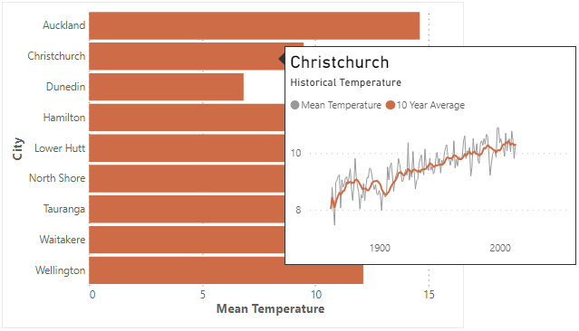
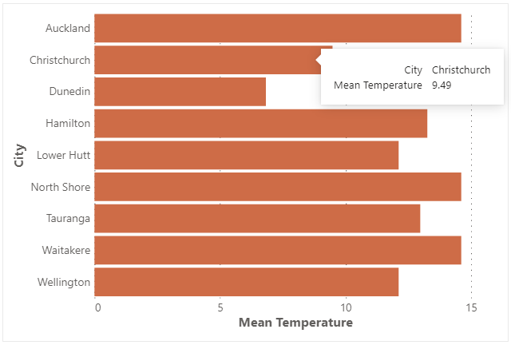
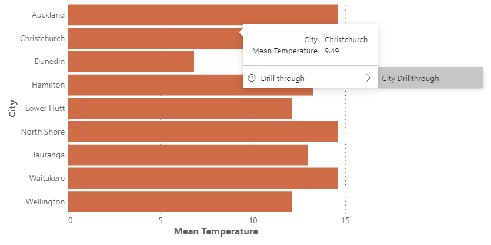
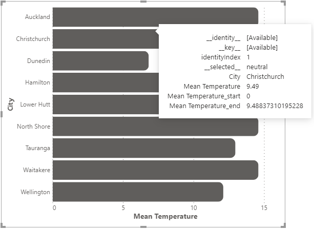

# Tooltips

We saw [in the worked example](simple-example#tooltips), that it's fairly straightforward to add tooltips to a specification, but we'll unpack on this page in a bit more detail.

If you haven't read it already, it's worth reviewing the [preceding page](interactivity-overview) to understand some of the considerations for integrating back into Power BI. It will certainly help with understanding the logistics around report page tooltips in particular.

## Tooltip Strategy

[Vega](https://github.com/vega/vega-tooltip/blob/master/docs/creating_your_tooltip.md#step-4-define-your-tooltip-in-vega-or-vega-lite) and [Vega-Lite](https://vega.github.io/vega-lite/docs/tooltip.html) both provide the ability to customize how their tooltip events can be interpreted. Deneb contains a tooltip handler written specifically for Power BI, which will display under the following conditions:

1. **Tooltip Handler** is enabled in the _Tooltips_ section of the [**Project setup** pane in the Visual editor](visual-editor#settings-pane). This is enabled by default.

2. An appropriate `tooltip` property is assigned to a mark. Refer [below](#vega-lite-syntax) for the recommended syntax for each provider.

3. A tooltip-enabled mark is hovered over.

## Data Point Resolution

Provided that your mark's datum is not transformed or mutated away from the `"dataset"` and represents the _"pure"_ row context passed in, Deneb can resolve this back to Power BI for delegation. Note that row context is only required for resolving report page tooltips; default tooltips are rendered from the tooltip data as plain key/value pairs and will work with any datum.

If a report page exists with at least one of the columns in the current datum, then Power BI will display it for the current row context, e.g.:



If there is no suitable report page for the current datum or you have specified a default tooltip in the _Tooltip_ menu in Power BI's _Properties_ pane, then a default tooltip will be displayed, e.g.:



:::note
A default tooltip will display all values for the current mark's datum, including any other columns or measures bound to its particular row context.
:::

If the title of a tooltip field matches the name of a column or measure in the **Values** data role, Deneb will check whether a format string is set in the data model and apply it automatically. If this cannot be resolved, then you can consider [applying a format manually](/docs/formatting).

If you have enabled [modern tooltip support](https://learn.microsoft.com/en-us/power-bi/create-reports/desktop-visual-tooltips) in your report, and a data point has a corresponding drill-through page, this is resolved in the tooltip, e.g.:



## Default Tooltip Styling

This is done in the usual way, i.e., in the _Tooltip_ menu in Power BI's properties pane.

## Vega-Lite Syntax

The [simplest approach for this](https://vega.github.io/vega-lite/docs/tooltip.html#encoding) is recommended, e.g.:

```json
{
    ...
        "mark": {
            ...
            "tooltip": true,
            ...
        },
    ...
}
```

## Vega Syntax

With Vega, you need to specify the `tooltip` signal in your mark's `encode` property, e.g.:

```json
{
    ...
    "encode": {
        "enter": {
            ...
            "tooltip": {
                "signal": "datum"
            },
            ...
        }
    },
    ...
}
```

## Sentence Template Support

[Sentence templates for tooltips were introduced to Power BI in June 2026](https://community.fabric.microsoft.com/t5/Power-BI-Updates-Blog/Power-BI-June-2026-Feature-Summary/ba-p/5193264#toc-hId-1475394710). These allow you to add free text to the standard tooltip, using brace-enclosed tokens to denote where field values should be inserted.

Deneb supports this integration, with one important caveat: **any field referenced in a sentence template must be an explicit component of the tooltip datum** that Deneb resolves for the hovered mark. If a field isn't present, its placeholder is left as-is in the rendered sentence. The simplest way to guarantee this is an explicit `tooltip` encoding channel (Vega-Lite) or `tooltip` encode entry (Vega) that enumerates all required fields.

Note that the _Tooltips_ menu is a standard container property owned by Power BI, so the sentence itself cannot be read, set, or changed from within your specification, and will not travel with a [Deneb template](/docs/templates) - it needs to be configured on the visual itself.

For a full worked example - including the common pitfalls and how to surface specification-only fields (such as transform output) into your sentences - see the blog post: [How-To: Power BI Sentence Tooltips with Deneb](/blog/sentence-tooltips).

## 'Debugging' with Tooltips

If you're using an approach to display the underlying data point ([e.g., Vega-Lite](https://vega.github.io/vega-lite/docs/tooltip.html#data)) rather than the resolved tooltip info that Vega provides by setting to `true`, we're able to see a bit further under the hood, e.g.:



This can help determine which additional fields or calculations may be applied to a datum for use in expressions. It can also help to determine whether a mark still [has row context](interactivity-overview/#reconciliation-of-data-andor-row-context) and can be reconciled back to Power BI for interactivity. If a tooltip's `datum` contains the `__row__` field, then this is a slam-dunk:

Please refer to the [interactivity documentation](interactivity-overview/#additional-datum-fields) for a further explanation of what these mean.

## Limitations and Considerations

- Report page tooltip integration with Power BI is wholly dependent on the correct row context, as the datum must be reconciled back to a row of the visual dataset. Default tooltips (including sentence templates) are rendered from the tooltip data as plain key/value pairs and do not require row context. [Refer above](#data-point-resolution), or to the [Overview](interactivity-overview) page for more information about ensuring row context is preserved.

- Adding a tooltip does not automatically add visual feedback or effects. If you want to track the position of the resolved data point more visually (e.g., for a line chart), you will need to add suitable marks to do so. Both [Vega](https://vega.github.io/vega/examples/) and [Vega-Lite](https://vega.github.io/vega-lite/examples/) have examples you can refer to.

- Development so far has been focused on Power BI integration. If you deviate from the above patterns, tooltips may not display correctly. If you find any such use cases, please [create an issue](https://github.com/deneb-viz/deneb/issues) with the appropriate reproduction steps (e.g., example specification and/or data) and we'll see what we can do about it.
