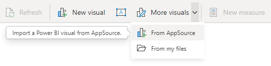
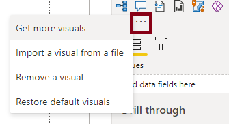
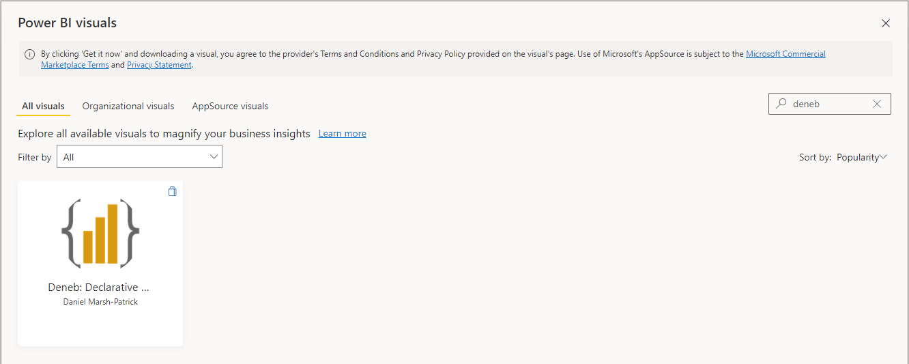
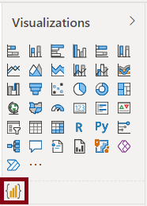

# Getting Started

## Installing from AppSource

Deneb is [available in AppSource](https://appsource.microsoft.com/en-us/product/power-bi-visuals/coacervolimited1596856650797.deneb), and this is the most straightforward way of getting started and staying up-to-date with the latest versions. It can be added directly in Power BI as follows:

1.  To add: in Power BI Desktop, choose _Insert > More visuals > From AppSource_ in the ribbon, e.g.:

    

    Or by clicking the ellipsis in the _Visualizations_ pane and choose _Get more visuals_, e.g.:

    

2.  In the _Power BI Visuals_ dialog, search for _Deneb_ - a shortlist of visuals will be displayed.

    

3.  Click on _Deneb_ in the shortlist to open the visual.

4.  Click the _Get It Now_ button to ad to your report.

5.  After a short time, **Deneb** will be visible in your _Visualizations_ pane, e.g.:

    

You're ready to start creating.

## Standalone Version

Because Deneb is certified, there are [certain restrictions](https://docs.microsoft.com/en-us/power-bi/developer/visuals/power-bi-custom-visuals-certified?WT.mc_id=DP-MVP-5003712#source-code-requirements) imposed upon it. If you wish to use features such as loading images from remote URLs, you will need to download the standalone version.

Note that **the standalone version is not tied to AppSource** and will require you to update manually in the event of new versions being published. This can be mitigated by setting it up as an [organizational visual](https://docs.microsoft.com/en-us/power-bi/developer/visuals/power-bi-custom-visuals-organization?WT.mc_id=DP-MVP-5003712) if you are using across many reports.

The latest version is published via _Releases_ in [Deneb's GitHub repository](https://github.com/deneb-viz/deneb). The packaged .pbiviz file is available in the _Assets_ section for a particular release.

You can also use this link to [jump straight to the latest release page](https://github.com/deneb-viz/deneb/releases/latest).

:::caution Trust Your Sources
**Please be careful when installing custom visuals from unknown or unsolicited sources**. I can assure you that [our intentions are honorable](http://localhost:8000/privacy-policy) but you should exercise caution around your data. If you have any doubts, then work with your admins to ensure that all the necessary checks and balances are carried out.
:::

## Early Access Build Channels

Due to AppSource submission being a lengthy process, users wishing to trial or feed back on early-access releases can find [more information about installing these builds here](/community/early-access).
