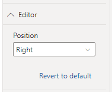

The Visual Editor is used to define your specification, configuration and any other options.

## Opening the Editor

The Visual Editor is only available when your report is in edit mode, that is, when you're editing in Power BI Desktop or in the Service. If the report is being viewed in the Power BI Service or other application, then it is not eligible for editing and any such options will be unavailable to your end-users.

To use the editor, your visual first needs some data, so please ensure that you have added any appropriate columns or measures to the **Values** data role.

Once data has been provided, the Visual Editor is accessed by selecting the visual header (...) and then **Edit**, e.g.:

This will put the visual into focus mode and display the Visual Editor for you to begin creating or amending your specification.

## Finding your Way Around

By default, the Visual Editor pane will be on the left and your rendered specification will be shown in a preview area to the right, e.g.:

:::info Here's One We Made Earlier
We're showing a pre-built specification here; if this is your first time opening the editor in a new visual, then the **New Specification** dialog will be visible, to help you get started. Refer to the [Simple Worked Example](simple-example) page for an example of this functionality, or the [New Specification](#new-specification-ctrl--alt--n) section below for more details.
:::

### Preview Area

Deneb captures the dimensions of your visual prior to opening the Visual Editor and shows this at 100% scale. This is so that you know how your design should look within the confines of the visual viewport when you return to the report.

The dashed line represents the boundaries of your visual in standard view. **Power BI does not allow visuals to resize themselves dynamically**, so if you wish to change the physical width and/or height of your visual in the report view, you will need to exit the advanced editor, resize and re-open the advanced editor.

Your visual may not fit entirely into the preview area at 100% scale, so you can use the [zoom controls in the preview area toolbar](#the-preview-area-toolbar) to adjust this accordingly, [or resize (or minimize) the editor pane](#the-visual-editor-pane) to accommodate.

If you would prefer to not see the boundary marker, you can disable this in the properties pane by selecting **Editor > Show Boundary Marker > OFF** in the Power BI Format pane:

### Editor Pane Position

If you prefer your editor on the right, you can modify this in the properties pane by selecting **Editor > Position > Right** in the Power BI Format pane:

### JSON Editor Font Size

The size of the font used for editing JSON can be modified by selecting **Editor > JSON Editor Font Size** in the Power BI Format pane:

### The Visual Editor Pane

The _Visual Editor_ pane is used to carry out any operations in this screen:

- It can be collapsed and expanded, much like the other panes in Power BI, which can be useful for previewing designs.

:::note Keyboard shortcut for collapse/expand:
**\[ Ctrl + Alt + Space ]**
:::

- The pane can be resized to use a maximum of 60% of the visible canvas by click-dragging.
- Double-clicking the resizer will revert the pane to its default size (40% of the visible canvas).

### The Command Bar

The Command Bar contains the following operations (from left to right):

#### Apply (Ctrl + Enter)

- Selecting this option will apply any changes you have made in either the _Specification_ or _Config_ and update your visual.
- This option is disabled if you have _Auto-Apply_ enabled (see below).

:::caution Apply Often
If you exit focus mode (and out of the Visual Editor) **any unapplied changes may not be saved**, so please ensure that you apply changes before returning to the standard view. Refer to the [Unapplied Changes](#unapplied-changes) section below for more details as to how you can mitigate this.
:::

#### Toggle Auto-Apply (Ctrl + Shift + Enter)

- Selecting this option will apply changes to the _Specification_ or _Config_ editors as you type them.
- Enabling this option will disable the _Apply_ command.

:::caution Consider Performance
Whilst this option is convenient for seeing changes take effect immediately, it can have negative performance implications if you're working with a large number of data points or elements within your visualization. Please refer to the [Performance Considerations](performance) page for further details on potential risks and mitigation approaches.
:::

#### **Repair and Format JSON (Ctrl + Alt + R)**

- Selecting this option will attempt to repair any simple typographical issues in your JSON, and re-format it with indentation.
- The tooling does its best to fix anything straightforward but in some cases it will not be possible to repair the JSON and manual corrections may be required and a banner will be shown above the editor.
- In these cases, you can select the error details in the bottom-right to investigate further and use this information to correct, e.g.:

#### New Specification (Ctrl + Alt + N)

- Selecting this option will open the _Create New Specification_ dialog.
- The dialog can be used to replace the current Specification and Config with either an bare-minimum set of JSON for each, or you can choose from a number of simple templates to get started.
- Templates are currently packaged in with the visual and it's not yet possible to import them, although hopefully this will be something we can work on bringing in later on.

:::info First Time Use
This dialog is also displayed by default if this is the first time opening the Visual Editor for any new instance of Deneb that you add to the report canvas.
:::

#### Generate JSON Template (Ctrl + Alt + E)

- Selecting this option will open the **Generate JSON Template** dialog.
- The dialog can be used to create an exportable version of the your specification. Refer to the [appropriate section in the Templates page](templates#generating-a-template) for more information on usage.

#### **Help (Ctrl + Alt + H)**

- Selecting this option will cause Power BI to confirm you wish to open the link to this documentation site. Selecting **OK** will open it in a new browser tab.

### Specification Editor Tab

:::note Keyboard shortcut
**\[ Ctrl + Alt + 1 ]**
:::

- This tab contains an editor that you can use to enter and amend your specification's JSON as desired.
  - The Vega JSON specification reference [can be found here](https://vega.github.io/vega/docs/specification/).
  - The Vega-Lite JSON specification reference [can be found here](https://vega.github.io/vega-lite/docs/spec.html).
- To view the results of your changes, you can either **Apply** your changes, or ensure that **Auto-Apply** is enabled.
- The JSON must produce a valid specification for your selected provider (either Vega or Vega-Lite).
- The editor will perform validation against the schema for the specified provider and warnings are displayed that you can inspect, e.g.:

### Config Editor Tab

:::note Keyboard shortcut
**\[ Ctrl + Alt + 2 ]**
:::

- This tab contains an editor that you can use to enter and amend any JSON you wish to add for your visual's config as desired.
  - The Vega JSON config reference [can be found here](https://vega.github.io/vega/docs/config/).
  - The Vega-Lite JSON config reference [can be found here](https://vega.github.io/vega-lite/docs/config.html).
- To view the results of your changes, you can either **Apply** your changes, or ensure that **Auto-Apply** is enabled.
- The JSON must produce a valid config for your selected provider (either Vega or Vega-Lite).
- It's generally advised to try and use the config for anything that can "theme" your chart and keep this separate from the specification. This makes easier to port across to other instances of the visual, e.g.:

### Settings Tab

:::note Keyboard shortcut
**\[ Ctrl + Alt + 3 ]**
:::

- This tab is used to configure specific behavior of Deneb when generating output:

- The **Provider** section allows you to specify whether to use Vega or Vega-Lite for your Specification and Config.
  - Vega-Lite is much simpler for newcomers as it is much more concise and abstracts away a lot of the things that you would normally need to prescribe when using Vega.
  - Vega does provide a lot more in the way of control over your visualization at the cost of a higher-learning curve.
- _The_ **Render Mode** section specifies whether to use either Vega's SVG renderer or Canvas renderer when compiling, parsing and producing your design.
  - _Canvas_ renders your design as pixel graphics.
  - _SVG_ creates your design from vector graphics, results in a number of component elements within the visual to produce the output.
  - Please refer to the [Performance Considerations](performance#selection-of-renderer) page for further details on potential risks and mitigation approaches when it comes to selecting a renderer.
- The **Vega > Power BI Interactivity** section specifies which interactivity features to enable.
  - As these require some additional setup in your specification, as well as some internal logic to link everything together you are able to specify whether they should be set-up or not.
  - Please refer to the [Interactivity Features](interactivity-overview) and related pages ([Tooltips](interactivity-tooltips) | [Context-Menu](interactivity-context-menu) | [Cross-Filtering](interactivity-selection)) for further details on how to configure these for your specification.

### The Preview Area Toolbar

The preview area contains a toolbar, which provides additional controls to assist with detail work. From left to right these are:

- Zoom preview out by 10% **( Ctrl + Alt + - )**
- Zoom level slider - allows manual adjustment of zoom level from 10% to 300%.
- Zoom preview out by 10% **( Ctrl + Alt + + )**
- Zoom preview to actual size **( Ctrl + Alt + 0 )**
- Zoom preview to fit available space **( Ctrl + Alt + \* )**

## Column and Measure Completion

:::note Specification editor only
:::

As the specification is text-based, it can be onerous to look-up or type the names for measures or columns in manually. For any that are added to the **Values** data role, they will be offered (along with a qualifier as to their type) in the Specification editor’s auto-completion, e.g.:

## Unapplied Changes

If you've made changes in the Visual Editor and select _Back to report_ without applying them, you will get a prompt alerting you of this:

:::caution
This is a 'last chance' to make sure that any changes you want to keep are applied. If changes are discarded, they cannot be recovered.
:::
