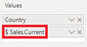
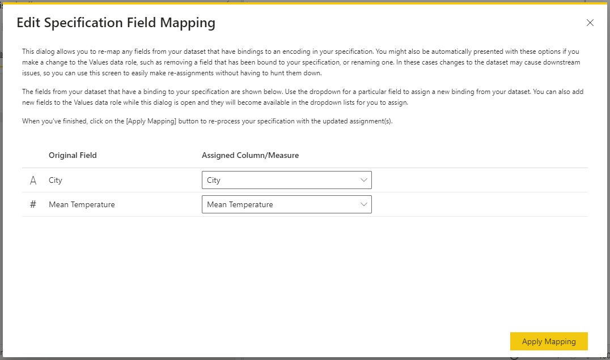
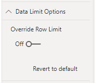
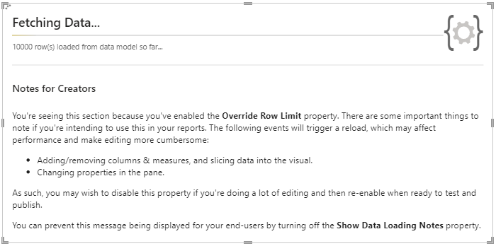
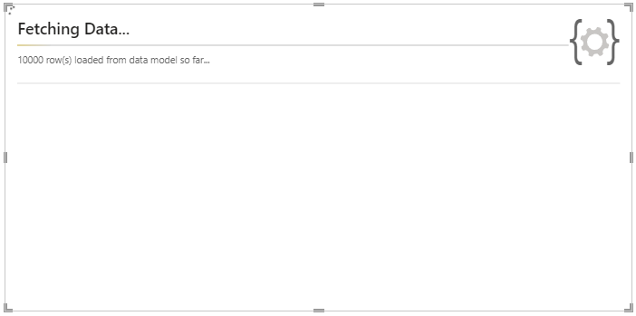

Any data you add to the visual's **Values** data role is automatically bound to an internal dataset named **`dataset`** in the Vega or Vega-Lite view. This will update dynamically as you add or remove columns and measures, or the number of rows in the dataset changes (e.g. filter context).

## Linking Visual Data to A Specification

Even though this is passed through from Power BI, a specification needs to contain a reference to the named `dataset`, otherwise the values cannot be encoded when the specification is parsed. You should always ensure that a specification contains the following content for this to work:

```json title=Vega-Lite
{
    ...
    "data": { "name": "dataset" }
    ...
}
```

```json title=Vega
{
    ...
    "data": [
        { "name": "dataset" }
    ]
    ...
}
```

The visual's starter templates all follow this approach, so if in doubt, create a new specification using the **\[empty]** template as a boilerplate.

## Grain / Row Context

Internally, the visual handles its dataset in much the same way as a core [table](https://docs.microsoft.com/en-us/power-bi/visuals/power-bi-visualization-tables?WT.mc_id=DP-MVP-5003712), i.e. the number of rows in the dataset is equivalent to the combination of all unique values across all columns and measures added.

Let's say that we have the following data in our visual:

 and measure (Mean Temperature).")

If you're used to working with JSON, a representation similar to the following JSON output is patched into the specification when it is parsed:

```json
{
  "dataset": [
    { "City": "Auckland", "Mean Temperature": 14.62 },
    { "City": "Christchurch", "Mean Temperature": 9.49 },
    { "City": "Dunedin", "Mean Temperature": 6.83 },
    { "City": "Hamilton", "Mean Temperature": 13.27 },
    { "City": "Lower Hutt", "Mean Temperature": 12.12 },
    { "City": "North Shore", "Mean Temperature": 14.62 },
    { "City": "Tauranga", "Mean Temperature": 12.99 },
    { "City": "Waitakere", "Mean Temperature": 14.62 },
    { "City": "Wellington", "Mean Temperature": 12.12 }
  ]
}
```

## Referencing Columns and Measures

Wherever you need to reference a column or a measure in your specification, you should use its **display name** from the **Values** data role rather than those from the data model.

If you rename or remove a column or measure, please remember to update your specification accordingly.

:::info Re-Mapping Encoded Fields
If a renamed/removed field is detected in any encodings or expressions used in your specification, the [**Edit Specification Field Mapping**](dataset#edit-specification-field-mapping) dialog will be automatically displayed.
:::

### 'Special Characters' in Column and Measure Names

You might use all kinds of characters in your data model when naming columns or measures. However, [Vega](https://vega.github.io/vega/docs/types/#Field) and [Vega-Lite](https://vega.github.io/vega-lite/docs/field.html) (and JSON) have some specific considerations to make with certain characters in field binding and expressions, notably `.`, `[`, `]`, `\` and `"`.

In these cases, Deneb will replace occurrences of these characters with an underscore (`_`) when they are passed into the visual dataset. By doing this, we avoid placing the onus on you, the author to remember how to escape them using the rules in the linked documentation above.

To further illustrate, let's assume we have this measure:



Using this in a specification's `field` encoding would need to substitute the `.` with an underscore as follows:

```json {4}
{
    ...
    "x": {
      "field": "$ Sales_Current",
      "type": "quantitative"
    }
    ...
}
```

It is recommended that if you're passing in measures or columns containing special characters and do not wish for this behavior to occur, then rename them in the **Values** data role so that they are not passed through to the dataset.

### Edit Specification Field Mapping

<EarlyAccessWarning />

Measures or columns that are bound to specification encodings or expressions might be used all the way through. If you want to change this or you've renamed a field in the **Values** data role, it can be cumbersome to manually find and replace these values.

To make this easier, you can click the **Edit Specification Field Mapping** command or press **\[ Ctrl + Alt + F ]** to open the dialog. This will display all fields from the dataset that have been detected in encodings or expressions and display them in a list, e.g.:



Much like when you create a new specification from a template, you can add or remove fields from the **Values** data role and they will become available for selection/substitution.

Similarly, the dialog will be automatically displayed if you remove a field from the **Values** data role, that is currently bound to an encoding or expression. This way, you can easily substitute an alternative column or measure from your data model.

## Augmenting Other Datasets

In the case of a Vega specification, you can potentially add further `data` objects to the array, and Vega-Lite specifications can also contain layer-specific datasets (or multiple named ones) but bear the following in mind:

- AppSource certified visuals are not permitted to bring in data or resources from external locations.
  - To this end, loading external files is not permitted in the visual.
  - You can attempt this in the [standalone version](getting-started#standalone-version) of the visual, but loading data from remote endpoints is subject to CORS restrictions due to security restrictions in all Power BI custom visuals. [You can read more about this here](https://www.html-content.com/reference/limitations#custom-visuals-high-level).
- As such, it is recommended that you regard the named `"dataset"` source as where all data for your specification should come from in terms of your data model.

## Considerations for Transforming Data

Both [Vega](https://vega.github.io/vega/docs/transforms/) and [Vega-Lite](https://vega.github.io/vega-lite/docs/transform.html) support the concept of transforms, which ultimately mutate the data from its initial state. Whilst this approach may be necessary to produce particular types of visual, this changes the row context and some features may no longer be available (particularly those that leverage interactivity). Please refer to the pages in the [Interactivity Features](interactivity-overview) section for more details.

## Data Row Limits

In order to try and keep performance usable for most cases, the visual caps the row count at **10,000** by default.

It is however possible to override this if you so wish, but the number of rows returned will be subject to resource limits and entirely up to Power BI. If you wish to override this, you can find the _Data Limit Options_ menu in the Power BI Format pane:



Switching on the **Override Row Limit** property, will ask Power BI to load more rows into the dataset, in batches of 10,000, e.g.:



Because there's a lot to consider when enabling this property, the **Show Data Loading Notes** property is enabled by default: this is intended to provide creators or developers a bit more detail around the caveats around using this feature in a condensed space.

Whist the information can probably be seen in the screenshot, the important details are listed here too for you to bear in mind:

- Power BI will cause the visual's data to reload when:
  - You add or remove columns or measures from the _Values_ data role.
  - The visual's filter context is changed.
  - Values in the properties pane are modified.
- Most operations in the visual editor will not trigger this behavior, so with the exception of doing anything above, there should be minimal disruption in terms of Power BI reloading the dataset.
- However **editing a specification with a lot of data can usually have negative performance implications**. Refer to the [Performance Considerations](performance) page for further details on potential risks and mitigation approaches.

When you're sufficiently used to the behavior of this feature (or when ready to publish and you don't want your users to see them), you can turn off the **Show Data Loading Notes** property to de-clutter this:


