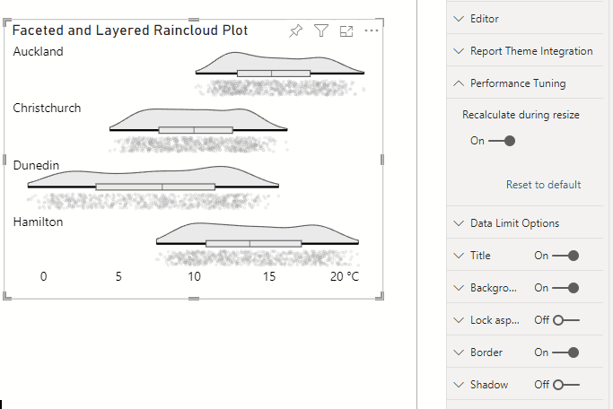

# Performance Considerations

## It's Early Days for Deneb

We're in the very first stages of getting Deneb off the ground and most of what has been done so far has been around solving technical challenges to get the functionality working within a custom visual.

For the majority of cases, Deneb should perform quite well, but if you're building a behemoth visual with lots of data, then you may need to think about the resulting output and the demand this can potentially create on a client machine - either while you're building a visual, or when your end users are consuming it.

Please bear in mind that while care has been taken so far to try and make things work nicely, we will apply concerted effort to work on performance of the interface as we iterate.

The following page has some recommendations for keeping performance optimal.

## Selection of Renderer

You can specify the renderer to use [in the Settings panel of the Visual Editor](visual-editor#settings-pane).

**SVG** is the default , which will render your specification using vector graphics. You also have the option to select **Canvas**, which will use pixel graphics.

- SVG is typically used for the lion's share of simple data visualizations and tyically produces "clearer" output that scales well at a variety of sizes.

- However much like adding multiple visuals to a report page in Power BI can have an impact on performance, using SVG with a lot of data can have similar detrimental effects on performance.

- It's recommended that you try and stick with Canvas, particularly if you're prototyping a design and aren't sure on how many elements or data points you're potentially working with.

- If you want to use SVG and you're working with a lot of data, consider if you can use elements that consolidate many data points into a single item on-screen, such as a `line` rather than a `point`, as this helps reduce the number of moving parts.

For more details on Canvas vs. SVG, [there's a great article here at CSS-Tricks](https://css-tricks.com/when-to-use-svg-vs-when-to-use-canvas) that consolidates a lot of useful info and summarizes a number of pros and cons.

## Applying Changes as You Type vs. Manually

The Visual Editor has the ability to [apply changes to your output as you type them](visual-editor#toggle-auto-apply-ctrl--shift--enter). Whilst this is pretty cool, it can really slow things down if you're making many changes to a particularly ambitious specification in a short space of time, as each change requires Vega or Vega-Lite to re-parse and render the output.

We already use some techinques to minimise unnecessary chatter if this option is enabled, such as [debouncing text input](https://css-tricks.com/debouncing-throttling-explained-examples/), but it's still recommended that you apply your changes manually when ready, if editing a complex or data-intensive specification.

## Include only Necessary Columns and Measures

Any data that you add to the visual will have performance implications, specifically:

- The DAX query required by Power BI to generate the dataset for Deneb.

- The amount of resources needed by Deneb to process the dataset and for Vega or Vega-Lite to render the resulting output as per your specification.

- Creating a row context with lower granularity than you actually need, which can make producing the desired output more challenging.

Therefore, only add the columns and measures (and filter context) that your visual needs to communicate its message.

## The Performance Tuning Property Menu

The **Performance Tuning** menu in the Power BI format pane is used to expose additional properties that you can use to alter performance of your specification. Where possible, these properties are set to what makes the most sense for optimal performance.

### Recalculate During Resize

:::info OFF By Default
:::

Due to the dynamic nature of Power BI visual containers, any change to the sizing can trigger an update to a visual's logic and this can cause your visual specification to get re-calculated during the process. This may not be noticeable for visuals that use a small amount of marks, but for those that are more complex, this might create more overhead than you need for something you don't do frequently.

If enabled, the **Recalculate during resize** property will continue to calculate any changes to the specification while a visual is in the process of being resized. If disabled, Deneb will delay any further updates until you have completed the resize operation by releasing the mouse button, e.g.:

