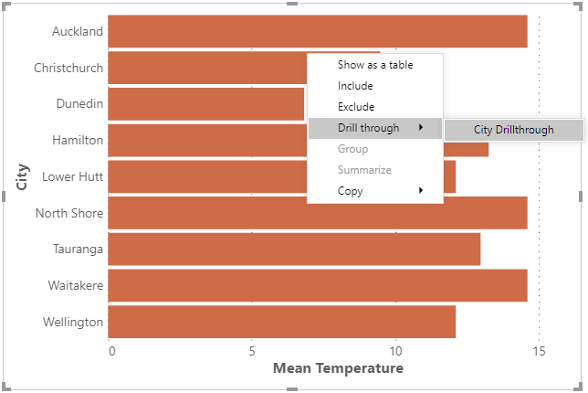

# Context Menu

If you or a user right-clicks the visual canvas, Deneb will display the Power BI context menu.

The context menu is managed by the main Power BI window, so Deneb manages integration between the Vega view and Power BI, in order to delegate as much as possible on your behalf.

## Context Menu Strategy

The context menu works as follows:

- The context menu will always be available when right-clicking the visual canvas (or within the boundary representing the visual viewport in the Advanced Editor's [Preview Area](visual-editor/#preview-pane))

- You can configure whether Deneb should attempt to [resolve data points](#data-point-resolution) when invoking the context menu, through the **Resolve Data Points in Context Menu** property in the _Vega > Power BI Interactivity_ section of the [Settings pane in the Visual editor](visual-editor#settings-pane). This is enabled by default.

## Data Point Resolution

With the **Resolve Data Points in Context Menu** property enabled: if the right-click target area is a mark, and represents an un-transformed row from your `"dataset"`, Deneb will attempt to resolve the current row context and present any options that Power BI makes available from the main window, e.g.:

## Regular Context Menu (or Resolution Not Possible)

If the property is disabled or a datum cannot be resolved from a mark (or the target area is not a mark), Deneb will display the regular context menu, e.g.:

## Limitations and Considerations

- Data resolution integration with Power BI is wholly dependent on the correct row context. [Refer above](#data-point-resolution), or to the [Overview](interactivity-overview) page for more information about ensuring this is preserved.

- The Power BI context menu only accepts a single datum, or row. This means that if you are aggregating rows into marks then we cannot resolve the context menu in these cases.
