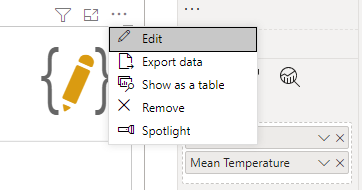
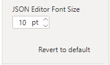

import ReactPlayer from "react-player";

The Visual Editor is used to define your specification, configuration and any other options.

## Opening the Editor

The Visual Editor is only available when your report is in edit mode - when you're editing in Power BI Desktop or in the Service. If the report is being viewed in the Power BI Service or other application, then it is not eligible for editing and any such options will be unavailable to your end-users.

To use the editor, your visual first needs some data, so please ensure that you have added any appropriate columns or measures to the **Values** data role.

Once data has been provided, the Visual Editor is accessed by selecting the visual header (...) and then **Edit**, e.g.:

This will put the visual into focus mode and display the Visual Editor for you to begin creating or amending your specification.

## Finding your Way Around

The Visual Editor has 3 main components, or panes:

1. Editor Pane - for creating your visual.
2. Preview Pane - for seeing what your visual will look like in your report.
3. Debug Pane - for assisting with the development process.

:::info Here's One We Made Earlier
We're showing a pre-built specification here; if this is your first time opening the editor in a new visual, then the **New Specification** dialog will be visible, to help you get started. Refer to the [Simple Worked Example](simple-example) page for an example of this functionality, or the [New Specification](#new-specification-ctrl--alt--n) section below for more details.
:::

## Editor Pane

The Editor Pane is where you will edit your specification, config and apply any other settings you need to. There are some additional options for working with templates also, e.g.:

### Resizing the Editor Pane

The Editor Pane can be resized, or collapsed if you wish to allocate more space on the screen for your Preview and/or Debug panes, e.g.:

<ReactPlayer
  controls
  url="/mp4/1.3.0/editor-interface-editor-pane-resize.mp4"
/>

Some points to note:

- The pane can be resized to use a maximum of 60% of the visible canvas by click-dragging.
- Double-clicking the resizer will revert the pane to its default size (40% of the visible canvas).

### Editor Pane Position

If you prefer your editor on the right, you can modify this in the properties pane by selecting **Editor > Position > Right** in the Power BI Format pane:

### JSON Editor Font Size

The size of the font used for editing JSON can be modified by selecting **Editor > JSON Editor Font Size** in the Power BI Format pane:

### Word Wrap

By default, any content in the editor that overflows the width will wrap onto a new line. By disabling the **Editor > Word Wrap** property in the Power BI Format pane, you can keep content on a single line, and the editor will display a horizontal scrollbar as appropriate.

### Line Gutter & Line Numbers

By default, the editor will show line numbers in the left-hand gutter.

- You can disable this gutter by disabling the **Editor > Line Gutter** property in the Power BI Format pane.
- Alternatively, you can keep the gutter (so that sections of JSON can still be expanded and collapsed as needed) but hide the line numbers by disabling the **Editor > Line Numbers** property.

### The Command Bar

The Command Bar contains the following operations (from left to right):

#### Apply (Ctrl + Enter)

- Selecting this option will apply any changes you have made in either the _Specification_ or _Config_ and update your visual.
- This option is disabled if you have _Auto-Apply_ enabled (see below).

:::caution Apply Often
If you exit focus mode (and out of the Visual Editor) **any unapplied changes may not be saved**, so please ensure that you apply changes before returning to the standard view. Refer to the [Unapplied Changes](#unapplied-changes) section below for more details as to how you can mitigate this.
:::

#### Toggle Auto-Apply (Ctrl + Shift + Enter)

- Selecting this option will apply changes to the _Specification_ or _Config_ editors as you type them.
- Enabling this option will disable the _Apply_ command.

:::caution Consider Performance
Whilst this option is convenient for seeing changes take effect immediately, it can have negative performance implications if you're working with a large number of data points or elements within your visualization. Please refer to the [Performance Considerations](performance) page for further details on potential risks and mitigation approaches.
:::

#### **Repair and Format JSON (Ctrl + Alt + R)**

- Selecting this option will attempt to repair any simple typographical issues in your JSON, and re-format it with indentation.
- The tooling does its best to fix anything straightforward but in some cases it will not be possible to repair the JSON and manual corrections may be required and a banner will be shown above the editor.
- In these cases, you can select the error details in the bottom-right to investigate further and use this information to correct, e.g.:

<ReactPlayer
  controls
  url="/mp4/1.3.0/editor-interface-editor-pane-repair.mp4"
/>

#### **Edit Specification Field Mapping (Ctrl + Alt + F)**

- Selecting this option allows you to re-assign any columns or measures that are bound to an encoding or expression in your specification.
- This is documented in more detail [on the Dataset page](dataset#edit-specification-field-mapping).

#### New Specification (Ctrl + Alt + N)

- Selecting this option will open the _Create New Specification_ dialog.
- The dialog can be used to replace the current Specification and Config with either an bare-minimum set of JSON for each, or you can choose from a number of simple templates to get started.
- Templates are currently packaged in with the visual and it's not yet possible to import them, although hopefully this will be something we can work on bringing in later on.

:::info First Time Use
This dialog is also displayed by default if this is the first time opening the Visual Editor for any new instance of Deneb that you add to the report canvas.
:::

#### Generate JSON Template (Ctrl + Alt + E)

- Selecting this option will open the **Generate JSON Template** dialog.
- The dialog can be used to create an exportable version of the your specification. Refer to the [appropriate section in the Templates page](templates#generating-a-template) for more information on usage.

#### **Help (Ctrl + Alt + H)**

- Selecting this option will cause Power BI to confirm you wish to open the link to this documentation site. Selecting **OK** will open it in a new browser tab.

### Specification Editor Pane

:::note Keyboard shortcut
**\[ Ctrl + Alt + 1 ]**
:::

- This pane contains an editor that you can use to enter and amend your specification's JSON as desired.

  - The Vega JSON specification reference [can be found here](https://vega.github.io/vega/docs/specification/).
  - The Vega-Lite JSON specification reference [can be found here](https://vega.github.io/vega-lite/docs/spec.html).

- To view the results of your changes, you can either **Apply** your changes, or ensure that **Auto-Apply** is enabled.
- The JSON must produce a valid specification for your selected provider (either Vega or Vega-Lite).
- The editor will perform validation against the schema for the specified provider and warnings are displayed that you can inspect, e.g.:

### Config Editor Pane

:::note Keyboard shortcut
**\[ Ctrl + Alt + 2 ]**
:::

- This pane contains an editor that you can use to enter and amend any JSON you wish to add for your visual's config as desired.
  - The Vega JSON config reference [can be found here](https://vega.github.io/vega/docs/config/).
  - The Vega-Lite JSON config reference [can be found here](https://vega.github.io/vega-lite/docs/config.html).
- To view the results of your changes, you can either **Apply** your changes, or ensure that **Auto-Apply** is enabled.
- The JSON must produce a valid config for your selected provider (either Vega or Vega-Lite).
- It's generally advised to try and use the config for anything that can "theme" your chart and keep this separate from the specification. This makes easier to port across to other instances of the visual, e.g.:

### Settings Pane

:::note Keyboard shortcut
**\[ Ctrl + Alt + 3 ]**
:::

- This pane is used to configure specific behavior of Deneb when generating output:

- The **Provider** section allows you to specify whether to use Vega or Vega-Lite for your Specification and Config.

  - Vega-Lite is much simpler for newcomers as it is much more concise and abstracts away a lot of the things that you would normally need to prescribe when using Vega.
  - Vega does provide a lot more in the way of control over your visualization at the cost of a higher-learning curve.

- _The_ **Render Mode** section specifies whether to use either Vega's SVG renderer or Canvas renderer when compiling, parsing and producing your design.
  - _Canvas_ renders your design as pixel graphics.
  - _SVG_ creates your design from vector graphics, results in a number of component elements within the visual to produce the output.
  - Please refer to the [Performance Considerations](performance#selection-of-renderer) page for further details on potential risks and mitigation approaches when it comes to selecting a renderer.
- The **Vega > Power BI Interactivity** section specifies which interactivity features to enable.
  - As these require some additional setup in your specification, as well as some internal logic to link everything together you are able to specify whether they should be set-up or not.
  - Please refer to the [Interactivity Features](interactivity-overview) and related pages ([Tooltips](interactivity-tooltips) | [Context-Menu](interactivity-context-menu) | [Cross-Filtering](interactivity-selection) | [Cross-Highlighting](interactivity-highlight)) for further details on how to configure these for your specification.

### Column and Measure Completion

:::note Specification editor only
:::

As the specification is text-based, it can be onerous to look-up or type the names for measures or columns in manually. For any that are added to the **Values** data role, they will be offered (along with a qualifier as to their type) in the Specification editor’s auto-completion, e.g.:

### Unapplied Changes

If you've made changes in the Visual Editor and select _Back to report_ without applying them, you will get a prompt alerting you of this:

:::caution
This is a 'last chance' to make sure that any changes you want to keep are applied. If changes are discarded, they cannot be recovered.
:::

## Preview Pane

Deneb captures the dimensions of your visual prior to opening the Visual Editor and shows this at 100% scale. This is so that you know how your design should look within the confines of the visual viewport when you return to the report, e.g.:

Your visual may not fit entirely into the preview area at 100% scale, so you can use the [Zoom Controls in the Debug Pane](#zoom-controls) (or collapse it) to adjust this accordingly, [or resize (or collapse) the editor pane](#the-visual-editor-pane) to accommodate.

#### Boundary Marker

The dashed line represents the boundaries of your visual in standard view. **Power BI does not allow visuals to resize themselves dynamically**, so if you wish to change the physical width and/or height of your visual in the report view, you will need to exit the Visual Editor, resize your visual, and then re-open the Visual Editor.

If you would prefer to not see the boundary marker, you can disable this in the properties pane by selecting **Editor > Show Boundary Marker > OFF** in the Power BI Format pane:

## Debug Pane

The Debug Pane provides you with additional tooling to inspect and debug your visual design, as well as exposing information about the Vega or Vega-Lite view used to generate it.

From left to right, the components of the pane are as follows:

### Data Pane

The Data Pane exposes information about data sets from the Vega view, and is the default view in the Debug Pane. Assuming that your visual parses correctly, this will provide a dropdown to choose the desired data stream to inspect, and the details of this will then be shown in the table underneath.

- The default selection is the `dataset` entry, which is the data supplied to Deneb from your data model. This includes [any additional fields](interactivity-overview#additional-datum-fields) Deneb adds to assist you for interactivity purposes, so that you can inspect their values much more easily than [using tooltips to expose a mark's datum](interactivity-tooltips#debugging-with-tooltips).

- Complex objects will only render if they are small enough; larger ones will be truncated with `{...}` (but can be inspected further in a tooltip by hovering over the placeholder value), e.g.:

  

- Tooltips for interactivity values and headers are also contextual, to better assist you with what things might mean, e.g.:

  

- For performance reasons with rendering (mainly because a data stream can contain complex objects), the number of visible rows is capped at 10 per page. You may therefore need to navigate the table using the pagination tools underneath it to look at any specific records; however, columns can be sorted by clicking on the appropriate header.

### Signals Pane

The Signals Pane can be used to inspect the state of [signals](https://vega.github.io/vega/docs/signals/) from the Vega view. Signals are often auto-generated for features in Vega-Lite, such as [parameters](https://vega.github.io/vega-lite/docs/parameter.html).

The functionality of the table is very much the same as for the Data Pane.

### Logs Pane

The Logs pane is used to monitor [logging](https://vega.github.io/vega/docs/api/util/#logging) events emitted by the Vega view. Here, you can set the desired log level and this will update when the specification is (re)parsed.

- The default logging level is `warn`.
- Note that due to the verbosity of the output created by the `debug` level, this is not available in Deneb.

### Provider and Version

This are provides re-statement as to which provider you're using (Vega or Vega-Lite) and which version is embedded.

:::tip Check the Provider Version Can Do What You're Looking Up
Deneb doesn't automatically support new releases of Vega or Vega-Lite. Because the runtimes are embedded, any new releases need to be be tested, implemented and deployed to AppSource, which can take some time. As such, you can use this information in the toolbar to confirm if the embedded version might be behind any new features published by the Vega team.
:::

### Zoom Controls

The Zoom Controls are intended to assist you with detail work; particularly as Power BI custom visuals can only occupy a certain amount of the main interface. These functions are:

- Zoom preview out by 10%
- Zoom level slider - allows manual adjustment of zoom level from 10% to 300%.
- Zoom preview in by 10%
- Zoom preview to actual size
- Zoom preview to fit available space

### Collapse or Expand Debug Pane

This control will allow you to toggle the visible state of the Debug Pane.
