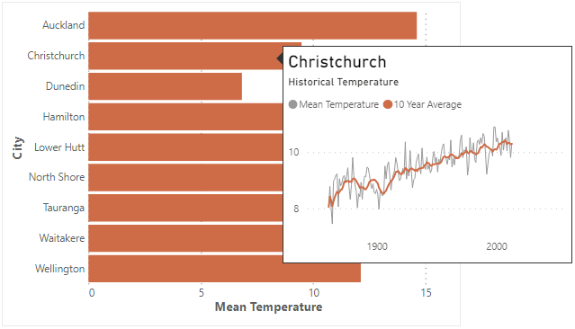
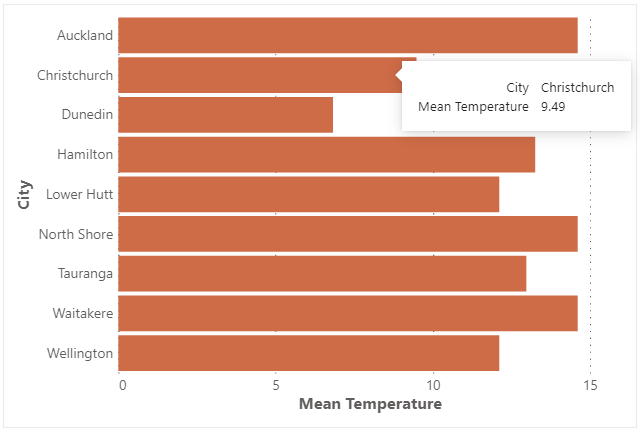
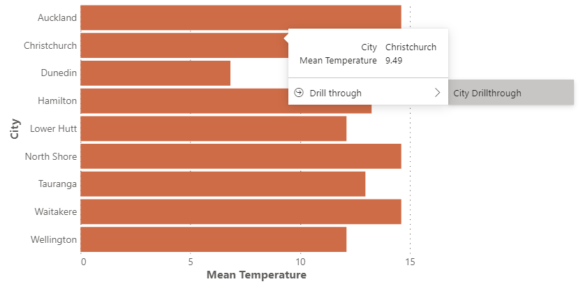
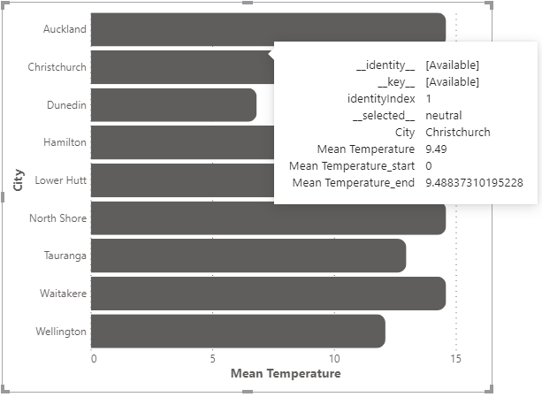

# Tooltips

We saw [in the worked example](simple-example#tooltips), that it's fairly straightforward to add tooltips to a specification, but we'll unpack on this page in a bit more detail.

If you haven't read it already, it's worth reviewing the [preceding page](interactivity-overview) to understand some of the considerations that need to be made with integrating back to Power BI. It will certainly help with understanding the logistics around report page tooltips in particular.

## Tooltip Strategy

[Vega](https://github.com/vega/vega-tooltip/blob/master/docs/creating_your_tooltip.md#step-4-define-your-tooltip-in-vega-or-vega-lite) and [Vega-Lite](https://vega.github.io/vega-lite/docs/tooltip.html) both provide the ability to customize how their tooltip events can be interpreted. Deneb contains a tooltip handler writen specifically for Power BI, which will display under the following conditions:

1. **Tooltip Handler** is enabled in the _Vega > Power BI Interactivity_ section of the [Settings pane in the Visual editor](visual-editor#settings-tab). This is enabled by default.

2. An appropriate `tooltip` property is assigned to a mark. Refer [below](#vega-lite-syntax) for the recommended syntax for each provider.

3. A tooltip-enabled mark is hovered over.

## Data Point Resolution

Provided that your mark's datum is not transformed or mutated away from the `"dataset"` and represents the _"pure"_ row context passed-in, Deneb can resolve this back to Power BI for delegation.

If a report page exists with at least one of the columns in the current datum, then Power BI will display it for the current row context, e.g.:



If there is no suitable report page for the current datum or you have specified a default tooltip in the _Tooltip_ menu in Power BI's _Properties_ pane, then a default tooltip will be displayed, e.g.:



:::note
A default tooltip will display all values for the current mark's datum, including any other columns or measures bound to its particular row context.
:::

If the title of a tooltip field matches the name of a column or measure from the **Values** data role, Deneb will attempt to see if it has a format string set in the data model and apply this automatically. If this cannot be resolved, then you can consider [applying a format manually](/formatting).

If you have enabled [modern tooltip support](https://docs.microsoft.com/en-us/power-bi/create-reports/desktop-visual-tooltips) in your report, and a data point has a corresponding drill through page, this is resolved in the tooltip, e.g.:



## Default Tooltip Styling

This is done in the usual way, i.e. in the _Tooltip_ menu in Power BI's properties pane.

## Vega-Lite Syntax

The [simplest approach for this](https://vega.github.io/vega-lite/docs/tooltip.html#encoding) is recommended, e.g.:

```json
{
    ...
        "mark": {
            ...
            "tooltip": true,
            ...
        },
    ...
}
```

## Vega Syntax

With Vega, you need to specify the `tooltip` signal in your mark's `encode` property, e.g.:

```json
{
    ...
    "encode": {
        "enter": {
            ...
            "tooltip": {
                "signal": "datum"
            },
            ...
        }
    },
    ...
}
```

## 'Debugging' with Tooltips

If you're using an approach to display the underlying data point ([e.g. Vega-Lite](https://vega.github.io/vega-lite/docs/tooltip.html#data)) rather than the resolved tooltip info that Vega provides by setting to `true`, we're able to see a bit further under the hood, .e.g:



This can be useful to understand what additional fields or calculations may be applied to a datum for usage in expressions. It can also help to understand if a mark still [has row context](interactivity-overview/#reconciliation-of-data-andor-row-context) and can be reconciled back to Power BI for interactivity purposes. If a tooltip's `datum` contains the following properties, then this is a slam-dunk:

- `__identity__`
- `__key__`
- `identityIndex`
- `__selected__`

Please refer to the [interactivity documentation](interactivity-overview/#additional-datum-fields) for a further explanation of what these mean.

## Limitations and Considerations

- Tooltip integration with Power BI is wholly dependent on the correct row context. [Refer above](#data-point-resolution), or to the [Overview](interactivity-overview) page for more information about ensuring this is preserved.

- Adding a tooltip does not automatically add visual feedback or effects. If you want to track the position of the resolved data point more visually (e.g. like for a line chart), you will need to add a suitable set of marks to do this. Both [Vega](https://vega.github.io/vega/examples/) and [Vega-Lite](https://vega.github.io/vega-lite/examples/) have examples you can refer to.

- Development so far has been focused on Power BI integration. It's possible that if you deviate from the above patterns, then tooltips may not display correctly. If you find any such use cases, please [create an issue](https://github.com/deneb-viz/deneb/issues) with the appropriate reproduction steps (e.g. example specification and/or data) and we'll see what we can do about it.
